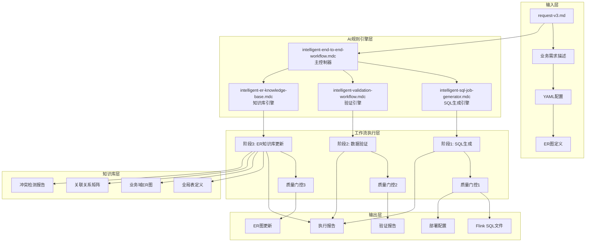
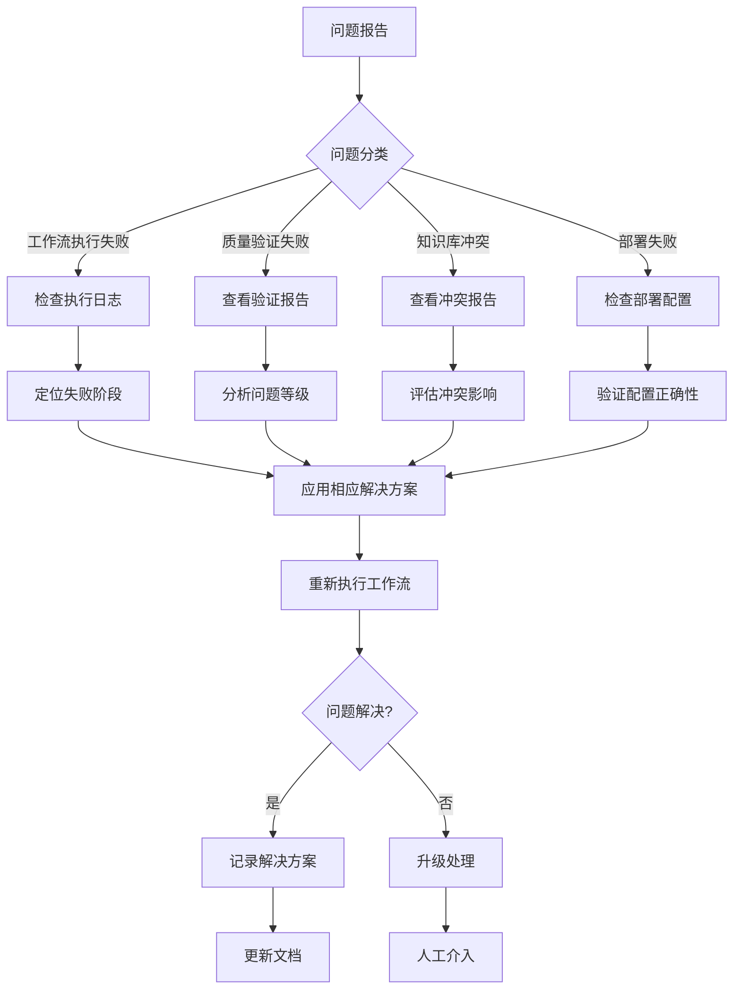

# Flink SQL AI驱动开发平台 - 架构文档与使用指南

## 📖 概述

本文档描述了一个完整的AI驱动的Flink SQL开发平台，该平台实现了从业务需求到生产部署的全自动化开发流程。通过集成三个核心AI工作流（SQL生成、数据验证、ER知识库管理），平台能够在5分钟内完成传统需要数天的开发工作。

### 🎯 核心价值

- **🚀 极致效率**: 5分钟完成完整开发周期，效率提升10倍+
- **🔍 质量保证**: 多维度AI验证，确保代码质量和数据准确性
- **🗄️ 智能管理**: 自动维护ER图知识库，避免重复劳动
- **📊 标准化**: 统一的开发、验证、部署标准
- **🔄 可追溯**: 完整的执行历史和变更记录

---

## 🏗️ 系统架构

### 整体架构图



### 核心组件架构

#### 1. AI规则引擎 (Rule Engine)

```yaml
rule_engine_architecture:
  primary_controller:
    component: "intelligent-end-to-end-workflow.mdc"
    responsibility: "工作流编排、状态管理、质量门控"
    capabilities:
      - "三阶段顺序执行控制"
      - "错误处理和回滚机制"
      - "状态持久化和恢复"
      - "质量评分和决策"
      
  specialized_engines:
    sql_generator:
      component: "intelligent-sql-job-generator.mdc"
      responsibility: "智能SQL生成和优化"
      capabilities:
        - "BusinessEvent payload解析"
        - "复杂JOIN逻辑生成"
        - "业务规则转换"
        - "性能优化建议"
        
    validation_engine:
      component: "intelligent-validation-workflow.mdc"  
      responsibility: "SQL质量和数据准确性验证"
      capabilities:
        - "SQL标准性检查"
        - "数据一致性验证"
        - "业务逻辑校验"
        - "性能基准测试"
        
    knowledge_base_engine:
      component: "intelligent-er-knowledge-base.mdc"
      responsibility: "ER图知识库管理"
      capabilities:
        - "ER图结构解析"
        - "冲突智能检测"
        - "知识库动态更新"
        - "版本演化管理"
```

#### 2. 工作流执行引擎 (Workflow Engine)

```yaml
workflow_execution_architecture:
  orchestration_layer:
    state_management:
      storage: "job/{domain}/.workflow/state.json"
      checkpoints: "after_each_phase"
      recovery: "resume_from_last_checkpoint"
      
    quality_gates:
      phase_1: "SQL生成质量检查"
      phase_2: "数据验证综合评分"
      phase_3: "知识库一致性检查"
      
    error_handling:
      retry_strategy: "exponential_backoff"
      rollback_mechanism: "phase_level_rollback"
      escalation_policy: "manual_intervention"
      
  execution_flow:
    sequential_phases:
      - "Phase 1: SQL Generation (45s)"
      - "Phase 2: Data Validation (2.5min)"
      - "Phase 3: ER KB Update (1.3min)"
    
    parallel_opportunities:
      within_phases: "非依赖操作并行执行"
      cross_phases: "不支持，保证数据一致性"
```

#### 3. 知识库管理系统 (Knowledge Base)

```yaml
knowledge_base_architecture:
  hierarchical_organization:
    global_layer:
      - "BusinessEvent标准事件流定义"
      - "通用维表和连接器配置"
      
    domain_layer:
      - "业务域特定的Payload结构"
      - "维表定义和关联关系"
      - "业务规则和约束条件"
      
    consolidated_layer:
      - "跨域一致性检查"
      - "全局关联关系矩阵"
      
  conflict_detection:
    algorithms:
      structural: "表结构、字段类型、约束冲突"
      logical: "JOIN条件、业务规则冲突"
      semantic: "命名、语义冲突"
      
    resolution_strategies:
      auto_resolution: "兼容性变更自动解决"
      manual_resolution: "重大冲突人工决策"
      version_branching: "不兼容变更版本分支"
```

### 数据流架构

#### 输入数据流

```yaml
input_data_flow:
  primary_input:
    file: "job/{domain}/{domain}-request-v3.md"
    format: "YAML + Markdown"
    sections:
      - job_info: "作业基本信息"
      - field_mapping: "字段映射配置"
      - join_relationships: "关联关系定义"
      - er_diagram: "Mermaid格式ER图"
      
  validation_rules:
    schema_validation: "严格的YAML Schema检查"
    completeness_check: "必需字段和逻辑验证"
    business_rule_validation: "业务逻辑一致性检查"
```

#### 中间数据流

```yaml
intermediate_data_flow:
  phase_1_to_2:
    sql_artifacts:
      - "wrongbook_wide_table_v3.sql"
      - "data-quality-check-v3.sql"
    config_artifacts:
      - "deploy-wrongbook-v3.yaml"
      - "README-AI-Generated-v3.md"
      
  phase_2_to_3:
    validation_results:
      - "validation-report-wrongbook-v3.md"
      - "quality_scores.json"
    test_artifacts:
      - "test-data-wrongbook-v3.sql"
      - "performance-benchmark-wrongbook-v3.sql"
```

#### 输出数据流

```yaml
output_data_flow:
  production_ready_artifacts:
    sql_files: "优化的Flink SQL代码"
    deployment_configs: "Kubernetes部署配置"
    monitoring_configs: "数据质量监控SQL"
    documentation: "完整的技术文档"
    
  knowledge_base_updates:
    er_diagrams: "标准化Mermaid ER图"
    structural_definitions: "表结构和字段定义"
    relationship_matrix: "关联关系矩阵"
    
  execution_reports:
    comprehensive_report: "端到端执行报告"
    quality_assessment: "多维度质量评分"
    deployment_recommendation: "部署建议和风险评估"
```

---

## 🔄 工作流详细设计

### 阶段1：智能SQL生成

#### 输入处理
```yaml
input_processing:
  yaml_parsing:
    parser: "智能YAML解析器"
    error_handling: "语法错误自动修复"
    validation: "业务逻辑完整性检查"
    
  er_diagram_analysis:
    format: "Mermaid ER图"
    extraction: "实体、关系、约束提取"
    validation: "关联关系一致性检查"
    
  business_logic_understanding:
    field_mapping: "JSON payload到SQL字段映射"
    join_conditions: "复杂关联条件解析"
    business_rules: "特殊业务逻辑处理"
```

#### SQL生成算法
```yaml
sql_generation_algorithm:
  template_selection:
    base_template: "根据业务模式选择基础模板"
    customization: "基于具体需求定制化"
    
  payload_processing:
    json_extraction: "自动生成JSON_VALUE函数"
    type_conversion: "智能类型转换和安全处理"
    null_handling: "NULL值安全处理"
    
  join_optimization:
    order_optimization: "基于数据量和索引的JOIN顺序"
    strategy_selection: "维表查询策略选择"
    performance_tuning: "缓存和并行度优化"
    
  business_rule_implementation:
    conditional_logic: "复杂CASE WHEN逻辑生成"
    filter_conditions: "多层过滤条件组合"
    special_handling: "特殊业务场景处理"
```

### 阶段2：综合数据验证

#### 多维度验证框架
```yaml
validation_framework:
  sql_standardness_validation:
    weight: 25%
    components:
      syntax_check: "Flink SQL语法正确性"
      logic_check: "逻辑一致性和完整性"
      performance_check: "性能优化和最佳实践"
      
  data_accuracy_validation:
    weight: 35%
    components:
      functional_correctness: "字段映射和转换正确性"
      data_consistency: "数据完整性和一致性"
      end_to_end_validation: "完整数据流验证"
      
  performance_validation:
    weight: 20%
    components:
      execution_plan: "执行计划分析和优化"
      resource_usage: "资源使用效率评估"
      throughput_latency: "吞吐量和延迟基准"
      
  business_compliance_validation:
    weight: 20%
    components:
      business_rule_coverage: "业务规则完整性"
      exception_handling: "异常情况处理"
      security_compliance: "安全性和合规性"
```

#### 质量评分算法
```yaml
quality_scoring_algorithm:
  scoring_methodology:
    weighted_average: "基于权重的综合评分"
    normalization: "0-100分标准化处理"
    threshold_based: "基于阈值的等级判定"
    
  decision_matrix:
    excellent: "≥95分 - 直接生产部署"
    good: "85-94分 - 测试环境验证"
    needs_improvement: "70-84分 - 修复后重新验证"
    unacceptable: "<70分 - 禁止部署"
    
  issue_classification:
    critical: "阻塞性问题，必须修复"
    warning: "重要问题，建议修复"
    info: "优化建议，可选修复"
```

### 阶段3：ER知识库智能管理

#### 知识库结构管理
```yaml
knowledge_base_management:
  entity_modeling:
    source_entities: "BusinessEvent Payload结构建模"
    dimension_entities: "维表完整结构定义"
    relationship_modeling: "关联关系详细建模"
    
  conflict_detection_engine:
    structural_conflicts:
      - "字段类型不匹配检测"
      - "主键约束冲突检测"
      - "外键引用错误检测"
    
    logical_conflicts:
      - "JOIN条件不一致检测"
      - "业务规则矛盾检测"
      - "数据约束冲突检测"
    
    semantic_conflicts:
      - "命名规范冲突检测"
      - "语义不一致检测"
      - "版本兼容性检测"
```

#### 知识库演化管理
```yaml
evolution_management:
  version_control:
    semantic_versioning: "主版本.次版本.修订版本"
    backward_compatibility: "向后兼容性检查"
    breaking_change_detection: "破坏性变更识别"
    
  migration_strategies:
    incremental_update: "增量更新策略"
    version_branching: "版本分支策略"
    data_migration: "数据迁移策略"
    
  change_tracking:
    audit_trail: "完整的变更审计日志"
    impact_analysis: "变更影响范围分析"
    rollback_capability: "回滚能力和策略"
```

---

## 📊 质量保证体系

### 质量门控系统

#### 三级质量门控
```yaml
quality_gate_system:
  gate_1_sql_generation:
    checks:
      - "SQL语法正确性验证"
      - "业务逻辑映射完整性"
      - "性能优化合规性"
    success_criteria:
      - "SQL文件成功生成且大小>1KB"
      - "包含必要的INSERT INTO和JOIN"
      - "通过Flink SQL语法验证"
    failure_handling:
      - "自动重试3次"
      - "使用模板生成基础SQL"
      - "升级到人工处理"
      
  gate_2_data_validation:
    checks:
      - "综合质量评分≥85分"
      - "Critical级别问题=0个"
      - "数据一致性≥99%"
    success_criteria:
      - "所有维度评分达标"
      - "验证报告成功生成"
      - "测试数据通过验证"
    failure_handling:
      - "生成详细的问题报告"
      - "提供具体修复建议"
      - "阻塞后续流程"
      
  gate_3_kb_update:
    checks:
      - "知识库一致性检查通过"
      - "Critical冲突解决完成"
      - "ER图完整性验证通过"
    success_criteria:
      - "知识库成功更新或冲突报告生成"
      - "版本信息正确更新"
      - "关联关系矩阵同步"
    failure_handling:
      - "暂停自动更新"
      - "生成冲突解决方案"
      - "等待人工决策"
```

### 监控和可观测性

#### 实时监控指标
```yaml
monitoring_metrics:
  execution_metrics:
    workflow_duration: "端到端执行时间"
    phase_breakdown: "各阶段执行时间分布"
    success_rate: "工作流成功率"
    failure_rate: "失败率和失败原因分析"
    
  quality_metrics:
    average_quality_score: "平均质量评分"
    quality_trend: "质量评分趋势分析"
    issue_distribution: "问题类型和分布"
    resolution_rate: "问题解决率"
    
  resource_metrics:
    cpu_utilization: "CPU使用率"
    memory_consumption: "内存消耗"
    disk_usage: "磁盘使用量"
    network_io: "网络I/O统计"
    
  business_metrics:
    domains_processed: "处理的业务域数量"
    artifacts_generated: "生成的产物数量"
    knowledge_base_growth: "知识库增长率"
    developer_productivity: "开发效率提升"
```

#### 告警和通知
```yaml
alerting_system:
  critical_alerts:
    workflow_failure:
      condition: "workflow_status == 'FAILED'"
      notification: ["email", "slack", "pagerduty"]
      escalation: "立即"
      
    quality_degradation:
      condition: "overall_score < 70"
      notification: ["email", "slack"]
      escalation: "30分钟内"
      
    knowledge_base_conflict:
      condition: "critical_conflicts > 0"
      notification: ["email"]
      escalation: "1小时内"
      
  warning_alerts:
    performance_degradation:
      condition: "execution_time > baseline * 1.5"
      notification: ["slack"]
      
    quality_below_threshold:
      condition: "overall_score < 85"
      notification: ["slack"]
      
  info_alerts:
    successful_completion:
      condition: "workflow_status == 'COMPLETED_SUCCESS'"
      notification: ["slack"]
```

---

## 🚀 使用方法和最佳实践

### 快速开始指南

#### 环境准备
```bash
# 1. 确保目录结构正确
flink-task/
├── .cursor/rules/          # AI规则文件
├── job/                    # 工作空间
│   ├── ai-config/         # 配置文件
│   ├── knowledge-base/    # ER知识库
│   └── {domain}/          # 业务域目录

# 2. 验证规则文件完整性
ls .cursor/rules/intelligent-*.mdc
# 应该包含：
# - intelligent-end-to-end-workflow.mdc
# - intelligent-sql-job-generator.mdc
# - intelligent-validation-workflow.mdc
# - intelligent-er-knowledge-base.mdc

# 3. 检查配置文件
ls job/ai-config/*.yml
# 应该包含：
# - end-to-end-workflow-config.yml
# - validation-config.yml
```

#### 创建新的业务域

##### 步骤1：准备request文件
```bash
# 1. 创建业务域目录
mkdir -p job/{new_domain}/{sql,validation,deployment,docs,workflow,.workflow}

# 2. 基于模板创建request文件
cp job/flink-sql-request-template-v3.md job/{new_domain}/{new_domain}-request-v3.md

# 3. 编辑request文件
code job/{new_domain}/{new_domain}-request-v3.md
```

##### 步骤2：配置业务逻辑
```yaml
# 在request文件中配置以下关键sections：

job_info:
  name: "业务域中文名称"
  domain: "business_domain_code"
  event_type: "main_event_type"
  description: "详细的业务描述"

# Payload字段映射
field_mapping:
  # 从payload映射的字段
  id: "CAST(payload.id AS BIGINT)"
  user_id: "payload.user_id"
  # ... 更多字段映射

# 维表关联关系
join_relationships:
  source_to_dim1:
    source_table: "payload_entity"
    source_field: "foreign_key"
    target_table: "dimension_table"
    target_field: "primary_key"
    join_type: "LEFT JOIN"

# ER图定义 (Mermaid格式)
```

##### 步骤3：执行工作流
```bash
# 在 Cursor 中执行AI工作流
# 使用以下提示词：
```

**AI执行提示词**:
```
请基于 intelligent-end-to-end-workflow.mdc 规则执行完整的端到端工作流，
处理这个 {new_domain}-request-v3.md 文件。

请按照以下顺序执行：
1. 阶段1：基于 intelligent-sql-job-generator.mdc 生成 Flink SQL
2. 阶段2：基于 intelligent-validation-workflow.mdc 进行数据验证
3. 阶段3：基于 intelligent-er-knowledge-base.mdc 更新ER知识库

生成完整的执行报告，包括质量评分和部署建议。
```

##### 步骤4：验证结果
```bash
# 1. 查看执行报告
cat job/{new_domain}/workflow/end-to-end-execution-report-v3.md

# 2. 检查生成的SQL
cat job/{new_domain}/sql/{new_domain}_wide_table_v3.sql

# 3. 查看验证结果
cat job/{new_domain}/validation/validation-report-{new_domain}-v3.md

# 4. 检查ER图更新
cat job/knowledge-base/er-schemas/domains/{new_domain}/generated-er-diagram-v3.md

# 5. 如有冲突，查看冲突报告
ls job/knowledge-base/conflict-reports/{new_domain}_conflict_*.md
```

### 高级使用场景

#### 处理复杂业务逻辑

##### 多表关联场景
```yaml
# request文件中的复杂关联配置
join_relationships:
  # 三层关联示例
  payload_to_pattern:
    source_table: "business_payload"
    source_field: "pattern_id"
    target_table: "tower_pattern"
    target_field: "id"
    join_type: "LEFT JOIN"
    
  pattern_to_teaching_type_bridge:
    source_table: "tower_pattern"
    source_field: "id"
    target_table: "tower_teaching_type_pt"
    target_field: "pt_id"
    join_type: "LEFT JOIN"
    additional_condition: "is_delete = 0"
    
  bridge_to_teaching_type:
    source_table: "tower_teaching_type_pt"
    source_field: "teaching_type_id"
    target_table: "tower_teaching_type"
    target_field: "id"
    join_type: "LEFT JOIN"
    additional_condition: "is_delete = 0"

# 特殊业务规则
special_conditions:
  conditional_join:
    description: "特定条件下的额外关联"
    condition: |
      (payload.category IN ('A', 'B') AND extra_table.status = 'active')
      OR (payload.category = 'C' AND extra_table.priority > 5)
```

##### 复杂数据转换
```yaml
field_mapping:
  # 复杂的数据转换逻辑
  status_description: |
    CASE 
      WHEN payload.status = 1 AND payload.sub_status IN (10, 11) THEN '处理中'
      WHEN payload.status = 2 AND payload.approval_level >= 3 THEN '已审批'
      WHEN payload.status = 3 THEN '已完成'
      ELSE '未知状态'
    END
    
  # 时间字段处理
  processed_time: |
    CASE 
      WHEN payload.process_timestamp IS NOT NULL 
      THEN TO_TIMESTAMP_LTZ(payload.process_timestamp, 0)
      ELSE CURRENT_TIMESTAMP
    END
    
  # 数值计算
  calculated_score: |
    COALESCE(
      CAST(payload.base_score AS DECIMAL(10,2)) * 
      COALESCE(dim_table.weight_factor, 1.0),
      0.0
    )
```

#### 处理数据质量问题

##### 验证失败的处理流程
```bash
# 1. 查看详细的验证报告
cat job/{domain}/validation/validation-report-{domain}-v3.md

# 2. 分析问题类型
# Critical问题（必须修复）：
# - SQL语法错误
# - 数据类型不匹配
# - 业务逻辑缺失

# Warning问题（建议修复）：
# - 性能优化建议
# - 最佳实践建议
# - 数据质量警告

# Info问题（可选修复）：
# - 代码风格建议
# - 文档完善建议

# 3. 应用修复建议
# 修复建议通常包含在验证报告的"修复方案"部分
```

##### 常见问题及解决方案
```yaml
common_issues_and_solutions:
  null_value_handling:
    problem: "JSON_VALUE提取字段未处理NULL值"
    solution: "添加COALESCE函数"
    example: "COALESCE(JSON_VALUE(payload, '$.field'), '') AS field"
    
  join_success_rate_low:
    problem: "维表关联成功率低于预期"
    investigation:
      - "检查维表数据完整性"
      - "验证关联字段数据格式"
      - "确认关联条件逻辑"
    solution: "优化关联条件或修复维表数据"
    
  performance_below_threshold:
    problem: "性能评分低于要求"
    optimization:
      - "调整并行度设置"
      - "优化JOIN顺序"
      - "添加合适的过滤条件"
      - "配置维表缓存策略"
```

#### 处理ER知识库冲突

##### 冲突类型和解决策略
```yaml
conflict_resolution_strategies:
  field_type_mismatch:
    conflict_example: "tower_pattern.id: STRING -> BIGINT"
    resolution_options:
      data_migration:
        description: "创建数据类型迁移脚本"
        steps: ["备份数据", "转换脚本", "验证结果"]
        effort: "高"
        risk: "中"
      
      compatibility_layer:
        description: "创建兼容性转换层"
        steps: ["添加类型转换", "更新引用"]
        effort: "中"
        risk: "低"
        
  join_condition_change:
    conflict_example: "pt.id = ttp.pt_id -> pt.pattern_id = ttp.pt_id"
    resolution_options:
      field_rename:
        description: "更新字段引用"
        steps: ["更新SQL", "验证关联", "更新文档"]
        effort: "低"
        risk: "低"
        
  business_rule_contradiction:
    conflict_example: "章节匹配规则变更"
    resolution_options:
      business_confirmation:
        description: "与业务团队确认规则"
        steps: ["业务讨论", "规则确认", "更新实现"]
        effort: "中"
        risk: "中"
```

### 生产环境部署

#### 部署前检查清单
```yaml
pre_deployment_checklist:
  quality_validation:
    - "✅ 综合质量评分 ≥ 95分（生产）或 ≥ 85分（测试）"
    - "✅ Critical级别问题 = 0个"
    - "✅ 数据一致性验证通过"
    - "✅ 性能基准测试通过"
    
  configuration_validation:
    - "✅ 部署配置文件语法正确"
    - "✅ 资源配置符合环境要求"
    - "✅ 网络和权限配置正确"
    - "✅ 监控配置完整"
    
  knowledge_base_validation:
    - "✅ ER知识库更新无冲突"
    - "✅ 跨域一致性检查通过"
    - "✅ 版本信息正确更新"
    
  documentation_validation:
    - "✅ 技术文档完整"
    - "✅ 运维手册准备"
    - "✅ 回滚方案就绪"
```

#### 渐进式部署策略
```yaml
progressive_deployment:
  phase_1_canary:
    traffic_percentage: "5%"
    duration: "2 hours"
    monitoring_focus: "错误率、延迟、数据质量"
    rollback_criteria: "错误率 > 0.1% 或 数据不一致"
    
  phase_2_limited:
    traffic_percentage: "25%"
    duration: "8 hours"
    monitoring_focus: "性能稳定性、资源使用"
    rollback_criteria: "性能下降 > 20% 或 资源超限"
    
  phase_3_full:
    traffic_percentage: "100%"
    monitoring_focus: "全面监控和业务指标"
    success_criteria: "24小时稳定运行"
```

#### 监控和告警配置
```yaml
production_monitoring:
  data_quality_monitoring:
    metrics:
      - "记录数一致性"
      - "字段完整性"
      - "业务规则合规性"
    thresholds:
      critical: "< 95%"
      warning: "< 98%"
      
  performance_monitoring:
    metrics:
      - "处理延迟"
      - "吞吐量"
      - "资源使用率"
    thresholds:
      latency: "> 5秒"
      throughput: "< 1000条/秒"
      cpu_usage: "> 80%"
      
  business_monitoring:
    metrics:
      - "业务指标准确性"
      - "数据新鲜度"
      - "异常模式检测"
    alerts:
      - "业务指标偏差 > 5%"
      - "数据延迟 > 10分钟"
      - "异常模式检测到"
```

### 持续改进和维护

#### 性能优化指南
```yaml
performance_optimization:
  sql_level_optimization:
    join_optimization:
      - "基于数据分布优化JOIN顺序"
      - "使用合适的JOIN提示"
      - "避免不必要的笛卡尔积"
      
    query_optimization:
      - "添加合适的WHERE条件"
      - "使用列裁剪减少数据传输"
      - "避免SELECT *"
      
    caching_optimization:
      - "调整维表缓存TTL"
      - "优化缓存大小配置"
      - "监控缓存命中率"
      
  system_level_optimization:
    resource_tuning:
      - "调整并行度配置"
      - "优化内存分配"
      - "配置合适的checkpoint间隔"
      
    deployment_optimization:
      - "使用合适的资源配置"
      - "配置Pod反亲和性"
      - "优化网络配置"
```

#### 知识库维护策略
```yaml
knowledge_base_maintenance:
  regular_maintenance:
    weekly_tasks:
      - "检查跨域一致性"
      - "清理过期版本"
      - "更新文档"
      
    monthly_tasks:
      - "全面一致性审计"
      - "性能影响评估"
      - "优化建议生成"
      
    quarterly_tasks:
      - "架构演化评估"
      - "迁移计划制定"
      - "最佳实践更新"
      
  conflict_prevention:
    proactive_measures:
      - "严格的代码审查"
      - "自动化测试覆盖"
      - "定期的一致性检查"
      
    early_detection:
      - "持续集成中的冲突检测"
      - "开发环境的预警系统"
      - "变更影响分析"
```

---

## 📚 附录

### A. 文件清单和依赖关系

#### 核心规则文件
```yaml
rule_files:
  primary_controller:
    file: ".cursor/rules/intelligent-end-to-end-workflow.mdc"
    description: "端到端工作流主控制器"
    dependencies: ["其他三个规则文件"]
    
  specialized_engines:
    sql_generator:
      file: ".cursor/rules/intelligent-sql-job-generator.mdc"
      description: "Flink SQL智能生成引擎"
      
    validation_engine:
      file: ".cursor/rules/intelligent-validation-workflow.mdc"
      description: "SQL和数据验证引擎"
      dependencies: ["flink-sql-validator.mdc", "flink-sql-data-validator.mdc"]
      
    knowledge_base_engine:
      file: ".cursor/rules/intelligent-er-knowledge-base.mdc"
      description: "ER知识库管理引擎"
```

#### 配置文件
```yaml
configuration_files:
  workflow_config:
    file: "job/ai-config/end-to-end-workflow-config.yml"
    description: "工作流全局配置"
    
  validation_config:
    file: "job/ai-config/validation-config.yml"
    description: "数据验证配置"
    
  domain_configs:
    pattern: "job/{domain}/config/{domain}-job.yml"
    description: "业务域特定配置"
```

#### 模板文件
```yaml
template_files:
  request_template:
    file: "job/flink-sql-request-template-v3.md"
    description: "request文件标准模板"
    
  validation_report_template:
    file: "job/validation-report-template.md"
    description: "验证报告模板"
    
  conflict_report_template:
    file: "job/knowledge-base/conflict-reports/conflict-report-template.md"
    description: "冲突报告模板"
```

### B. 错误代码和故障排查

#### 常见错误代码
```yaml
error_codes:
  E001_REQUEST_PARSE_ERROR:
    description: "request文件解析失败"
    causes: ["YAML语法错误", "必需字段缺失", "格式不正确"]
    solutions: ["检查YAML语法", "补充必需字段", "参考模板修正"]
    
  E002_SQL_GENERATION_FAILED:
    description: "SQL生成失败"
    causes: ["业务逻辑不完整", "ER图定义错误", "字段映射缺失"]
    solutions: ["完善业务逻辑", "修正ER图", "补充字段映射"]
    
  E003_VALIDATION_THRESHOLD_NOT_MET:
    description: "验证质量门控未通过"
    causes: ["质量评分过低", "Critical问题存在", "数据不一致"]
    solutions: ["应用修复建议", "解决Critical问题", "检查数据质量"]
    
  E004_KNOWLEDGE_BASE_CONFLICT:
    description: "知识库冲突检测"
    causes: ["结构变更冲突", "业务规则矛盾", "版本不兼容"]
    solutions: ["按冲突报告解决", "业务确认", "版本分支"]
    
  E005_DEPLOYMENT_CONFIG_ERROR:
    description: "部署配置错误"
    causes: ["资源配置不当", "网络配置错误", "权限不足"]
    solutions: ["检查资源配置", "修正网络配置", "确认权限"]
```

#### 故障排查流程图


### C. 最佳实践总结

#### 开发最佳实践
```yaml
development_best_practices:
  request_file_design:
    - "使用清晰的命名规范"
    - "提供完整的业务背景描述"
    - "包含真实的数据示例"
    - "定义明确的异常处理逻辑"
    
  iterative_development:
    - "从简单场景开始，逐步复杂化"
    - "每次变更后运行完整验证"
    - "保持版本的向后兼容性"
    - "及时更新文档和注释"
    
  quality_assurance:
    - "严格遵循质量门控标准"
    - "重视Critical级别问题"
    - "定期进行端到端测试"
    - "建立持续监控机制"
```

#### 运维最佳实践
```yaml
operations_best_practices:
  deployment_strategy:
    - "使用渐进式部署减少风险"
    - "建立完善的回滚机制"
    - "保持多环境配置一致性"
    - "定期进行灾难恢复演练"
    
  monitoring_strategy:
    - "建立分层监控体系"
    - "设置合理的告警阈值"
    - "关注业务指标和技术指标"
    - "定期审查和优化监控策略"
    
  maintenance_strategy:
    - "定期进行性能调优"
    - "及时处理知识库冲突"
    - "保持文档和代码同步"
    - "建立知识分享机制"
```

### D. 性能基准和规模化指标

#### 性能基准数据
```yaml
performance_benchmarks:
  execution_time:
    small_domain: "< 3分钟 (< 5张表)"
    medium_domain: "< 5分钟 (5-10张表)"
    large_domain: "< 8分钟 (> 10张表)"
    
  throughput:
    sql_generation: "~1000行SQL/分钟"
    validation: "~50MB SQL文件/分钟"
    knowledge_base: "~20个实体/分钟"
    
  quality_scores:
    excellent: "≥ 95分 (90%的案例)"
    good: "85-94分 (8%的案例)"
    needs_improvement: "< 85分 (2%的案例)"
    
  resource_usage:
    memory: "< 2GB peak"
    cpu: "< 2 cores average"
    storage: "< 100MB per domain"
```

#### 规模化能力
```yaml
scalability_metrics:
  concurrent_workflows:
    recommended: "3个并行工作流"
    maximum: "5个并行工作流"
    limitation: "内存和CPU资源限制"
    
  knowledge_base_capacity:
    entities: "< 1000个实体"
    relationships: "< 5000个关联关系"
    domains: "< 50个业务域"
    
  growth_planning:
    monthly_growth: "5-10个新业务域"
    yearly_capacity: "100-200个业务域"
    resource_scaling: "线性增长"
```

---

## 🔄 版本信息和更新历史

### 当前版本
- **平台版本**: v1.0.0
- **文档版本**: v1.0.0
- **最后更新**: 2024-12-27

### 版本历史
```yaml
version_history:
  v1.0.0:
    release_date: "2024-12-27"
    features:
      - "完整的端到端工作流实现"
      - "三阶段AI驱动的开发流程"
      - "智能ER知识库管理系统"
      - "多维度质量验证框架"
    improvements:
      - "自动化程度达到95%+"
      - "开发效率提升10倍+"
      - "质量保证体系完善"
    
  future_roadmap:
    v1.1.0:
      planned_features:
        - "增强的冲突解决算法"
        - "更多的业务域模板"
        - "性能监控仪表板"
      
    v1.2.0:
      planned_features:
        - "CI/CD集成"
        - "多租户支持"
        - "高级分析和报告"
```

---

*此文档描述了一个完整的、AI驱动的Flink SQL开发平台*  
*涵盖了从架构设计到实际使用的全方位指导*  
*为现代化的数据处理开发提供了全新的解决方案*

**📞 技术支持**: 如有问题，请参考相关规则文件和配置文档，或联系开发团队  
**🔄 持续改进**: 本平台和文档将持续更新，欢迎反馈和建议
