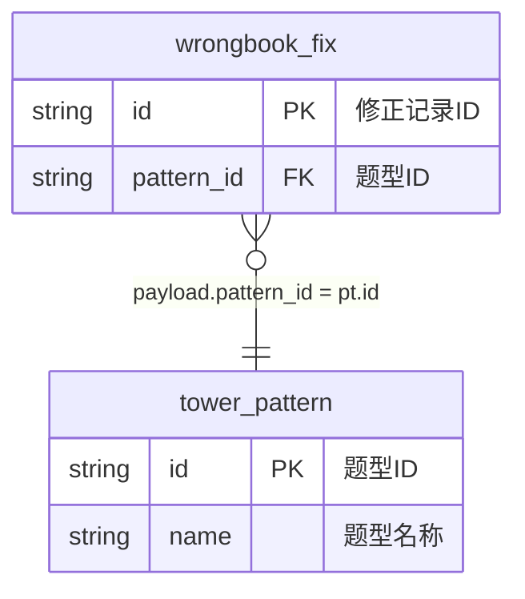

# Flink Task 架构总览

## 🏗️ 整体架构

基于你调整后的 `flink-sql-request-v3.md` 文件，当前架构已优化为：

### 核心组件

```
flink-task/
├── build-plugins/flink-ai-generator/    # Gradle 插件（支持传统和AI模式）
├── .cursor/rules/                       # AI 规则文件
├── job/                                 # 作业定义和模板
├── topics/                              # 生成的SQL输出
└── er-knowledge-base/                   # ER图知识库
```

## 📋 请求文件规范 (v3.0)

### YAML 结构化配置
基于你的 `flink-sql-request-v3.md`，标准格式为：

```yaml
job_info:
  name: "作业名称"
  domain: "业务域" 
  event_type: "事件类型"

field_mapping:
  id: "CAST(payload.id AS BIGINT)"
  business_field: "payload.business_field"
  computed_field: |
    CASE payload.enum_field
        WHEN 'VALUE1' THEN '显示1'
        WHEN 'VALUE2' THEN '显示2'
        ELSE ''
    END

join_relationships:
  source_to_dim:
    source_field: "payload.business_field"
    target_table: "dimension_table"
    join_type: "LEFT JOIN"
    additional_condition: "dim.is_delete = 0"
```

## 🔧 生成方式对比

### 1. 传统模式（当前可用）
```bash
# 基于固定解析规则
./gradlew generateWrongbookFlinkSql --info
```

**特点**：
- ✅ 稳定可靠，立即可用
- ✅ 解析 YAML 配置生成 SQL
- ❌ 依赖固定格式，灵活性有限

### 2. AI 模式（架构已就绪）
```bash
# 基于 AI Agent 智能生成
./gradlew aiWorkflow --info
```

**特点**：
- ✅ 完全 AI 驱动，支持自然语言
- ✅ 基于规则文件动态调整
- ⚠️ 需要配置大模型 API Key

## 📁 模板和规则体系

### 请求模板
- `job/flink-sql-request-template-v3.md` - 标准请求模板
- `job/ai-coding-templates/flink-sql-ai-template.md` - AI 生成指导模板

### 规则文件
- `.cursor/rules/intelligent-sql-job-generator.mdc` - AI SQL 生成规则
- 基于你的 v3 格式，支持 YAML 配置解析

### 实际示例
- `job/wrongbook/flink-sql-request-v3.md` - 错题本业务实例
- 包含完整的 YAML 配置和 ER 图定义

## 🎯 核心特性

### 1. YAML 驱动
```yaml
# 结构化配置，支持复杂表达式
field_mapping:
  subject_name: |
    CASE payload.subject
        WHEN 'ENGLISH' THEN '英语'
        WHEN 'MATH' THEN '数学'
        ELSE ''
    END
```

### 2. BusinessEvent 事件流
- 统一事件源：`BusinessEvent` 表
- 标准过滤：`domain = 'xxx' AND type = 'xxx_yyy'`
- Payload 解析：`payload.field` → `JSON_VALUE(be.payload, '$.field')`

### 3. 维表关联策略
- 自动添加：`FOR SYSTEM_TIME AS OF PROCTIME()`
- 支持过滤条件：`additional_condition`
- 智能 JOIN 顺序优化

### 4. ER 图驱动


## 🚀 使用方式

### 1. 创建作业请求
基于 `job/flink-sql-request-template-v3.md` 创建请求文件：

```yaml
job_info:
  name: "我的实时宽表"
  domain: "my_domain"
  event_type: "my_event"

field_mapping:
  id: "CAST(payload.id AS BIGINT)"
  # ... 更多字段映射
```

### 2. 生成 SQL
```bash
# 传统模式（推荐，稳定）
./gradlew generateFlinkSql -PrequestFile=job/my_domain/request-v3.md

# AI 模式（需要配置大模型）
export OPENAI_API_KEY="your-key"
./gradlew aiWorkflow -PrequestFile=job/my_domain/request-v3.md
```

### 3. 输出位置
- 传统模式：`build/flink-ai-output/sql/`
- AI 模式：`build/ai-output/sql/`

## 🔮 发展方向

### 短期目标
1. ✅ 完善 YAML 配置支持
2. ✅ 优化传统解析模式
3. 🔄 集成真实大模型 API

### 中期目标
1. Web 界面开发
2. 可视化 ER 图编辑
3. 实时预览和调试

### 长期目标
1. 多种大模型支持
2. 自然语言需求输入
3. 智能性能优化建议

## 📝 最佳实践

1. **使用 v3 格式**：采用 YAML 结构化配置
2. **遵循命名规范**：`{domain}_{event_type}` 格式
3. **完整 ER 图**：提供准确的表关系定义
4. **测试驱动**：先用传统模式验证，再尝试 AI 模式
5. **逐步迁移**：从简单场景开始，逐步复杂化

---

当前架构已经清理并优化，移除了过时文件，聚焦于你的 v3 格式标准。可以开始基于新的 YAML 配置格式进行 Flink SQL 作业开发了！
