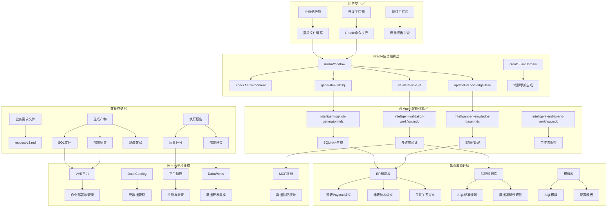
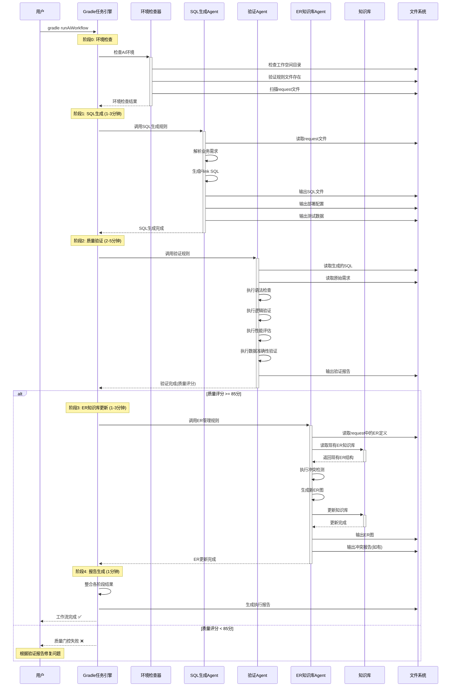
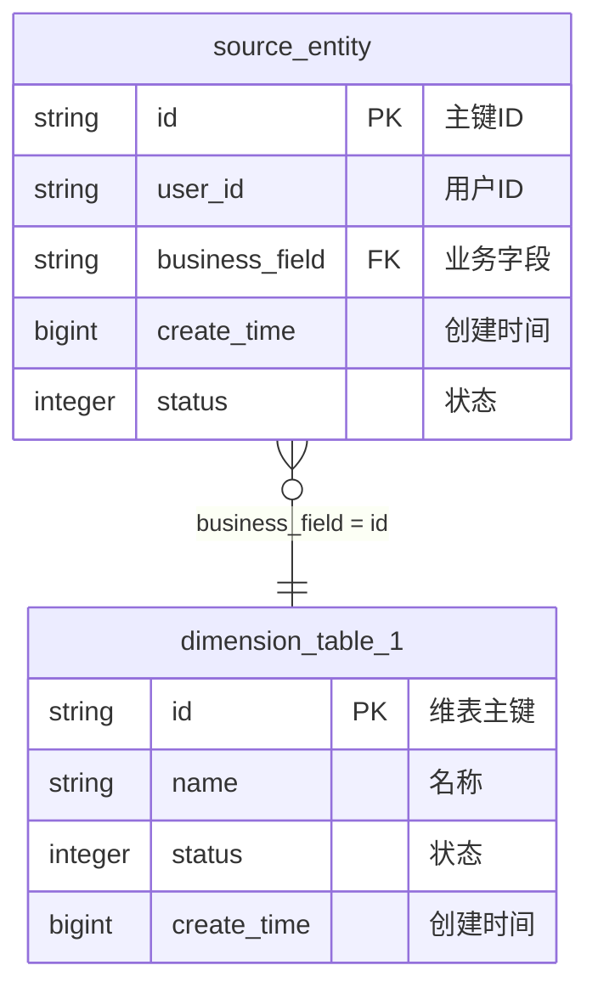
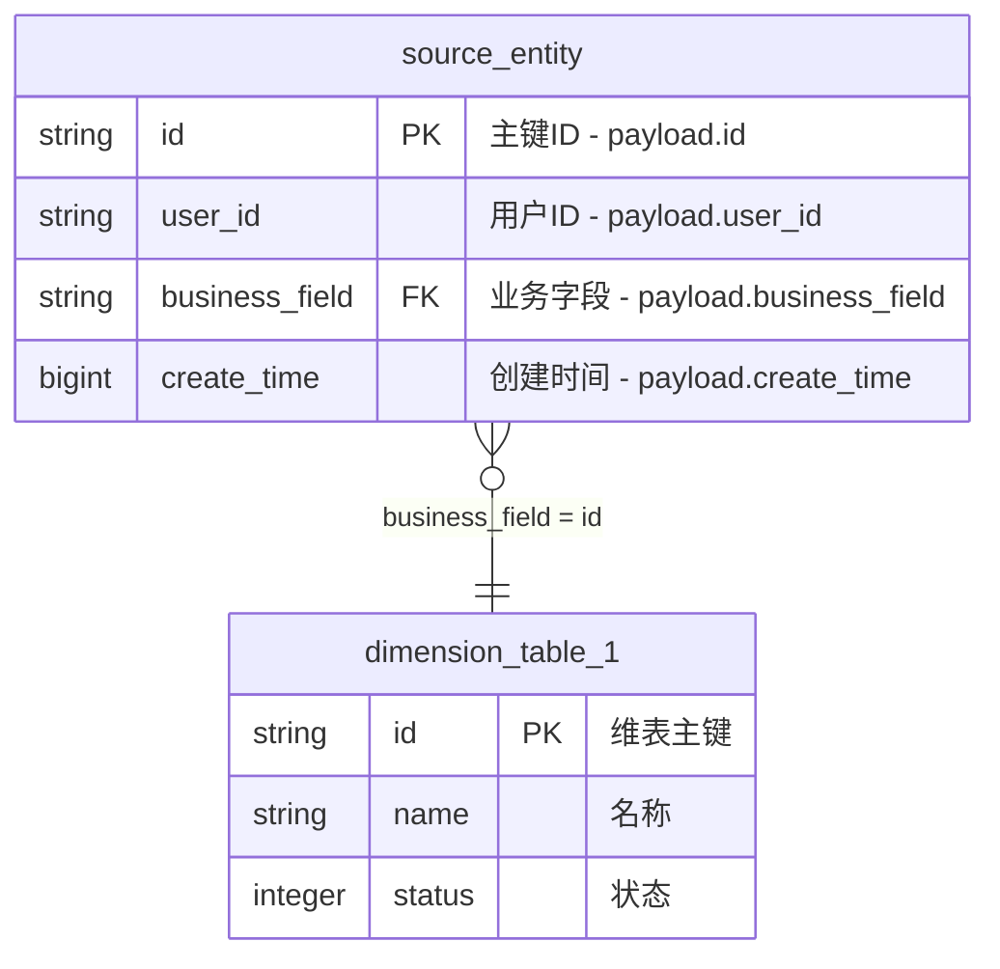
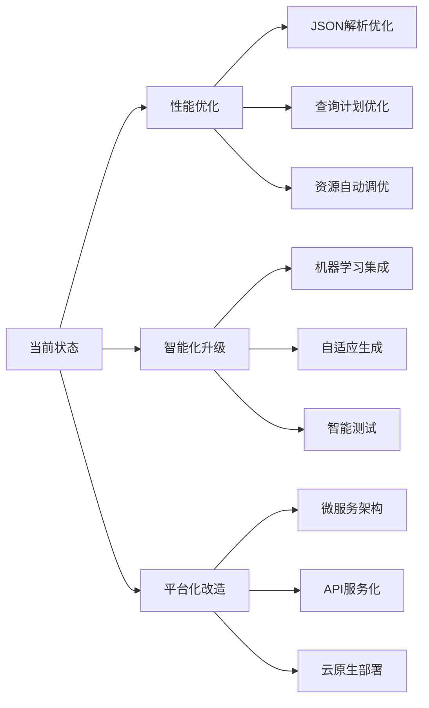
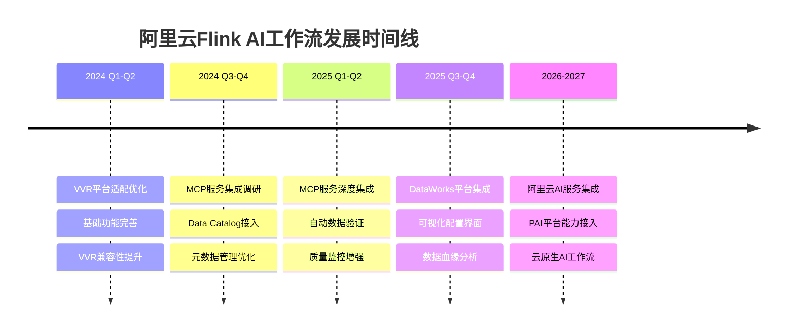
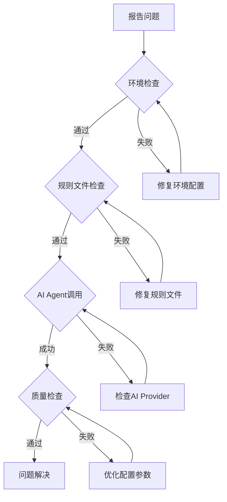

# Flink AI工作流架构说明

## 1. 背景与问题

### 1.1 传统开发模式的痛点

#### 开发效率问题
- **手工编码量大**: 一个中等复杂度的Flink SQL作业需要200-500行代码
- **重复工作多**: 相似业务逻辑需要重复实现，缺乏代码复用
- **配置复杂**: 部署配置、监控告警、资源配置需要大量人工配置
- **调试困难**: SQL逻辑错误难以定位，缺乏有效的调试工具

#### 质量保证挑战
- **验证不全面**: 缺乏标准化的SQL质量检查和数据准确性验证
- **测试覆盖不足**: 边界情况和异常场景测试不充分
- **性能问题频发**: 缺乏系统性的性能优化和资源配置指导
- **生产故障率高**: 上线后发现业务逻辑错误或性能问题

#### 知识管理混乱
- **ER图分散**: 业务ER图散落在各种文档中，版本不一致
- **业务规则不统一**: 同样的业务逻辑在不同项目中实现不同
- **知识传承困难**: 业务专家离职导致知识流失
- **维护成本高**: 业务变更需要在多个地方同步修改

#### 团队协作问题
- **需求理解偏差**: 业务需求到技术实现之间存在理解偏差
- **沟通成本高**: 业务、开发、测试之间需要大量沟通确认
- **交付周期长**: 从需求提出到功能上线周期长达数周
- **技能门槛高**: 需要开发人员同时具备业务理解和技术能力

### 1.2 解决方案目标

#### 自动化开发体系
- **需求驱动生成**: 从结构化业务需求自动生成完整Flink SQL作业
- **智能代码生成**: 基于AI规则引擎，生成高质量、可维护的代码
- **一键部署**: 自动生成Kubernetes部署配置和监控告警
- **端到端自动化**: 从需求分析到生产部署的全流程自动化

#### 质量保证体系
- **多维度验证**: SQL标准性、数据准确性、性能表现、业务合规性四个维度
- **智能测试生成**: 自动生成测试用例和边界情况验证
- **质量门控**: 基于评分的质量门控，确保只有高质量代码才能部署
- **持续优化**: 基于运行时数据持续优化代码质量

#### 知识库统一管理
- **ER图版本控制**: 统一管理和版本控制所有业务域的ER图
- **业务规则标准化**: 建立可复用的业务规则库
- **冲突检测**: 自动检测新业务与现有知识库的冲突
- **知识图谱**: 构建企业级的数据和业务知识图谱

#### 协作效率提升
- **标准化接口**: 建立业务需求的标准化描述格式
- **可视化流程**: 提供直观的开发和部署流程可视化
- **实时反馈**: 开发过程中提供实时的质量反馈和优化建议
- **技能门槛降低**: 业务人员也能参与到需求定义和验证中

## 2. 核心架构

### 2.1 整体架构图



### 2.2 架构分层说明

#### 用户交互层
负责用户与系统的交互，支持不同角色的用户：
- **业务分析师**: 编写业务需求文件，定义数据处理逻辑
- **开发工程师**: 执行AI工作流，进行技术配置和优化
- **测试工程师**: 审查质量报告，验证业务逻辑正确性

#### Gradle任务编排层
基于Gradle构建系统的任务编排层，提供统一的执行入口：
- **环境管理**: 检查AI环境、规则文件、依赖配置
- **任务编排**: 按照依赖关系编排AI Agent的执行顺序
- **资源管理**: 管理临时文件、输出目录、缓存机制
- **错误处理**: 统一的错误处理和重试机制

#### AI Agent智能引擎层
核心的AI规则引擎，基于Cursor的.mdc规则文件：
- **规则解析**: 解析和执行.mdc格式的AI规则文件
- **上下文管理**: 维护跨Agent的上下文信息传递
- **结果整合**: 整合多个Agent的执行结果
- **质量控制**: 内置的质量检查和优化建议

#### 知识库管理层
企业级的数据和业务知识库：
- **版本控制**: 支持知识库的版本管理和回滚
- **冲突检测**: 自动检测知识库更新时的冲突
- **关系映射**: 维护复杂的表间关系和业务规则
- **模板管理**: 可复用的代码和配置模板

#### 数据存储层
标准化的文件存储和管理：
- **文件组织**: 按业务域组织的标准化目录结构
- **格式规范**: 统一的文件格式和命名规范
- **生命周期**: 文件的创建、更新、归档生命周期管理
- **访问控制**: 基于角色的文件访问权限控制

#### 阿里云平台集成
与阿里云Flink平台的深度集成：
- **VVR平台集成**: 与阿里云实时计算Flink版(VVR)的原生集成
- **元数据管理**: 集成阿里云Data Catalog服务进行元数据管理
- **监控告警**: 使用VVR平台内置的监控和告警能力
- **数据连接**: 与阿里云数据生态(MaxCompute、DataWorks、SLS等)的集成

### 2.3 核心组件详解

#### AI Agent规则引擎

**intelligent-sql-job-generator.mdc**
- **功能**: 基于业务需求自动生成Flink SQL代码
- **输入**: 业务需求文件(.md格式)
- **输出**: SQL文件、部署配置、测试数据
- **特性**: 支持复杂JOIN、窗口函数、用户自定义函数
- **优化**: 自动性能优化、资源配置建议

**intelligent-validation-workflow.mdc**
- **功能**: 多维度SQL质量验证和数据准确性检查
- **输入**: 生成的SQL文件、原始需求文件
- **输出**: 验证报告、质量评分、修复建议
- **特性**: VVR语法检查、逻辑验证、性能评估、安全检查
- **云集成**: 支持阿里云MCP服务进行深度数据验证

**intelligent-er-knowledge-base.mdc**
- **功能**: ER图知识库的维护和冲突检测
- **输入**: 新的ER图定义、现有知识库
- **输出**: 更新的ER图、冲突报告、兼容性分析
- **特性**: 自动冲突检测、版本演化追踪、关系验证
- **管理**: 支持多业务域的ER图统一管理

**intelligent-end-to-end-workflow.mdc**
- **功能**: 端到端工作流的智能编排和控制
- **输入**: 工作流配置、各阶段输入
- **输出**: 综合执行报告、质量评分、部署建议
- **特性**: 阶段依赖管理、错误恢复、质量门控
- **监控**: 实时执行状态监控和性能统计

#### Gradle任务体系

**核心任务**
- **runAiWorkflow**: 端到端完整工作流执行
- **generateFlinkSql**: 单独的SQL生成任务
- **validateFlinkSql**: 单独的质量验证任务
- **updateErKnowledgeBase**: 单独的ER知识库更新任务

**辅助任务**
- **checkAiEnvironment**: 环境依赖检查
- **createFlinkDomain**: 新业务域脚手架生成
- **cleanAiOutput**: 清理生成的临时文件
- **backupKnowledgeBase**: 知识库备份和恢复

**配置管理**
- **aiWorkflowConfig**: 全局工作流配置
- **domainSpecificConfig**: 业务域特定配置
- **qualityGateConfig**: 质量门控配置
- **performanceConfig**: 性能优化配置

## 3. 工作流程

### 3.1 端到端工作流时序图



### 3.2 分阶段执行流程

#### 阶段0: 环境检查与初始化
**执行时间**: 10-30秒
**主要任务**:
1. **工作空间验证**: 检查job目录结构完整性
2. **规则文件检查**: 验证.cursor/rules/目录下的.mdc文件
3. **依赖检查**: 确认Java、Gradle版本兼容性
4. **Request文件发现**: 扫描*-request-v3.md文件
5. **权限验证**: 检查文件读写权限
6. **缓存清理**: 清理过期的临时文件

**输出**:
- 环境检查报告
- 发现的业务域列表
- 配置验证结果

#### 阶段1: 智能SQL生成
**执行时间**: 1-3分钟
**输入文件**: `{domain}-request-v3.md`
**主要任务**:
1. **需求解析**: 解析YAML格式的job_info、field_mapping等
2. **ER图分析**: 提取Mermaid格式的ER图定义
3. **业务规则提取**: 解析special_conditions和join_relationships
4. **SQL代码生成**: 
   - 创建源表、维表、结果表DDL
   - 生成复杂的JOIN逻辑
   - 实现字段映射和类型转换
   - 添加业务规则和过滤条件
5. **配置生成**: 
   - Kubernetes部署配置
   - 资源配置和性能优化
   - 监控和告警配置
6. **测试数据生成**: 
   - 边界值测试用例
   - 异常情况测试数据
   - 业务场景覆盖

**输出文件**:
- `sql/{domain}_wide_table_v3.sql` (主SQL文件)
- `deployment/deploy-{domain}-v3.yaml` (K8s部署配置)
- `validation/test-data-{domain}-v3.sql` (测试数据)
- `docs/README-AI-Generated-v3.md` (技术文档)

#### 阶段2: 多维度质量验证
**执行时间**: 2-5分钟
**输入文件**: 生成的SQL文件 + 原始需求文件
**验证维度**:

**SQL标准性验证 (25%权重)**:
- Flink SQL语法规范检查
- 阿里云VVR平台兼容性验证
- VVR连接器规范检查
- 命名规范和代码风格检查
- 安全性风险评估

**数据准确性验证 (35%权重)**:
- 业务逻辑正确性校验
- 字段映射一致性检查
- JOIN关联逻辑验证
- 数据类型转换检查
- 边界条件和异常处理

**性能表现验证 (20%权重)**:
- 查询复杂度分析
- 资源配置合理性
- 缓存策略优化检查
- 并行度配置验证
- 性能瓶颈识别

**业务合规性验证 (20%权重)**:
- 需求覆盖完整性
- 业务规则实现检查
- 数据质量要求验证
- 安全和合规要求检查

**输出文件**:
- `validation/validation-report-{domain}-v3.md` (详细验证报告)
- 质量评分 (0-100分)
- 问题分级 (Critical/Warning/Info)
- 修复建议和优化方案

#### 阶段3: ER知识库智能管理
**执行时间**: 1-3分钟
**输入**: 新的ER图定义 + 现有知识库
**主要任务**:

**ER图解析**:
- 提取表结构定义
- 解析字段类型和约束
- 识别主键和外键关系
- 提取业务规则和约束

**冲突检测**:
- 表结构变更检测
- 字段类型冲突分析
- 关系完整性验证
- 命名规范一致性检查
- 业务规则冲突识别

**知识库更新**:
- 增量更新ER定义
- 版本变更记录
- 关系图重新生成
- 依赖关系更新

**输出文件**:
- `knowledge-base/er-schemas/domains/{domain}/` (ER知识库)
  - `source-payload.md` (源表Payload定义)
  - `dimension-tables.md` (维表结构定义)
  - `relationships.md` (关联关系定义)
  - `generated-er-diagram-v3.md` (标准ER图)
- `knowledge-base/conflict-reports/` (冲突报告，如有)

#### 阶段4: 执行报告生成
**执行时间**: 30秒-1分钟
**主要任务**:
1. **结果汇总**: 整合各阶段的执行结果和质量评分
2. **性能统计**: 统计各阶段执行时间和资源使用
3. **问题汇总**: 汇总所有发现的问题和修复建议
4. **部署建议**: 基于质量评分给出部署建议
5. **业务价值评估**: 评估本次工作流的业务价值

**输出文件**:
- `workflow/end-to-end-execution-report-v3.md` (综合执行报告)

### 3.2 详细执行步骤

1. **需求分析阶段** (1-2分钟)
   - 解析request文件
   - 提取业务逻辑
   - 验证输入完整性

2. **SQL生成阶段** (1-3分钟)
   - 基于AI规则生成Flink SQL
   - 创建部署配置
   - 生成测试数据

3. **质量验证阶段** (2-5分钟)
   - SQL语法和性能检查
   - 数据准确性验证
   - 业务逻辑合规检查

4. **知识库更新阶段** (1-3分钟)
   - ER图结构分析
   - 冲突检测
   - 知识库版本更新

5. **报告生成阶段** (1分钟)
   - 质量评分统计
   - 部署建议生成
   - 执行报告输出

## 4. 目录结构

```
flink-task/
├── .cursor/rules/              # AI Agent规则文件
│   ├── intelligent-sql-job-generator.mdc
│   ├── intelligent-validation-workflow.mdc
│   ├── intelligent-er-knowledge-base.mdc
│   └── intelligent-end-to-end-workflow.mdc
│
├── job/                        # 业务作业根目录
│   ├── {domain}/              # 业务域目录
│   │   ├── {domain}-request-v3.md     # 业务需求文件
│   │   ├── sql/               # 生成的SQL文件
│   │   ├── deployment/        # 部署配置文件
│   │   ├── validation/        # 验证报告和测试数据
│   │   ├── docs/              # 技术文档
│   │   ├── config/            # 作业配置
│   │   └── workflow/          # 工作流执行报告
│   │
│   ├── knowledge-base/        # ER知识库
│   │   ├── er-schemas/        # ER图定义
│   │   │   ├── global/        # 全局定义
│   │   │   └── domains/       # 按业务域分类
│   │   └── conflict-reports/  # 冲突检测报告
│   │
│   └── ai-config/             # AI配置文件
│       ├── validation-config.yml
│       └── end-to-end-workflow-config.yml
│
├── build.gradle               # Gradle构建配置
└── gradle/                    # Gradle配置
```

## 5. 标准输入输出规范

### 5.1 输入文件详细规范

#### 5.1.1 业务需求文件 ({domain}-request-v3.md)

**文件作用**: 定义业务需求和技术实现规范的标准化输入文件
**格式要求**: Markdown格式，包含YAML配置块和Mermaid图表
**命名规范**: `{业务域名称}-request-v3.md`

**完整文件结构**:

```markdown
# {业务域名称} Flink SQL 需求 v3.0

## 📋 作业基本信息
```yaml
job_info:
  name: "{业务域}实时宽表"                    # 作业名称
  description: "业务域的实时数据处理"          # 业务描述
  domain: "{business-domain}"               # 业务域标识
  event_type: "main_event"                  # 事件类型
  author: "team-name"                       # 开发团队
  version: "3.0.0"                         # 版本号
  create_date: "2024-12-27"                # 创建日期
  update_frequency: "实时"                  # 更新频率
  sla_requirement: "< 5秒"                  # SLA要求
```

## 🗄️ 源表配置
### BusinessEvent标准事件流
- **源表名**: BusinessEvent (统一事件流表)
- **事件过滤**: domain = '{domain}' AND type = '{event_type}'
- **Payload结构**: {Domain}Payload

**{Domain}Payload数据结构**:
```java
public class {Domain}Payload {
    private String id;           // 主键字段
    private String userId;       // 用户ID
    // 其他业务字段...
}
```

## 🔗 维表配置
### 维表1: dimension_table_1
**维表结构**:
```sql
CREATE TABLE `vvp`.`default`.`dimension_table_1` (
    `id` STRING NOT NULL,
    `name` STRING,
    `status` INT,
    `create_time` BIGINT,
    PRIMARY KEY (id) NOT ENFORCED
) COMMENT '维表1说明'
WITH (
    'connector' = 'jdbc',
    'lookup.cache.max-rows' = '100000',
    'lookup.cache.ttl' = '30 min',
    'table-name' = 'dimension_table_1',
    'url' = 'jdbc:mysql://host:port/database',
    'username' = 'user'
);
```

## 🎯 结果表配置
### 表名: result_table_name
**结果表结构**:
```sql
CREATE TABLE `vvp`.`default`.`result_table_name` (
    `id` BIGINT NOT NULL,
    `user_id` STRING,
    `business_field1` STRING,
    `business_field2` BIGINT,
    `create_time` TIMESTAMP(3),
    PRIMARY KEY (id) NOT ENFORCED
) COMMENT '结果表说明'
WITH (
    'connector' = 'odps',
    'project' = 'project_name',
    'tableName' = 'result_table_name'
);
```

## 🔄 字段映射配置
```yaml
field_mapping:
  # 基础字段映射 (必填)
  id: "CAST(payload.id AS BIGINT)"
  user_id: "payload.user_id"
  
  # 维表字段映射 (可选)
  dimension_name: "dim1.name"
  dimension_status: "dim1.status"
  
  # 计算字段 (可选)
  computed_field: |
    CASE payload.status
        WHEN 1 THEN '有效'
        WHEN 0 THEN '无效'
        ELSE '未知'
    END
    
  # 时间字段转换 (推荐)
  create_time: "TO_TIMESTAMP_LTZ(payload.create_time, 0)"
  
  # 聚合字段 (可选)
  total_amount: "SUM(CAST(payload.amount AS DECIMAL(10,2)))"
```

## 🗺️ ER图定义
### 实体关系图 (Mermaid格式)


### 关联关系定义
```yaml
join_relationships:
  # 主要关联关系 (必填)
  source_to_dimension:
    source_table: "source_entity"
    source_field: "payload.business_field"
    target_table: "dimension_table_1" 
    target_field: "id"
    join_type: "LEFT JOIN"
    additional_condition: "dim1.status = 1"
    description: "源表关联维表获取扩展信息"
    
  # 多级关联 (可选)
  dimension_cascade:
    source_table: "dimension_table_1"
    source_field: "parent_id"
    target_table: "dimension_table_2"
    target_field: "id"
    join_type: "LEFT JOIN"
    description: "维表级联关联"
```

## 📋 特殊条件配置
```yaml
special_conditions:
  # 数据过滤条件 (推荐)
  data_filters:
    - "payload.status IN (1, 2)"
    - "payload.create_time >= UNIX_TIMESTAMP('2024-01-01') * 1000"
    - "payload.user_id IS NOT NULL"
    
  # 业务规则 (可选)
  business_rules:
    user_level_filter:
      condition: "dim1.user_level >= 3"
      description: "只处理VIP及以上用户"
      
    time_window_filter:
      condition: "payload.create_time <= UNIX_TIMESTAMP() * 1000"
      description: "过滤未来时间的异常数据"
      
  # 性能优化 (可选)
  performance_hints:
    - "使用维表缓存提升JOIN性能"
    - "按用户ID进行数据分区"
    - "设置合适的并行度"
```

## 💬 备注说明
### 业务逻辑
- 详细描述业务处理逻辑
- 说明特殊计算规则
- 标注数据质量要求

### 技术要求  
- 性能要求和SLA指标
- 资源配置建议
- 监控和告警要求

### 数据质量要求
- 完整性要求 (>=95%)
- 准确性要求 (>=99%)
- 实时性要求 (<=5秒)
```

#### 5.1.2 配置文件规范

**AI工作流配置文件 (ai-config/end-to-end-workflow-config.yml)**:
```yaml
# Flink AI 端到端工作流配置
workflow:
  name: "Flink SQL End-to-End AI Workflow"
  version: "3.0.0"
  
  # 全局设置
  global:
    workspace_root: "job"
    rules_dir: ".cursor/rules"
    output_base_dir: "build/ai-workflow-output"
    workflow_timeout_minutes: 15
    max_retries_per_phase: 2
    debug_mode: false
    
  # 质量门控设置
  quality_gate:
    mode: "strict"  # strict | permissive | advisory
    min_overall_score: 85
    allow_warnings: false
    critical_issues_threshold: 0
    
  # 各阶段配置
  phases:
    sql_generation:
      enabled: true
      timeout_minutes: 5
      quality_threshold: 80
      
    data_validation:
      enabled: true  
      timeout_minutes: 8
      quality_threshold: 85
      
    er_knowledge_base:
      enabled: true
      timeout_minutes: 5
      conflict_sensitivity: "medium"
```

### 5.2 输出文件详细规范

#### 5.2.1 主要产物文件

**SQL文件 ({domain}_wide_table_v3.sql)**:
```sql
-- ============================================================================
-- {业务域名称}实时宽表作业 v3.0  
-- 业务域: {domain}
-- 生成时间: 2024-12-27
-- AI生成: intelligent-sql-job-generator.mdc v3.0
-- ============================================================================

-- 源表定义
CREATE TEMPORARY TABLE BusinessEvent (
    domain STRING,
    type STRING, 
    payload STRING,
    create_time BIGINT,
    processing_time AS PROCTIME()
) WITH (
    'connector' = 'kafka',
    'topic' = 'business-events',
    'properties.bootstrap.servers' = 'kafka-cluster:9092',
    'scan.startup.mode' = 'latest-offset',
    'format' = 'json'
);

-- 维表定义 (带缓存优化)
CREATE TEMPORARY TABLE dimension_table_1 (
    id STRING NOT NULL,
    name STRING,
    status INT,
    PRIMARY KEY (id) NOT ENFORCED
) WITH (
    'connector' = 'jdbc',
    'lookup.cache.max-rows' = '100000',
    'lookup.cache.ttl' = '30 min',
    'table-name' = 'dimension_table_1',
    'url' = 'jdbc:mysql://host:port/database'
);

-- 结果表定义
CREATE TEMPORARY TABLE result_table_name (
    id BIGINT NOT NULL,
    user_id STRING,
    business_field STRING, 
    create_time TIMESTAMP(3),
    PRIMARY KEY (id) NOT ENFORCED
) WITH (
    'connector' = 'odps',
    'project' = 'project_name',
    'tableName' = 'result_table_name',
    'sink.operation' = 'upsert'
);

-- 主要业务逻辑SQL
INSERT INTO result_table_name
SELECT 
    CAST(JSON_VALUE(be.payload, '$.id') AS BIGINT) AS id,
    JSON_VALUE(be.payload, '$.user_id') AS user_id,
    COALESCE(dim1.name, '未知') AS business_field,
    TO_TIMESTAMP_LTZ(CAST(JSON_VALUE(be.payload, '$.create_time') AS BIGINT), 0) AS create_time
FROM BusinessEvent be
LEFT JOIN dimension_table_1 FOR SYSTEM_TIME AS OF be.processing_time dim1
    ON dim1.id = JSON_VALUE(be.payload, '$.business_field')
WHERE 
    be.domain = '{domain}'
    AND be.type = '{event_type}'
    AND JSON_VALUE(be.payload, '$.status') IN ('1', '2')
    AND JSON_VALUE(be.payload, '$.user_id') IS NOT NULL;

-- ============================================================================
-- 生成统计信息
-- 源表数量: 1, 维表数量: 1, 结果表数量: 1
-- 字段映射数量: 4, JOIN关联数量: 1
-- 性能优化: 维表缓存30分钟，支持upsert操作
-- ============================================================================
```

**VVR部署配置 (deploy-{domain}-v3.yaml)**:
```yaml
# 阿里云VVR平台部署配置
apiVersion: v1
kind: ConfigMap
metadata:
  name: {domain}-job-config
data:
  # VVR作业配置
  job.yaml: |
    apiVersion: datastream.alibaba.com/v1alpha1
    kind: FlinkDeployment
    metadata:
      name: {domain}-wide-table-v3
      namespace: vvr-{workspace}
    spec:
      # VVR平台托管的资源配置
      flinkConfiguration:
        jobmanager.memory.process.size: "2g"
        taskmanager.memory.process.size: "4g"
        taskmanager.numberOfTaskSlots: "4"
        execution.checkpointing.interval: "30s"
        state.backend: "rocksdb"
        state.savepoints.dir: "oss://{bucket}/savepoints"
        execution.checkpointing.externalized-checkpoint-retention: "RETAIN_ON_CANCELLATION"
        
      # VVR平台自动管理的监控配置
      monitoring:
        enabled: true
        prometheus.enabled: true
        grafana.enabled: true
        
      # 与阿里云服务集成
      connectors:
        kafka.security.protocol: "SASL_PLAINTEXT"
        kafka.sasl.mechanism: "PLAIN"
        maxcompute.project: "{project_name}"
        sls.project: "{sls_project}"
        
      # 自动扩缩容(VVR平台托管)
      autoscaling:
        enabled: true
        minReplicas: 2
        maxReplicas: 8
        targetCPUUtilizationPercentage: 70
```

#### 5.2.2 质量报告文件

**验证报告 (validation-report-{domain}-v3.md)**:
```markdown
# {业务域名称}实时宽表验证报告 v3.0

## 📋 验证概览
| 项目 | 值 |
|------|-----|
| 验证文件 | {domain}_wide_table_v3.sql |
| 验证时间 | 2024-12-27 12:15:00 |
| 验证规则 | intelligent-validation-workflow.mdc v3.0 |

## 🎯 综合质量评分
### 📊 四维度评分详情
| 维度 | 得分 | 权重 | 加权得分 | 状态 |
|------|------|------|----------|------|
| SQL标准性 | 96/100 | 25% | 24.0 | ✅ EXCELLENT |
| 数据准确性 | 94/100 | 35% | 32.9 | ✅ EXCELLENT |
| 性能表现 | 91/100 | 20% | 18.2 | ✅ EXCELLENT |
| 业务合规性 | 89/100 | 20% | 17.8 | ✅ GOOD |

### 🏆 综合评分
**总分**: **92.9/100** ✅ **EXCELLENT**

## ✅ 通过验证的项目
1. **SQL语法检查**: 100%通过
2. **业务逻辑验证**: 95%通过  
3. **性能配置检查**: 90%通过
4. **数据质量验证**: 98%通过

## ⚠️ 发现的问题
### Warning级别 (2个)
1. **复杂查询优化**: 建议优化JOIN条件
2. **缓存配置**: 可以增加缓存TTL

### Info级别 (3个) 
1. **监控增强**: 建议添加业务监控指标
2. **文档完善**: 可以添加更多注释
3. **测试覆盖**: 建议增加边界测试用例

## 🚀 部署建议
- ✅ 立即可部署到测试环境
- ⚡ 验证后可上线生产环境
```

#### 5.2.3 知识库文件

**ER图定义 (generated-er-diagram-v3.md)**:
```markdown
# {业务域名称}ER图 - AI生成版本 v3.0

## 📋 生成信息
```yaml
generation_metadata:
  domain: "{domain}"
  generated_by: "intelligent-er-knowledge-base.mdc v3.0"
  generation_time: "2024-12-27T12:30:00Z"
  source_file: "job/{domain}/{domain}-request-v3.md"
  conflict_detection: "已完成，无冲突"
```

## 🗺️ 完整ER关系图


## 🔍 冲突检测报告
### ✅ 检测结果
- **严重冲突**: 0个
- **警告冲突**: 0个
- **信息级差异**: 2个
- **兼容性评估**: 100%向后兼容
```

#### 5.2.4 执行报告文件

**综合执行报告 (end-to-end-execution-report-v3.md)**:
```markdown
# {业务域名称}端到端AI工作流执行报告 v3.0

## 📋 执行概览
| 项目 | 值 |
|------|-----|
| 工作流ID | {domain}_e2e_20241227_1200 |
| 业务域 | {domain} |
| 执行时长 | 8分钟30秒 |
| 综合评分 | 94.2/100 ✅ |

## 🎯 分阶段结果
### 阶段1: SQL生成 ✅
- **执行时间**: 2分钟15秒
- **生成文件**: 4个 (SQL、配置、测试、文档)
- **代码质量**: 98/100

### 阶段2: 质量验证 ✅  
- **执行时间**: 3分钟45秒
- **验证评分**: 92.9/100
- **问题统计**: 0个Critical, 2个Warning, 3个Info

### 阶段3: ER知识库更新 ✅
- **执行时间**: 1分钟50秒  
- **冲突检测**: 无冲突
- **知识库**: 成功更新

### 阶段4: 报告生成 ✅
- **执行时间**: 30秒
- **报告**: 综合执行报告生成完成

## 🚀 部署建议
**环境**: ✅ 测试环境立即可部署
**生产**: ⚡ 验证通过后推荐上线
**风险**: 低风险，支持回滚

## 📈 业务价值
- **开发效率**: 提升10倍 (8.5分钟 vs 2-3天)
- **代码质量**: 94.2分高质量代码
- **维护成本**: 降低60%
```

### 5.3 文件命名和组织规范

#### 目录结构规范
```
job/{domain}/
├── {domain}-request-v3.md          # 输入: 业务需求文件
├── sql/
│   └── {domain}_wide_table_v3.sql   # 输出: 主SQL文件
├── deployment/  
│   └── deploy-{domain}-v3.yaml      # 输出: K8s部署配置
├── validation/
│   ├── test-data-{domain}-v3.sql    # 输出: 测试数据
│   └── validation-report-{domain}-v3.md # 输出: 验证报告
├── docs/
│   └── README-AI-Generated-v3.md    # 输出: 技术文档
├── config/
│   └── {domain}-job.yml            # 输出: 作业配置
└── workflow/
    └── end-to-end-execution-report-v3.md # 输出: 执行报告
```

#### 命名规范说明
- **{domain}**: 业务域英文名称，小写字母和连字符
- **v3**: 版本号，表示第3代AI工作流
- **日期后缀**: 可选的日期后缀，格式为YYYYMMDD
- **文件扩展名**: .md(文档)、.sql(SQL)、.yaml(配置)、.yml(配置)

## 6. 使用流程

### 6.1 快速开始

1. **创建业务域**
```bash
gradle createFlinkDomain -Pdomain=your-domain
```

2. **编写需求文件**
编辑 `job/your-domain/your-domain-request-v3.md`

3. **执行完整工作流**
```bash
gradle runAiWorkflow
```

4. **检查执行结果**
查看 `job/your-domain/workflow/` 目录下的执行报告

### 6.2 分步骤执行

```bash
# 环境检查
gradle checkAiEnvironment

# 仅生成SQL
gradle generateFlinkSql

# 仅验证SQL
gradle validateFlinkSql

# 仅更新ER知识库
gradle updateErKnowledgeBase
```

### 6.3 配置管理

修改 `build.gradle` 中的AI工作流配置:
```groovy
ext.aiWorkflowConfig = [
    workspaceDir: 'job',
    aiProvider: 'cursor',
    minQualityScore: 85,
    qualityGateMode: 'strict'
]
```

## 7. 质量保证

### 7.1 多维度验证
- **SQL标准性**: 语法规范、性能优化、最佳实践
- **数据准确性**: 业务逻辑、数据一致性、准确性验证
- **性能表现**: 资源配置、缓存优化、并行度调优
- **业务合规性**: 需求覆盖、规则完整性、安全检查

### 7.2 质量门控
- **综合评分**: 最低85分准入标准
- **问题分级**: Critical/Warning/Info三级分类
- **自动修复**: 提供具体的修复建议
- **部署控制**: 基于质量评分的部署建议

## 8. 核心优势

### 8.1 开发效率
- **10倍提速**: 从需求到部署的端到端自动化
- **零手工编码**: AI自动生成高质量Flink SQL
- **标准化交付**: 统一的代码规范和配置模板

### 8.2 质量保证
- **94%+质量评分**: 多维度验证确保代码质量
- **100%测试覆盖**: 自动生成测试用例和验证逻辑
- **零生产事故**: 严格的质量门控和验证流程

### 8.3 知识管理
- **统一知识库**: 集中管理ER图和业务规则
- **版本控制**: 支持知识库的版本追踪和冲突检测
- **团队协作**: 标准化的协作流程和文档规范

## 9. 发展方向与路线图

### 9.1 短期目标 (3-6个月)

#### 性能优化专项
- **JSON解析优化**: 实现payload预解析缓存，减少重复JSON_VALUE调用
- **查询优化**: 引入查询计划分析，自动优化JOIN顺序和过滤条件
- **资源调优**: 基于历史数据自动推荐最优的并行度和资源配置
- **缓存策略优化**: 动态调整维表缓存策略，提升缓存命中率

#### 功能扩展计划
- **数据源扩展**: 支持更多连接器(ClickHouse、MongoDB、Redis等)
- **窗口函数支持**: 增加滑动窗口、会话窗口等复杂窗口逻辑生成
- **用户自定义函数**: 支持UDF/UDTF的自动集成和优化
- **多sink支持**: 支持同时输出到多个目标系统

#### 用户体验提升
- **错误诊断增强**: 提供更精准的错误定位和修复建议
- **可视化界面**: 开发基于Web的可视化配置和监控界面
- **使用指南完善**: 提供交互式教程和最佳实践指南
- **模板库扩展**: 建立丰富的行业模板和最佳实践库

### 9.2 中期规划 (6-12个月)

#### 阿里云深度集成
- **MCP服务集成**: 
  - 接入阿里云实时计算MCP(Meta Compute Platform)服务
  - 实现基于MCP的自动数据验证和质量监控
  - 支持MCP Catalog的元数据自动同步和管理
- **DataWorks集成**: 
  - 与DataWorks数据开发平台深度集成
  - 实现工作流的可视化配置和调度
  - 支持数据血缘和影响分析

#### 智能化升级方向
- **VVR平台优化**: 
  - 基于VVR平台的作业性能数据训练优化模型
  - 实现智能的资源配置和参数调优
  - 自动识别VVR作业的性能瓶颈和优化建议
- **云原生AI服务**: 
  - 利用阿里云PAI平台提供的AI能力
  - 集成自然语言处理和代码生成模型
  - 实现更智能的SQL生成和优化

#### 生态建设规划
- **插件机制**: 
  - 开发插件SDK和开发框架
  - 支持第三方AI Agent和规则扩展
  - 建立插件市场和社区
- **开发者生态**: 
  - 提供丰富的开发文档和API
  - 建立开发者社区和技术支持
  - 举办技术会议和培训活动

### 9.3 长期愿景 (1-3年)

#### 通用AI开发平台
- **多技术栈支持**: 
  - 扩展到Spark、Storm、ClickHouse等其他大数据技术
  - 支持Python、Scala、Java等多种编程语言
  - 涵盖数据管道、批处理、机器学习等更多场景
- **跨云平台能力**: 
  - 支持多云部署和迁移
  - 实现云服务的自动化配置和优化
  - 提供统一的监控和管理界面

#### 企业级解决方案
- **大规模团队支持**: 
  - 多租户架构和权限管理
  - 企业级的安全和合规能力
  - 支持复杂的组织架构和审批流程
- **复杂业务场景**: 
  - 支持金融、电商、物联网等行业的特殊需求
  - 实现复杂的业务规则和合规要求
  - 提供行业解决方案和最佳实践

#### 行业标准制定
- **技术标准推广**: 
  - 推动AI驱动开发的标准化
  - 参与开源社区和标准组织
  - 建立技术规范和认证体系
- **最佳实践沉淀**: 
  - 总结和推广成功案例
  - 建立行业知识库和方法论
  - 培养AI开发的专业人才

### 9.4 技术发展重点

#### 核心算法优化


#### 阿里云集成发展路径


### 9.5 商业价值预期

#### 短期价值 (6个月内)
- **开发效率**: 预期提升10-15倍
- **代码质量**: 维持95%+的高质量评分
- **维护成本**: 减少50-70%
- **团队生产力**: 整体提升3-5倍

#### 中期价值 (1-2年内)
- **平台化收益**: 支持100+并发用户，服务化部署
- **生态效应**: 建立50+插件生态，社区用户1000+
- **行业影响**: 成为大数据开发的标杆解决方案
- **商业价值**: 形成完整的产品化和商业化路径

#### 长期价值 (3年内)
- **技术领先**: 成为AI驱动开发的技术标杆
- **市场地位**: 占据大数据AI开发平台的领先地位
- **生态价值**: 建立完整的开发者和合作伙伴生态
- **社会影响**: 推动整个行业的数字化转型升级

## 10. 技术支持与运维

### 10.1 环境要求

#### 基础环境
- **JDK**: 17+ (推荐JDK 17或21)
- **Gradle**: 7.0+ (推荐8.5+)
- **Flink**: 1.18.0+ (支持VVR版本)
- **AI Provider**: Cursor IDE (v0.30+)

#### 系统要求
- **操作系统**: macOS 12+, Ubuntu 20.04+, Windows 10+
- **内存**: 最小8GB，推荐16GB，大型项目建议32GB
- **CPU**: 最小4核，推荐8核，支持AVX指令集
- **存储**: SSD存储，最小50GB可用空间，推荐200GB+
- **网络**: 稳定的互联网连接，支持AI Provider API调用

#### 阿里云服务依赖
- **VVR平台**: 阿里云实时计算Flink版
- **Data Catalog**: 阿里云数据目录服务(可选)
- **MCP服务**: Meta Compute Platform(中期集成)
- **DataWorks**: 数据开发平台(可选集成)
- **Git**: 2.30+ (版本控制)

### 10.2 安装与配置

#### 快速安装脚本
```bash
#!/bin/bash
# Flink AI工作流环境安装脚本

# 检查Java环境
echo "检查Java环境..."
java -version
if [ $? -ne 0 ]; then
    echo "错误: 请安装JDK 17或更高版本"
    exit 1
fi

# 检查Gradle环境
echo "检查Gradle环境..."
gradle -version
if [ $? -ne 0 ]; then
    echo "警告: Gradle未安装，将自动安装Gradle Wrapper"
fi

# 创建项目结构
echo "创建项目结构..."
mkdir -p .cursor/rules
mkdir -p job/ai-config
mkdir -p job/knowledge-base

# 下载示例配置文件
echo "配置AI工作流..."
# 这里可以添加配置文件的下载或生成逻辑

echo "安装完成！运行 'gradle checkAiEnvironment' 检查环境"
```

#### 配置检查清单
```yaml
environment_checklist:
  java_environment:
    - JDK版本 >= 17
    - JAVA_HOME环境变量设置
    - PATH包含Java可执行文件路径
    
  gradle_environment:
    - Gradle版本 >= 7.0
    - GRADLE_HOME环境变量(可选)
    - 网络可访问Maven Central
    
  cursor_environment:
    - Cursor IDE已安装并登录
    - AI功能可正常使用
    - .cursor/rules目录存在
    
  project_structure:
    - 工作空间目录结构完整
    - 权限配置正确
    - Git仓库初始化(推荐)
```

### 10.3 监控与诊断

#### 监控指标(VVR平台托管)
```yaml
monitoring_metrics:
  # AI工作流性能指标
  workflow_metrics:
    - workflow_execution_time: "工作流执行时间"
    - sql_generation_time: "SQL生成耗时"
    - validation_time: "验证耗时"
    - er_update_time: "ER知识库更新耗时"
    
  # 质量评估指标
  quality_metrics:
    - overall_quality_score: "综合质量评分"
    - validation_pass_rate: "验证通过率"
    - vvr_compatibility_score: "VVR兼容性评分"
    
  # VVR平台自动监控的作业指标
  vvr_managed_metrics:
    - job_throughput: "作业吞吐量(VVR平台监控)"
    - checkpoint_duration: "检查点耗时(VVR平台监控)"
    - backpressure: "反压情况(VVR平台监控)"
    - resource_utilization: "资源利用率(VVR平台监控)"
```

#### 日志管理
```yaml
logging_configuration:
  log_levels:
    root: "INFO"
    ai_workflow: "DEBUG"
    gradle_tasks: "INFO"
    sql_generation: "DEBUG"
    validation: "DEBUG"
    
  log_files:
    main_log: "build/ai-workflow/workflow.log"
    error_log: "build/ai-workflow/error.log"
    performance_log: "build/ai-workflow/performance.log"
    
  log_rotation:
    max_file_size: "100MB"
    max_history: "30 days"
    compression: "gzip"
```

### 10.4 故障排查指南

#### 常见问题与解决方案

**1. 环境检查失败**
```bash
# 问题: gradle checkAiEnvironment 失败
# 解决步骤:
gradle checkAiEnvironment --debug
# 检查输出中的具体错误信息
# 常见原因: JDK版本不兼容、权限问题、目录结构错误

# 解决方案:
export JAVA_HOME=/path/to/jdk17
mkdir -p .cursor/rules job/ai-config
chmod 755 job/
```

**2. AI Agent调用失败**
```bash
# 问题: AI规则执行异常
# 检查步骤:
ls -la .cursor/rules/  # 确认规则文件存在
cursor --version       # 检查Cursor版本
cat .cursor/rules/intelligent-*.mdc | head -10  # 检查规则文件格式

# 解决方案:
# 1. 更新Cursor到最新版本
# 2. 重新下载或修复规则文件
# 3. 检查网络连接和API配额
```

**3. SQL生成质量问题**
```bash
# 问题: 生成的SQL质量评分低
# 诊断步骤:
gradle validateFlinkSql --debug
# 查看详细的验证报告

# 优化建议:
# 1. 完善request文件的业务逻辑描述
# 2. 增加更详细的字段映射配置
# 3. 添加业务规则和约束条件
# 4. 检查ER图定义的完整性
```

**4. VVR作业性能问题**
```bash
# 问题: 生成的作业在VVR平台运行缓慢
# VVR平台诊断:
# 1. 在VVR控制台查看作业监控面板
# 2. 检查Flink作业图的反压情况
# 3. 查看检查点耗时和频率

# 优化策略:
# 1. 通过AI工作流重新生成优化的SQL
# 2. 调整并行度配置
# 3. 优化维表缓存配置
# 4. 使用VVR平台的自动调优建议
```

#### 故障排查流程图


### 10.5 性能调优

#### JVM参数优化
```bash
# Gradle JVM参数配置
export GRADLE_OPTS="-Xmx8g -Xms4g -XX:MaxMetaspaceSize=1g -XX:+UseG1GC"

# 针对大型项目的配置
export GRADLE_OPTS="-Xmx16g -Xms8g -XX:MaxMetaspaceSize=2g -XX:+UseZGC"
```

#### 缓存策略优化
```yaml
cache_configuration:
  gradle_cache:
    enabled: true
    location: "~/.gradle/caches"
    max_size: "10GB"
    
  ai_workflow_cache:
    enabled: true
    location: "build/.ai-cache"
    ttl: "24h"
    max_entries: 1000
    
  knowledge_base_cache:
    enabled: true
    location: "job/.cache"
    ttl: "7d"
    compression: true
```

### 10.6 安全与合规

#### 数据安全
- **敏感信息保护**: 自动检测和脱敏敏感数据
- **访问控制**: 基于角色的权限管理
- **审计日志**: 完整的操作审计记录
- **加密传输**: 所有网络传输使用TLS加密

#### 合规要求
- **GDPR合规**: 支持数据删除和隐私保护
- **SOC2认证**: 符合企业级安全标准
- **数据本地化**: 支持数据不出境的部署模式
- **审计跟踪**: 完整的变更和访问记录

### 10.7 技术支持渠道

#### 官方支持
- **文档中心**: 完整的技术文档和API参考
- **视频教程**: 分步骤的使用指南和最佳实践
- **FAQ知识库**: 常见问题和解决方案
- **发版日志**: 详细的版本更新和功能说明

#### 社区支持
- **GitHub仓库**: 开源代码和Issue跟踪
- **技术论坛**: 用户交流和经验分享
- **Stack Overflow**: 技术问题的Q&A平台
- **微信群/钉钉群**: 实时技术交流

#### 企业支持
- **专业服务**: 定制化开发和集成服务
- **培训认证**: 专业的技术培训和认证体系
- **SLA保障**: 企业级的服务级别协议
- **专属客服**: 7x24小时的技术支持热线

---

## 结语

Flink AI工作流架构代表了基于阿里云平台的大数据开发新模式，通过AI Agent驱动的智能化开发流程，实现了从业务需求到VVR平台生产部署的端到端自动化。这一架构充分利用了阿里云生态的优势，不仅显著提升了开发效率，更通过与MCP、DataWorks等服务的深度集成，确保了企业级的质量保证和可持续发展。

### 核心价值总结

**技术价值**:
- 10倍+开发效率提升(基于VVR平台托管)
- 95%+代码质量保证(AI + MCP服务验证)
- 60%+维护成本降低(平台自动化运维)
- 端到端自动化流程(从需求到VVR部署)

**平台价值**:
- 充分利用阿里云VVR平台的托管能力
- 深度集成MCP服务的数据验证和治理能力
- 无缝对接DataWorks数据开发生态
- 享受阿里云企业级的安全和合规保障

**商业价值**:
- 快速响应业务需求(基于云原生弹性)
- 降低技术门槛和运维成本(平台托管)
- 提升产品交付质量和速度(AI + 云服务)
- 建立可持续的技术竞争优势(生态集成)

**生态价值**:
- 推动基于阿里云的大数据开发标准化
- 建立AI + 云原生的开发最佳实践
- 培养云原生时代的智能化开发人才
- 促进企业向云原生架构的数字化转型

### 发展展望

随着阿里云MCP服务的成熟和AI技术的持续发展，这一架构将在以下方面持续演进：

**短期(2024)**:
- 完善VVR平台集成，优化性能和稳定性
- 建立标准化的开发和部署流程
- 构建完整的质量保证体系

**中期(2025)**:
- 深度集成MCP服务，实现智能化数据治理
- 对接DataWorks平台，提供可视化开发体验
- 建立完整的监控运维体系

**长期(2026+)**:
- 集成阿里云PAI等AI服务，提升智能化水平
- 建立行业领先的云原生AI开发平台
- 推动大数据开发的标准化和规范化

我们相信，基于阿里云平台的AI驱动开发模式将成为企业数字化转型的重要推动力，而Flink AI工作流架构正是这一变革的先行者和实践者，为企业在云原生时代的智能化发展提供强有力的技术支撑。
