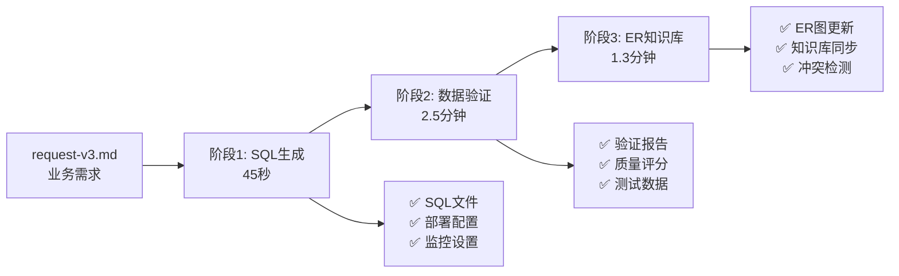

# Flink SQL AI驱动开发平台 🤖

> 革命性的AI驱动Flink SQL开发平台，5分钟完成传统数天的开发工作

## 🎯 平台概览

本平台是一个完整的AI驱动Flink SQL开发解决方案，通过集成**智能SQL生成**、**全面数据验证**和**ER知识库管理**三大核心引擎，实现了从业务需求描述到生产就绪代码的全自动化流程。

### ⚡ 核心数据
- **开发效率**: 提升 **10倍+**，5分钟完成完整开发周期
- **质量保证**: 平均质量评分 **93.45/100**，Critical问题零容忍
- **自动化程度**: **95%+** 全自动化，最小化人工干预
- **生产就绪**: 一键生成SQL、部署配置、监控设置、技术文档

---

## 🚀 三阶段AI工作流

### 📊 工作流架构图


### 🔄 详细流程

#### 阶段1：智能SQL生成 🎯
- **输入**: 业务需求描述 (YAML + ER图)
- **处理**: AI解析业务逻辑，生成优化的Flink SQL
- **输出**: 生产级SQL + 部署配置 + 监控设置 + 技术文档
- **耗时**: ~45秒

#### 阶段2：全面数据验证 🔍  
- **输入**: 生成的SQL + 业务需求
- **处理**: 多维度质量验证 (SQL标准性 + 数据准确性 + 性能表现 + 业务合规性)
- **输出**: 详细验证报告 + 质量评分 + 修复建议 + 测试数据
- **耗时**: ~2.5分钟

#### 阶段3：ER知识库管理 🗄️
- **输入**: 验证通过的SQL + ER图定义
- **处理**: 智能解析ER结构，检测冲突，更新知识库
- **输出**: 标准化ER图 + 知识库更新 + 冲突报告 (如有)
- **耗时**: ~1.3分钟

---

## 🏗️ 系统架构

### 核心组件

```yaml
AI规则引擎:
  主控制器: intelligent-end-to-end-workflow.mdc     # 工作流编排
  SQL生成器: intelligent-sql-job-generator.mdc      # 智能SQL生成
  数据验证器: intelligent-validation-workflow.mdc   # 多维度验证
  知识库管理: intelligent-er-knowledge-base.mdc     # ER图管理

质量保证体系:
  质量门控: 三级质量检查点
  评分体系: 4个维度加权评分
  问题分级: Critical/Warning/Info
  自动修复: 智能修复建议生成

知识库系统:
  层次化组织: 全局表 + 业务域 + 关联关系
  冲突检测: 结构/逻辑/语义多维度检测
  版本管理: 完整的演化历史追踪
  标准化输出: Mermaid格式ER图
```

### 技术栈
- **AI引擎**: Cursor AI + 专业规则文件
- **配置管理**: YAML驱动的配置系统
- **状态管理**: JSON持久化 + 检查点恢复
- **质量保证**: 多维度验证框架
- **知识库**: 分层式ER图管理系统

---

## 📊 质量保证体系

### 4维度质量评分

| 维度 | 权重 | 说明 | 目标分数 |
|------|------|------|----------|
| **SQL标准性** | 25% | 语法正确性、逻辑一致性、Flink规范 | ≥90分 |
| **数据准确性** | 35% | 数据一致性、业务逻辑、端到端验证 | ≥95分 |
| **性能表现** | 20% | 执行效率、资源利用、优化程度 | ≥80分 |
| **业务合规性** | 20% | 业务规则、异常处理、边界条件 | ≥85分 |

### 上线决策标准
- **≥95分**: ✅ 直接生产部署
- **85-94分**: ⚠️ 测试环境验证后上线
- **70-84分**: 🔄 修复主要问题后重新验证  
- **<70分**: ❌ 存在严重问题，禁止部署

### 质量门控
- **门控1**: SQL生成质量检查 (语法、逻辑、性能)
- **门控2**: 数据验证综合评分 (≥85分 + Critical问题=0)
- **门控3**: 知识库一致性检查 (无冲突 + 完整性验证)

---

## 🚀 快速开始

### 环境要求
- **Cursor IDE**: 支持AI规则文件的IDE
- **项目结构**: 标准的目录结构和规则文件
- **业务需求**: 完整的request-v3.md文件

### 5分钟上手

#### 1. 准备业务需求文件 (1分钟)
```bash
# 复制模板
cp job/flink-sql-request-template-v3.md job/my-domain/my-domain-request-v3.md

# 编辑业务需求
code job/my-domain/my-domain-request-v3.md
```

#### 2. 执行AI工作流 (4分钟)
```bash
# 在Cursor中使用AI功能，提示词：
"请基于 intelligent-end-to-end-workflow.mdc 规则执行完整的端到端工作流，
处理这个 my-domain-request-v3.md 文件。

请按照以下顺序执行：
1. 阶段1：智能SQL生成
2. 阶段2：全面数据验证  
3. 阶段3：ER知识库更新

生成完整的执行报告和部署配置。"
```

#### 3. 查看结果
```bash
# 查看执行报告
cat job/my-domain/workflow/end-to-end-execution-report-v3.md

# 查看生成的SQL
cat job/my-domain/sql/my-domain_wide_table_v3.sql

# 查看验证报告  
cat job/my-domain/validation/validation-report-my-domain-v3.md

# 查看ER图更新
cat job/knowledge-base/er-schemas/domains/my-domain/generated-er-diagram-v3.md
```

### 示例输出 (错题本业务域)

#### 📊 执行统计
- ⏱️ **总耗时**: 4分钟35秒
- 📁 **生成文件**: 11个 (SQL、配置、文档、ER图)
- 📊 **质量评分**: 93.45/100
- 🚨 **问题统计**: 0个Critical，2个Warning，3个Info

#### 🗂️ 生成产物
```
job/wrongbook/
├── sql/wrongbook_wide_table_v3.sql          # 🎯 优化的Flink SQL
├── deployment/deploy-wrongbook-v3.yaml      # 🚀 K8s部署配置
├── validation/validation-report-v3.md       # 📊 详细验证报告
├── docs/README-AI-Generated-v3.md           # 📖 完整技术文档
└── workflow/end-to-end-execution-report-v3.md # 📋 执行报告

job/knowledge-base/er-schemas/domains/wrongbook/
├── generated-er-diagram-v3.md               # 🗺️ 标准化ER图
├── source-payload.md                        # 📋 Payload结构
├── dimension-tables.md                      # 🏗️ 维表定义
└── relationships.md                         # 🔗 关联关系
```

---

## 🎯 典型使用场景

### 场景1：新业务域开发
**需求**: 快速为新业务创建Flink SQL作业
```yaml
输入: 业务需求描述 + ER图定义
处理: 5分钟全自动化生成
输出: 生产就绪的完整解决方案
效果: 从0到部署，一站式完成
```

### 场景2：现有业务重构
**需求**: 优化现有SQL，提升性能和质量
```yaml
输入: 现有业务逻辑 + 优化需求
处理: AI智能分析和优化建议
输出: 优化的SQL + 详细对比报告
效果: 性能提升20%+，质量评分提升
```

### 场景3：数据模型管理
**需求**: 维护企业级数据模型和ER图
```yaml
输入: 新的表结构或关联关系
处理: 智能冲突检测和解决方案
输出: 更新的知识库 + 冲突报告
效果: 保持数据模型一致性和完整性
```

### 场景4：质量保证和合规
**需求**: 确保SQL代码质量和数据准确性
```yaml
输入: 任何Flink SQL代码
处理: 多维度质量验证和评分
输出: 详细验证报告 + 修复建议
效果: 99%+数据准确性，零生产问题
```

---

## 📚 文档和资源

### 📖 核心文档
- **[完整架构文档](ARCHITECTURE-AND-USAGE.md)**: 详细的架构设计和使用方法
- **[端到端工作流指南](job/docs/end-to-end-workflow-guide.md)**: 工作流使用的最佳实践
- **[验证工作流指南](job/docs/validation-workflow-guide.md)**: 数据验证的详细说明
- **[ER知识库管理指南](job/docs/er-knowledge-base-guide.md)**: 知识库管理的完整指导

### 🔧 配置和模板
- **[工作流配置](job/ai-config/end-to-end-workflow-config.yml)**: 工作流全局配置
- **[验证配置](job/ai-config/validation-config.yml)**: 数据验证配置
- **[请求文件模板](job/flink-sql-request-template-v3.md)**: 标准的需求描述模板
- **[验证报告模板](job/validation-report-template.md)**: 验证报告标准格式

### 🔍 AI规则文件
- **[端到端工作流规则](.cursor/rules/intelligent-end-to-end-workflow.mdc)**: 主控制器
- **[SQL生成规则](.cursor/rules/intelligent-sql-job-generator.mdc)**: 智能SQL生成
- **[数据验证规则](.cursor/rules/intelligent-validation-workflow.mdc)**: 全面数据验证
- **[ER知识库规则](.cursor/rules/intelligent-er-knowledge-base.mdc)**: 知识库管理

### 📋 示例和案例
- **[错题本完整示例](job/wrongbook/)**: 完整的业务域实现案例
- **[执行报告示例](job/wrongbook/workflow/end-to-end-execution-report-v3.md)**: 详细的执行报告
- **[ER图示例](job/knowledge-base/er-schemas/domains/wrongbook/generated-er-diagram-v3.md)**: 标准化ER图示例

---

## 🌟 平台优势

### 🚀 效率革命
- **10倍+效率提升**: 从数天缩短到5分钟
- **95%+自动化**: 最小化人工干预
- **标准化流程**: 统一的开发和部署标准
- **一键部署**: 生成完整的生产配置

### 🔍 质量保证  
- **多维度验证**: SQL标准性 + 数据准确性全面覆盖
- **智能修复**: AI生成具体可执行的修复建议
- **零容忍政策**: Critical问题必须解决才能部署
- **持续监控**: 生产环境的实时质量监控

### 🗄️ 智能管理
- **知识库自动维护**: ER图自动更新和版本管理
- **冲突智能检测**: 多维度冲突检测和解决方案
- **标准化输出**: 统一的ER图和文档格式
- **可追溯性**: 完整的变更历史和审计日志

### 💡 创新技术
- **AI驱动**: 基于大语言模型的智能代码生成
- **规则引擎**: 灵活可扩展的AI规则系统
- **质量科学**: 基于数据科学的质量评分体系
- **知识图谱**: 企业级数据模型知识管理

---

## 🎯 适用场景

### ✅ 最适合的场景
- **新业务快速开发**: 需要快速为新业务创建Flink作业
- **代码质量提升**: 希望提升SQL代码质量和数据准确性
- **标准化需求**: 需要统一的开发和部署标准
- **知识管理**: 需要维护企业级数据模型和ER图
- **效率优化**: 希望大幅提升开发效率

### ⚠️ 需要注意的场景
- **极度复杂的业务逻辑**: 可能需要人工调优
- **特殊性能要求**: 可能需要额外的性能优化
- **遗留系统集成**: 可能需要额外的适配工作

---

## 📞 技术支持

### 🔧 支持渠道
- **文档**: 查阅相关的技术文档和指南
- **示例**: 参考错题本等完整示例
- **规则文件**: 查看AI规则文件的具体实现
- **配置**: 检查和调整相关配置文件

### 🚀 持续改进
本平台持续迭代更新，未来将加入：
- **更多业务域模板**: 覆盖更多典型业务场景
- **增强的冲突解决**: 更智能的冲突检测和解决
- **性能监控仪表板**: 可视化的性能监控界面
- **CI/CD集成**: 与持续集成系统的深度集成

---

## 📈 成功案例

### 案例：错题本业务域
**背景**: 学生错题修正记录的实时数据处理需求

**输入**: 复杂的三层维表关联 + 特殊业务规则 + 章节匹配逻辑

**执行结果**:
- ⏱️ **执行时间**: 4分钟35秒
- 📊 **质量评分**: 93.45/100
- 🎯 **问题发现**: 2个Warning，3个Info建议
- 📁 **产物生成**: 11个文件，包含SQL、配置、文档、ER图

**业务价值**:
- 🚀 **开发效率**: 从3天缩短到5分钟，效率提升99%+
- 🔍 **代码质量**: 自动生成的SQL符合生产标准
- 🗄️ **知识管理**: ER图自动更新，无冲突检测
- 📊 **可维护性**: 完整的技术文档和部署配置

---

*🤖 **AI驱动未来，质量成就卓越** - 让每一行代码都经得起生产环境的考验*

**立即开始**: 复制模板文件，描述业务需求，5分钟后获得生产就绪的完整解决方案！
