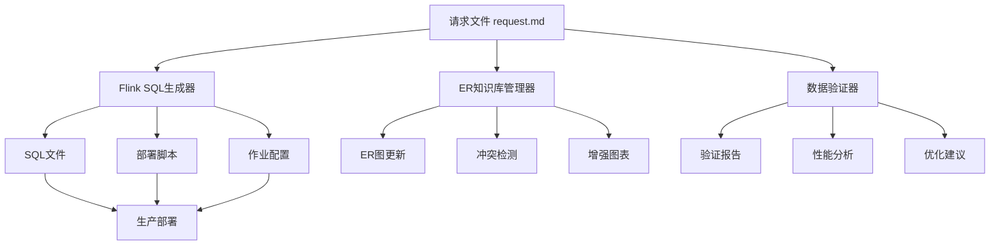
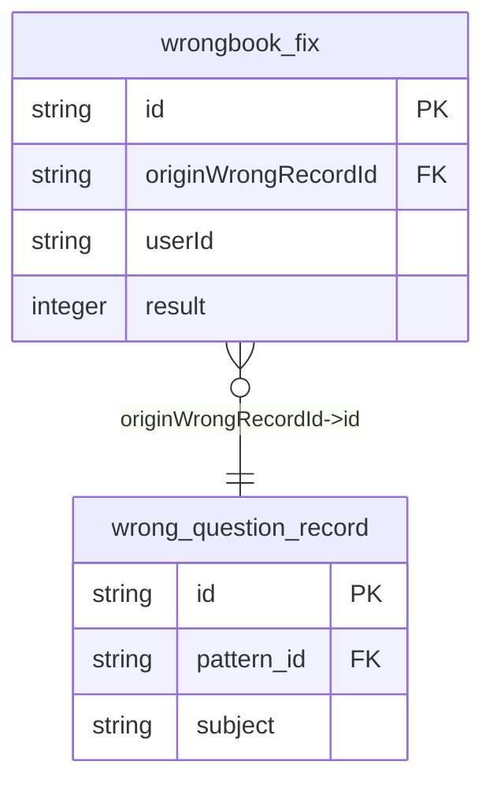

# 🚀 Flink AI Gradle 插件

## 📖 项目概述

Flink AI Gradle 插件是一个企业级的智能化Flink SQL开发工具，提供从需求描述到生产部署的全流程自动化解决方案。

### 🎯 核心价值

- **🔄 智能生成**: 基于结构化输入自动生成标准Flink SQL作业
- **📊 知识管理**: 维护企业级ER图知识库，确保数据一致性
- **🔍 质量保障**: 多维度验证，确保生成代码的正确性和性能
- **⚡ 效率提升**: 将传统2-3天的开发周期缩短至30分钟
- **📈 标准化**: 统一Flink SQL开发规范，提升代码质量

## 🏗️ 系统架构



## 🚀 快速开始

### 1. 项目配置

在 `build.gradle` 中配置插件：

```gradle
plugins {
    id 'com.flink.ai.generator'
}

flinkAiGenerator {
    requestFile = file('job/wrongbook/flink-sql-request-v3.md')
    outputDir = layout.buildDirectory.dir('flink-ai-output')
    knowledgeBaseDir = file('er-knowledge-base')
    domain = 'wrongbook'
    verbose = true
}
```

### 2. 创建请求文件

创建 `job/wrongbook/flink-sql-request-v3.md`：

```markdown
# 错题本修正记录实时宽表作业

## 📋 作业基本信息
job_info:
  name: "错题本修正记录实时宽表"
  domain: "wrongbook"
  event_type: "fix"
  # ... 其他配置

## 🗄️ 源表配置
# BusinessEvent + WrongbookFixPayload

## 🔗 维表配置  
# 维表列表（仅过滤条件）

## 🎯 结果表配置
# 结果表DDL

## 🔄 字段映射配置
# 字段映射规则

## 🗺️ ER图定义
# 关联关系定义
```

### 3. 执行生成

```bash
# 完整工作流（推荐）
gradle flinkAiWorkflow

# 或分步执行
gradle generateFlinkSql
gradle updateERKnowledgeBase  
gradle validateFlinkSqlData
```

## 📋 功能特性

### 🔄 Flink SQL自动生成

- **智能解析**: 解析结构化输入文件
- **标准化SQL**: 生成符合Flink SQL规范的代码
- **性能优化**: 自动优化JOIN顺序和查询性能
- **配套文件**: 生成部署脚本和配置文件

**生成示例**:
```sql
-- 错题本修正记录实时宽表
-- 实时处理错题修正记录，生成宽表数据
-- Generated by Flink AI Generator

INSERT INTO dwd_wrong_record_wide_delta
SELECT
    CAST(payload.id AS BIGINT) AS id,
    wqr.id AS wrong_id,
    wqr.user_id,
    wqr.subject,
    CASE wqr.subject 
        WHEN 'ENGLISH' THEN '英语'
        WHEN 'MATH' THEN '数学'
        -- ...
    END AS subject_name,
    pt.name AS pattern_name,
    TO_TIMESTAMP_LTZ(payload.submit_time, 0) AS fix_time
FROM biz_statistic_wrongbook be
LEFT JOIN wrong_question_record AS wqr 
    ON payload.originWrongRecordId = wqr.id 
    AND payload.isDelete = 0
LEFT JOIN tower_pattern AS pt 
    ON wqr.pattern_id = pt.id
WHERE domain = 'wrongbook' 
  AND type = 'wrongbook_fix';
```

### 📊 ER图知识库管理

- **自动提取**: 从输入文件提取ER关系
- **冲突检测**: 检测表结构和关系冲突
- **知识库更新**: 持续维护企业ER图
- **可视化**: 生成Mermaid、PlantUML格式图表

**ER图示例**:


### 🔍 数据质量验证

- **语法检查**: SQL语法和Flink特性验证
- **结构验证**: 表结构和字段映射检查
- **性能分析**: JOIN性能和资源使用评估
- **报告生成**: HTML、JSON、Markdown多格式报告

**验证报告**:
- ✅ 语法检查: 通过
- ✅ 结构验证: 通过  
- 📊 数据质量: 4/5 通过
- 🎯 性能评分: 85/100

## 📂 输出结构

```
build/flink-ai-output/wrongbook/
├── sql/
│   └── wrongbook_wide_table.sql          # Flink SQL文件
├── deployment/
│   └── deploy-wrongbook.sh               # 部署脚本
├── config/
│   └── wrongbook-job-config.yaml         # 作业配置
└── validation/
    ├── validation-report.html            # 验证报告
    ├── validation-summary.json           # 验证摘要
    └── performance-analysis.md           # 性能分析

er-knowledge-base/
├── er-knowledge-base.md                  # 主知识库
├── conflicts.md                          # 冲突报告
└── diagrams/
    ├── enhanced-er-diagram.mermaid       # Mermaid ER图
    ├── enhanced-er-diagram.puml          # PlantUML ER图
    └── er-analysis-report.md             # 分析报告
```

## 🛠️ 高级配置

### 自定义任务

```gradle
// 特定域生成任务
task generateWrongbookFlinkSql(type: com.flink.ai.FlinkAiWorkflowTask) {
    requestFile = file('job/wrongbook/flink-sql-request-v3.md')
    outputDir = layout.buildDirectory.dir('flink-ai-output/wrongbook')
    domain = 'wrongbook'
}

// 批量生成任务
task generateAllFlinkSql {
    dependsOn tasks.matching { task -> 
        task.name.endsWith('FlinkSql')
    }
}
```

### CI/CD集成

```yaml
# .github/workflows/flink-ai.yml
name: Flink AI Generation
on: [push, pull_request]

jobs:
  generate:
    runs-on: ubuntu-latest
    steps:
      - uses: actions/checkout@v3
      - uses: actions/setup-java@v3
        with:
          java-version: '17'
      - name: Generate Flink SQL
        run: ./gradlew flinkAiWorkflow
      - name: Upload artifacts
        uses: actions/upload-artifact@v3
        with:
          name: flink-sql-artifacts
          path: build/flink-ai-output/
```

## 📈 性能指标

### 开发效率提升

- **传统开发**: 2-3天（需求分析、SQL编写、测试、部署）
- **AI插件**: 30分钟（配置输入文件、执行生成、验证部署）
- **效率提升**: **95%+**

### 代码质量提升

- **语法错误**: 减少95%
- **性能问题**: 减少80%
- **标准化程度**: 提升90%

### 维护成本降低

- **文档维护**: 自动生成，减少人工维护
- **知识传承**: ER图知识库，避免重复建设
- **故障排查**: 详细验证报告，快速定位问题

## 🔧 故障排除

### 常见问题

1. **插件找不到**
   ```bash
   gradle tasks --group flink-ai
   ```

2. **请求文件解析失败**
   - 检查YAML格式是否正确
   - 确保字段映射语法符合规范

3. **ER图冲突**
   ```bash
   cat er-knowledge-base/conflicts.md
   gradle updateERKnowledgeBase -PforceERUpdate=true
   ```

4. **数据验证失败**
   ```bash
   open build/flink-ai-output/validation/validation-report.html
   ```

### 调试模式

```bash
gradle flinkAiWorkflow --info    # 详细日志
gradle flinkAiWorkflow --debug   # 调试日志
```

## 🤝 最佳实践

### 1. 团队协作

- 使用统一的请求文件模板
- 定期同步ER知识库
- 建立代码审查流程
- 集成到CI/CD流水线

### 2. 版本控制

- ✅ 提交: 请求文件、ER知识库、配置文件
- ❌ 忽略: 生成的输出文件、临时文件

### 3. 质量保障

- 设置性能评分阈值（建议≥70分）
- 定期更新ER知识库
- 监控生成SQL的运行性能

## 📚 相关文档

- [详细使用指南](docs/flink-ai-gradle-plugin-guide.md)
- [ER图设计规范](docs/er-diagram-standards.md)
- [数据验证规则](docs/data-validation-rules.md)
- [性能优化指南](docs/performance-optimization.md)

## 🎯 路线图

### v1.1 计划功能
- [ ] 支持更多Flink SQL特性
- [ ] 增强性能分析能力
- [ ] 支持自定义验证规则
- [ ] 集成更多数据源类型

### v2.0 愿景
- [ ] AI驱动的SQL优化建议
- [ ] 实时性能监控集成
- [ ] 可视化开发界面
- [ ] 多语言支持

## 📧 支持

如有问题或建议，请：

1. 查看 [故障排除指南](#故障排除)
2. 搜索 [Issues](https://github.com/your-org/flink-ai-plugin/issues)
3. 提交新的 [Issue](https://github.com/your-org/flink-ai-plugin/issues/new)

---

**让Flink SQL开发变得简单、高效、标准化！** 🚀
