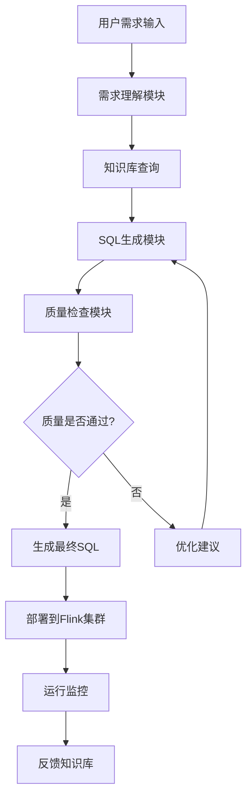

# FlinkSQL AI Coding 企业级平台设计方案

## 🎯 项目目标

打造一个企业级的FlinkSQL AI编程平台，实现：
- **降本增效**：减少70%的重复开发工作
- **提高质量**：确保SQL规范性和准确性
- **新手友好**：0基础快速上手FlinkSQL开发
- **持续迭代**：知识库自动更新和优化

## 🏗️ 整体架构设计

### 系统分层架构
```
┌─────────────────────────────────────────────────────────────┐
│                    AI Coding 前端界面                        │
├─────────────────────────────────────────────────────────────┤
│                    AI 编程服务层                             │
│  ┌─────────────┐ ┌─────────────┐ ┌─────────────┐ ┌─────────┐ │
│  │   需求理解   │ │   SQL生成   │ │   质量检查   │ │  优化建议 │ │
│  │    模块     │ │    模块     │ │    模块     │ │   模块   │ │
│  └─────────────┘ └─────────────┘ └─────────────┘ └─────────┘ │
├─────────────────────────────────────────────────────────────┤
│                    企业知识库层                              │
│  ┌─────────────┐ ┌─────────────┐ ┌─────────────┐ ┌─────────┐ │
│  │   表结构库   │ │ 业务规则库   │ │ SQL模板库   │ │ 最佳实践 │ │
│  │  (Catalog)  │ │ (Business)  │ │(Templates) │ │(Patterns)│ │
│  └─────────────┘ └─────────────┘ └─────────────┘ └─────────┘ │
├─────────────────────────────────────────────────────────────┤
│                    基础设施层                                │
│  ┌─────────────┐ ┌─────────────┐ ┌─────────────┐ ┌─────────┐ │
│  │  版本控制    │ │   CI/CD     │ │   监控告警   │ │  作业调度 │ │
│  │   (Git)     │ │ (Pipeline)  │ │ (Metrics)   │ │(Schedule)│ │
│  └─────────────┘ └─────────────┘ └─────────────┘ └─────────┘ │
└─────────────────────────────────────────────────────────────┘
```

## 📋 核心功能模块

### 1. 智能需求理解模块
```yaml
功能描述: 自然语言转换为结构化需求
核心能力:
  - 业务描述解析
  - 表关系识别  
  - 计算逻辑提取
  - 性能要求分析
输入格式: 自然语言 + 表名
输出格式: 结构化需求配置
```

### 2. SQL智能生成模块
```yaml
功能描述: 基于需求自动生成高质量FlinkSQL
核心能力:
  - 多表JOIN优化
  - 窗口函数选择
  - 性能调优建议
  - 业务规则应用
输入格式: 结构化需求配置
输出格式: 完整FlinkSQL + 配置文件
```

### 3. 质量检查模块
```yaml
功能描述: 全方位SQL质量检查和优化
核心能力:
  - 语法检查
  - 性能分析
  - 业务规则验证
  - 最佳实践检查
输入格式: FlinkSQL文件
输出格式: 质量报告 + 优化建议
```

### 4. 知识库管理模块
```yaml
功能描述: 企业级知识库构建和维护
核心能力:
  - 表结构自动同步
  - 业务规则提取
  - 模板自动归纳
  - 经验知识沉淀
数据来源: Catalog + Git历史 + 专家经验
```

## 🔧 技术实现方案

### 核心技术栈
```yaml
AI引擎: 
  - 大语言模型: GPT-4 / Claude / 通义千问
  - 向量数据库: Pinecone / Weaviate / Chroma
  - 知识图谱: Neo4j

后端技术:
  - 框架: Spring Boot 3.x
  - 数据库: PostgreSQL + Redis
  - 消息队列: Apache Kafka
  - 搜索引擎: Elasticsearch

前端技术:
  - 框架: Vue 3 + TypeScript
  - UI组件: Ant Design Vue
  - 编辑器: Monaco Editor (支持SQL语法高亮)
  - 图表: Apache ECharts

基础设施:
  - 容器化: Docker + Kubernetes
  - CI/CD: GitLab CI / GitHub Actions
  - 监控: Prometheus + Grafana
  - 日志: ELK Stack
```

### 数据流设计


## 🚀 实施路线图

### Phase 1: 基础平台搭建 (2个月)
```yaml
目标: 搭建基础开发和部署环境
主要任务:
  - 基础架构搭建 (Spring Boot + Vue)
  - 用户权限系统
  - 项目管理功能
  - Git集成
  - 基础的SQL编辑器
里程碑: 
  - 平台基础功能可用
  - 支持手动编写和管理SQL
```

### Phase 2: AI能力集成 (1.5个月)
```yaml
目标: 集成AI大模型和知识库
主要任务:
  - 大模型API集成
  - 向量数据库搭建
  - 知识库初始化
  - 简单的SQL生成功能
  - Catalog集成
里程碑:
  - AI可以生成简单的FlinkSQL
  - 支持表结构自动识别
```

### Phase 3: 智能生成增强 (2个月)
```yaml
目标: 提升AI生成质量和覆盖范围
主要任务:
  - 复杂JOIN逻辑处理
  - 窗口函数智能选择
  - 业务规则库建设
  - 质量检查引擎
  - 性能优化建议
里程碑:
  - 支持复杂业务场景SQL生成
  - 质量检查准确率达到85%+
```

### Phase 4: 企业级特性 (1.5个月)
```yaml
目标: 完善企业级功能和用户体验
主要任务:
  - 团队协作功能
  - 权限管理细化
  - 审批流程
  - 监控告警
  - 知识库持续学习
里程碑:
  - 支持多团队协作
  - 生产环境稳定运行
```

### Phase 5: 持续优化 (持续进行)
```yaml
目标: 基于用户反馈持续优化
主要任务:
  - 用户行为分析
  - AI模型fine-tuning
  - 知识库自动更新
  - 新特性开发
  - 社区建设
```

## 💼 商业价值分析

### 降本增效效果
```yaml
开发效率提升:
  - SQL开发时间: 减少70% (2天 → 0.5天)
  - 调试时间: 减少60% (1天 → 0.4天)
  - 代码审查: 减少50% (0.5天 → 0.25天)
  - 总体提升: 人效提升3-4倍

质量提升效果:
  - SQL语法错误: 减少90%
  - 性能问题: 减少70%
  - 业务逻辑错误: 减少60%
  - 生产事故: 减少80%

人员培训成本:
  - 新手上手时间: 1个月 → 1周
  - 培训成本: 减少80%
  - 知识传承: 标准化沉淀
```

### ROI估算 (以100人团队为例)
```yaml
成本投入:
  - 平台开发: 200万 (一次性)
  - 运维成本: 50万/年
  - AI服务费: 30万/年
  - 总投入: 280万 (首年)

收益回报:
  - 人力成本节省: 600万/年 (效率提升3倍)
  - 质量成本节省: 100万/年 (减少故障)
  - 培训成本节省: 50万/年
  - 总收益: 750万/年

ROI: (750-280)/280 = 168%
回收周期: 5个月
```

## 🎯 关键成功因素

### 1. 企业知识库质量
```yaml
表结构完整性:
  - Catalog实时同步: 99%覆盖率
  - 字段注释完备: 90%+
  - 关系定义清晰: 95%+

业务规则准确性:
  - 专家知识录入: 100个核心场景
  - 历史案例学习: 1000+个SQL样本
  - 持续更新机制: 每周增量更新
```

### 2. AI模型效果
```yaml
生成准确率:
  - 简单场景: 95%+
  - 复杂场景: 85%+
  - 创新场景: 70%+

响应时间:
  - 简单SQL: <10秒
  - 复杂SQL: <30秒
  - 优化建议: <5秒
```

### 3. 用户体验
```yaml
易用性:
  - 学习成本: <1周
  - 操作步骤: <5步完成SQL生成
  - 错误率: <5%

功能完整性:
  - 场景覆盖: 90%+常用场景
  - 集成度: 与现有工具无缝集成
  - 扩展性: 支持自定义规则和模板
```

## 🔨 具体实施方案

### 在现有项目中的集成
基于您当前的多源业务驱动架构，我们可以这样集成：

```yaml
现有优势:
  - ✅ 已有完整的项目结构
  - ✅ 标准化的配置模板
  - ✅ AI规则框架基础
  - ✅ 多种作业类型支持

集成方案:
  1. 扩展 job/ 目录结构支持AI生成
  2. 增强 flink-sql-request-template.md 为智能模板
  3. 扩展 intelligent-sql-job-generator 规则
  4. 添加 Web界面 和 API服务
  5. 集成 企业知识库 和 质量检查
```

## 📊 预期效果对比

| 维度 | 传统开发 | AI Coding平台 | 提升幅度 |
|------|----------|--------------|----------|
| **开发时间** | 2-5天 | 0.5-1天 | 70-80% ↓ |
| **代码质量** | 60-70分 | 85-90分 | 25-30% ↑ |
| **学习门槛** | 3-6个月 | 1-2周 | 90% ↓ |
| **维护成本** | 高 | 低 | 60% ↓ |
| **标准化** | 30% | 95% | 65% ↑ |
| **复用率** | 20% | 80% | 60% ↑ |

## 🎉 总结

这个FlinkSQL AI Coding平台项目具有很强的可行性和巨大的商业价值：

### ✅ **技术可行性**
- 基于成熟的AI技术栈
- 有现有项目架构基础
- 社区资源丰富

### ✅ **商业价值**
- ROI高达168%，5个月回收投资
- 显著提升开发效率和代码质量
- 降低人员培训和维护成本

### ✅ **竞争优势**
- 企业级定制化知识库
- 垂直领域深度优化
- 持续学习和迭代能力

建议从Phase 1开始，循序渐进地建设这个平台，重点关注知识库质量和用户体验，确保每个阶段都能产生实际价值！
