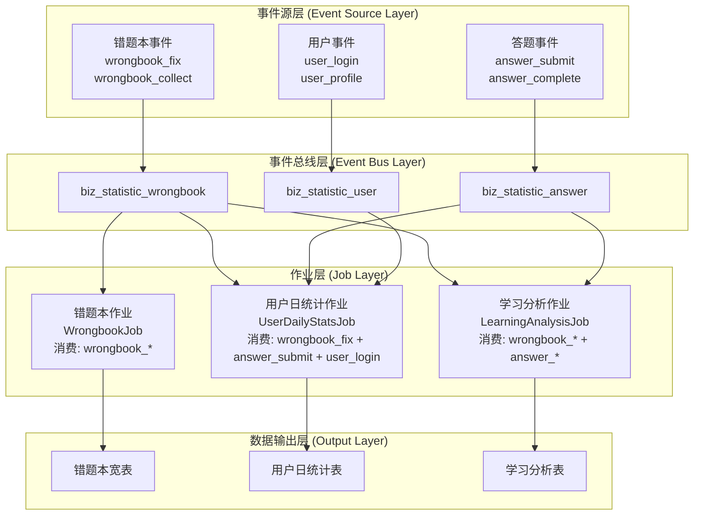

# 钉钉文档图表展示解决方案

## 🎯 问题说明

钉钉文档可能不完全支持Mermaid语法渲染，导致架构图无法正常显示。以下提供多种解决方案：

## 🔧 解决方案

### 方案1：已应用的文本图表（推荐）

我已经将文档中的Mermaid图表替换为ASCII文本图表，这些图表在钉钉文档中可以正常显示。

### 方案2：使用在线Mermaid渲染器

1. **复制Mermaid代码**：


2. **访问在线渲染器**：
   - https://mermaid.live/
   - https://mermaid-js.github.io/mermaid-live-editor/

3. **生成图片**：
   - 粘贴代码到编辑器
   - 导出为PNG/SVG图片
   - 将图片插入钉钉文档

### 方案3：使用Draw.io绘制

1. **访问Draw.io**：https://app.diagrams.net/
2. **按照文本图表结构绘制**
3. **导出图片插入钉钉文档**

### 方案4：使用表格方式展示

**事件驱动架构表格展示**：

| 层级 | 组件 | 功能描述 | 数据流向 |
|------|------|----------|----------|
| **事件源层** | 错题本事件 | wrongbook_fix, wrongbook_collect | ↓ |
| | 答题事件 | answer_submit, answer_complete | ↓ |
| | 用户事件 | user_login, user_profile | ↓ |
| **事件总线层** | biz_statistic_wrongbook | 错题本事件传输 | ↓ |
| | biz_statistic_answer | 答题事件传输 | ↓ |
| | biz_statistic_user | 用户事件传输 | ↓ |
| **作业层** | WrongbookJob | 消费wrongbook_* | ↓ |
| | UserDailyStatsJob | 消费多源事件进行聚合 | ↓ |
| | LearningAnalysisJob | 消费wrongbook_*+answer_* | ↓ |
| **输出层** | 错题本宽表 | 错题修正宽表数据 | 存储 |
| | 用户日统计表 | 用户每日行为统计 | 存储 |
| | 学习分析表 | 学习行为分析结果 | 存储 |

### 方案5：分层描述方式

**第一层：事件源层 (Event Source Layer)**
```
┌─错题本事件─┐  ┌─答题事件─┐  ┌─用户事件─┐
│wrongbook_fix│  │answer_submit│  │user_login │
│wrongbook_   │  │answer_      │  │user_      │
│collect      │  │complete     │  │profile    │
└─────────────┘  └────────────┘  └───────────┘
       │               │              │
       ▼               ▼              ▼
```

**第二层：事件总线层 (Event Bus Layer)**
```
┌─事件总线─┐  ┌─事件总线─┐  ┌─事件总线─┐
│biz_statistic│  │biz_statistic│  │biz_statistic│
│_wrongbook  │  │_answer     │  │_user       │
└───────────┘  └────────────┘  └────────────┘
       │               │              │
       ▼               ▼              ▼
```

**第三层：作业层 (Job Layer)**
```
┌─错题本作业─┐  ┌─用户日统计─┐  ┌─学习分析─┐
│WrongbookJob│  │UserDaily   │  │Learning  │
│消费:       │  │StatsJob    │  │Analysis  │
│wrongbook_* │  │消费:多源   │  │Job       │
└───────────┘  └────────────┘  └──────────┘
       │               │              │
       ▼               ▼              ▼
```

**第四层：数据输出层 (Output Layer)**
```
┌─错题本宽表─┐  ┌─用户日统计─┐  ┌─学习分析─┐
│dwd_wrong_  │  │dws_user_   │  │ads_      │
│record_wide │  │daily_stats │  │learning_ │
│_delta      │  │           │  │analysis  │
└───────────┘  └────────────┘  └──────────┘
```

## 💡 推荐使用方式

### 对于架构展示（推荐顺序）：
1. **文本图表**（已应用）- 兼容性最好
2. **表格展示** - 结构清晰
3. **分层描述** - 详细说明
4. **外部生成图片** - 视觉效果最好

### 对于ER图展示（推荐顺序）：
1. **文本表格格式**（已应用）- 信息完整
2. **分表描述** - 逐表说明
3. **外部生成图片** - 专业美观

## 📋 检查清单

在钉钉文档中粘贴后，请检查：

- [ ] 文本图表格式是否正确对齐
- [ ] 表格是否正常显示
- [ ] 特殊字符（箭头、框线）是否显示正常
- [ ] 如果格式有问题，可以使用备选方案

## 🔄 替代方案

如果文本图表在钉钉中仍有显示问题，可以：

1. **简化为纯文字描述**
2. **使用编号列表结构**
3. **制作PPT截图插入**
4. **使用钉钉自带的图表工具**

---

**选择最适合您团队的展示方式！** 📊
