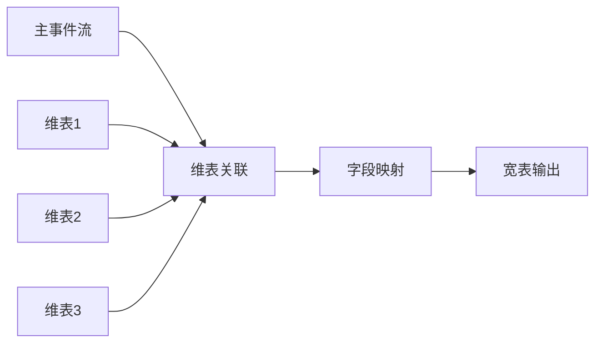
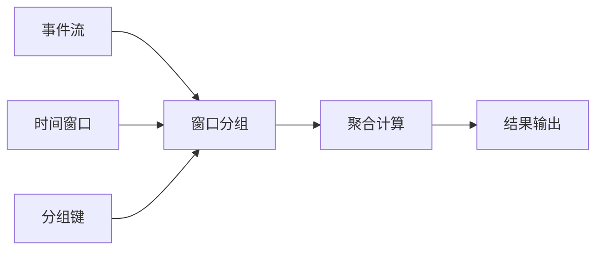
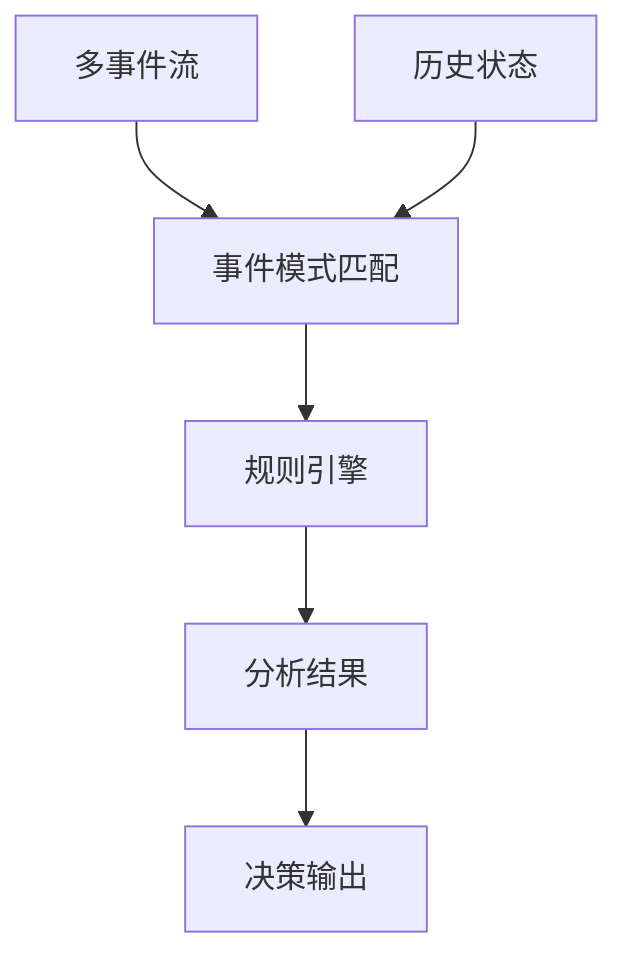

# Flink 实时开发规范文档

## 📖 概述

本规范基于事件驱动架构（Event-Driven Architecture），定义了企业级 Flink 实时数据处理的标准化开发规范。通过统一的事件模型、数据结构和开发流程，确保 Flink 作业的高质量、高性能和可维护性。

---

## 🎯 Flink 使用场景

### 1.1 核心业务场景

#### 🏗️ 宽表打宽（Wide Table Construction）
**业务目标**：将多个事件源的数据关联组成完整的业务数据视图

**典型场景**：
- **错题本宽表**：关联错题收集事件、修正事件、知识点信息，形成完整的学习轨迹
- **订单宽表**：关联下单、支付、物流、评价等事件，构建完整订单生命周期
- **用户行为宽表**：整合登录、浏览、购买等行为数据，支撑用户画像构建

**技术特点**：
- 事件时间语义，保证数据一致性
- 多维表 LEFT JOIN，丰富事件上下文
- 支持事件乱序和延迟到达处理

**架构模式**：


#### 📊 汇总统计（Aggregation Analytics）
**业务目标**：对事件流进行实时聚合计算，产出统计指标

**典型场景**：
- **用户日统计**：统计用户每日答题数、正确率、学习时长等指标
- **课程热度统计**：实时计算课程的学习人数、完成率、评分等
- **系统监控统计**：统计请求量、错误率、响应时间等技术指标

**技术特点**：
- 窗口聚合（滚动、滑动、会话窗口）
- 多维分组统计
- 支持迟到数据处理和结果更新

**架构模式**：


#### 🔍 实时分析（Real-time Analysis）
**业务目标**：基于实时数据流进行复杂业务逻辑分析和决策

**典型场景**：
- **学习路径推荐**：基于学习行为实时调整个性化学习路径
- **异常检测**：实时识别异常学习行为或系统异常
- **智能预警**：基于多指标综合分析触发业务预警

**技术特点**：
- 复杂事件处理（CEP）
- 多流关联和状态管理
- 实时机器学习模型应用

**架构模式**：


### 1.2 场景选择原则

| 场景类型 | 数据特征 | 计算复杂度 | 实时性要求 | 适用业务 |
|----------|----------|------------|------------|----------|
| **宽表打宽** | 多源关联，结构化 | 中等 | 分钟级 | 数据仓库、报表分析 |
| **汇总统计** | 单一或少量源，指标计算 | 简单 | 秒级 | 实时监控、运营看板 |
| **实时分析** | 多源关联，复杂逻辑 | 高 | 毫秒级 | 智能推荐、风控决策 |

---

## 🏗️ 事件驱动架构模型

### 2.1 整体架构图

```
┌─────────────────────────────────────────────────────────────────────────────┐
│                           事件源层 (Event Source Layer)                      │
├─────────────────────┬─────────────────────┬─────────────────────────────────┤
│     错题本事件       │      答题事件       │         用户事件                │
│   wrongbook_fix     │   answer_submit     │      user_login                 │
│   wrongbook_collect │   answer_complete   │      user_profile               │
└─────────┬───────────┴─────────┬───────────┴─────────┬───────────────────────┘
          │                     │                     │
          ▼                     ▼                     ▼
┌─────────────────────────────────────────────────────────────────────────────┐
│                          事件总线层 (Event Bus Layer)                        │
├─────────────────────┬─────────────────────┬─────────────────────────────────┤
│  biz_statistic_     │  biz_statistic_     │    biz_statistic_               │
│     wrongbook       │      answer         │        user                     │
└─────────┬───────────┴─────────┬───────────┴─────────┬───────────────────────┘
          │                     │                     │
          │                     │                     │
          ▼                     ▼                     ▼
┌─────────────────────────────────────────────────────────────────────────────┐
│                            作业层 (Job Layer)                               │
├─────────────────────┬─────────────────────┬─────────────────────────────────┤
│     错题本作业       │   用户日统计作业     │       学习分析作业               │
│   WrongbookJob      │ UserDailyStatsJob   │   LearningAnalysisJob           │
│  消费: wrongbook_*  │消费: wrongbook_fix  │  消费: wrongbook_* +            │
│                     │  + answer_submit    │       answer_*                  │
│                     │  + user_login       │                                │
└─────────┬───────────┴─────────┬───────────┴─────────┬───────────────────────┘
          │                     │                     │
          ▼                     ▼                     ▼
┌─────────────────────────────────────────────────────────────────────────────┐
│                         数据输出层 (Output Layer)                            │
├─────────────────────┬─────────────────────┬─────────────────────────────────┤
│     错题本宽表       │    用户日统计表      │       学习分析表                │
│                     │                     │                                │
└─────────────────────┴─────────────────────┴─────────────────────────────────┘
```

**数据流向说明**：
- **事件源层** → **事件总线层**：业务事件通过Kafka发布到对应Topic
- **事件总线层** → **作业层**：Flink作业消费事件进行实时处理
- **作业层** → **数据输出层**：处理结果写入目标存储系统

### 2.2 架构分层说明

#### 事件源层 (Event Source Layer)
- **职责**：产生和发布业务事件
- **特点**：按业务域分类，事件类型细分
- **示例**：用户操作、系统状态变更、外部接口调用

#### 事件总线层 (Event Bus Layer)
- **职责**：事件传输和分发
- **特点**：按域分Topic，保证事件有序性
- **技术**：Kafka、Pulsar等消息中间件

#### 作业层 (Job Layer)
- **职责**：事件消费和业务逻辑处理
- **特点**：业务驱动，支持多源消费
- **技术**：Flink DataStream API、Flink SQL

#### 数据输出层 (Output Layer)
- **职责**：处理结果存储和分发
- **特点**：支持多种存储引擎
- **技术**：MySQL、ClickHouse、Elasticsearch等

---

## 📋 源表结构规范

### 3.1 统一事件模型：BusinessEvent

#### 3.1.1 标准事件结构
```java
/**
 * 业务事件统一数据模型
 * 所有业务事件必须遵循此结构
 */
public class BusinessEvent {
    
    // ============ 事件标识 ============
    private String eventId;          // 事件唯一ID，UUID格式
    private String domain;           // 业务域：wrongbook、answer、user等
    private String type;             // 事件类型：wrongbook_fix、answer_submit等
    private String version;          // 事件版本：v1.0、v2.0等
    
    // ============ 时间信息 ============
    private Long eventTime;          // 事件发生时间戳（毫秒）
    private Long processTime;        // 事件处理时间戳（毫秒）
    private String eventDate;        // 事件发生日期（yyyy-MM-dd）
    
    // ============ 用户信息 ============
    private String userId;           // 用户ID
    private String sessionId;       // 会话ID
    private String deviceId;         // 设备ID
    
    // ============ 业务载荷 ============
    private String payload;          // 业务数据JSON字符串
    
    // ============ 元数据信息 ============
    private String source;           // 事件源系统
    private String traceId;          // 链路追踪ID
    private Map<String, String> tags; // 扩展标签
}
```

#### 3.1.2 事件命名规范

**Topic命名规范**：
```
biz_statistic_{domain}
```

**Type命名规范**：
```
{domain}_{action}
```

**示例**：
| 业务域 | Topic | Type | 说明 |
|--------|-------|------|------|
| 错题本 | `biz_statistic_wrongbook` | `wrongbook_fix` | 错题修正事件 |
| 错题本 | `biz_statistic_wrongbook` | `wrongbook_collect` | 错题收集事件 |
| 答题 | `biz_statistic_answer` | `answer_submit` | 答题提交事件 |
| 答题 | `biz_statistic_answer` | `answer_complete` | 答题完成事件 |
| 用户 | `biz_statistic_user` | `user_login` | 用户登录事件 |

### 3.2 Payload 数据规范

#### 3.2.1 Payload 设计原则
1. **类型一致性**：同一 `domain + type` 下的 payload 结构必须一致
2. **版本兼容性**：新版本 payload 必须向后兼容
3. **字段完整性**：包含业务处理所需的完整信息
4. **数据类型标准**：统一使用标准数据类型

#### 3.2.2 Payload 示例

**错题修正事件 Payload**：
```java
/**
 * 错题修正事件载荷
 * domain: wrongbook, type: wrongbook_fix
 */
public class WrongbookFixPayload {
    private String fixId;                    // 修正记录ID
    private String wrongId;                  // 原错题记录ID
    private String userId;                   // 用户ID
    private String questionId;               // 题目ID
    private String subject;                  // 学科
    private String patternId;                // 知识点ID
    private Integer fixResult;               // 修正结果：0-未修正，1-已修正
    private Long submitTime;                 // 提交时间
    private String answerContent;            // 修正答案内容
    private List<String> attachments;        // 附件列表
}
```

**答题提交事件 Payload**：
```java
/**
 * 答题提交事件载荷
 * domain: answer, type: answer_submit
 */
public class AnswerSubmitPayload {
    private String answerId;                 // 答题记录ID
    private String userId;                   // 用户ID
    private String questionId;               // 题目ID
    private String subject;                  // 学科
    private Integer isCorrect;               // 是否正确：0-错误，1-正确
    private Long answerTime;                 // 答题时长（秒）
    private Long submitTime;                 // 提交时间
    private String userAnswer;               // 用户答案
    private String correctAnswer;            // 正确答案
}
```

### 3.3 多源表关联规范

#### 3.3.1 多源表关联限制
```yaml
multi_source_rules:
  max_source_tables: 3                      # 最多3个源表关联
  watermark_skew_max: "5 minutes"           # 水位线偏差不超过5分钟
  state_ttl_max: "24 hours"                 # 状态TTL不超过24小时
  join_timeout_max: "10 minutes"            # JOIN超时时间不超过10分钟
```

#### 3.3.2 水位线同步策略
```sql
-- 多源表水位线配置示例
CREATE TABLE source_table_1 (
    -- 字段定义
    event_time AS TO_TIMESTAMP_LTZ(event_timestamp, 0),
    WATERMARK FOR event_time AS event_time - INTERVAL '5' SECOND
);

CREATE TABLE source_table_2 (
    -- 字段定义  
    event_time AS TO_TIMESTAMP_LTZ(event_timestamp, 0),
    WATERMARK FOR event_time AS event_time - INTERVAL '5' SECOND  -- 保持一致
);

-- 多流关联示例
SELECT *
FROM source_table_1 s1
JOIN source_table_2 s2
ON s1.join_key = s2.join_key
AND s1.event_time BETWEEN s2.event_time - INTERVAL '1' MINUTE 
                       AND s2.event_time + INTERVAL '1' MINUTE;
```

#### 3.3.3 状态管理最佳实践
```java
// Flink 状态TTL配置
StateTtlConfig ttlConfig = StateTtlConfig
    .newBuilder(Time.hours(24))              // 24小时TTL
    .setUpdateType(StateTtlConfig.UpdateType.OnCreateAndWrite)
    .setStateVisibility(StateTtlConfig.StateVisibility.NeverReturnExpired)
    .cleanupFullSnapshot()                   // 全量快照清理
    .build();

mapStateDescriptor.enableTimeToLive(ttlConfig);
```

---

## 🔗 维表关联规范

### 4.1 维表设计原则

#### 4.1.1 维表分类标准
| 维表类型 | 更新频率 | 缓存策略 | 适用场景 |
|----------|----------|----------|----------|
| **静态维表** | 很少更新 | 长期缓存(1天+) | 地区、学科等基础数据 |
| **准静态维表** | 小时级更新 | 中期缓存(1-6小时) | 用户信息、课程信息 |
| **动态维表** | 分钟级更新 | 短期缓存(5-30分钟) | 实时状态、临时配置 |

#### 4.1.2 维表访问模式
```sql
-- 标准维表关联语法
LEFT JOIN dimension_table FOR SYSTEM_TIME AS OF PROCTIME() AS dt
ON source.join_key = dt.primary_key
WHERE dt.is_deleted = false  -- 标准删除标识过滤
```

### 4.2 MySQL维表优化规范

#### 4.2.1 索引设计要求
```sql
-- 主键索引（必须）
PRIMARY KEY (id)

-- 关联字段索引（必须）
INDEX idx_join_key (join_field)

-- 复合索引（推荐）
INDEX idx_composite (join_field, status, is_deleted)

-- 查询优化索引（可选）
INDEX idx_query_optimize (common_filter_field, update_time)
```

#### 4.2.2 维表结构规范
```sql
-- 标准维表结构模板
CREATE TABLE dim_table_template (
    id BIGINT PRIMARY KEY AUTO_INCREMENT,           -- 主键ID
    business_key VARCHAR(64) NOT NULL,              -- 业务键
    
    -- 业务字段
    field1 VARCHAR(255),
    field2 INT,
    field3 DECIMAL(10,2),
    
    -- 标准控制字段
    is_deleted TINYINT DEFAULT 0,                   -- 删除标识：0-正常，1-删除
    status TINYINT DEFAULT 1,                       -- 状态标识：1-启用，0-禁用
    version INT DEFAULT 1,                          -- 版本号
    
    -- 标准时间字段
    created_at TIMESTAMP DEFAULT CURRENT_TIMESTAMP,  -- 创建时间
    updated_at TIMESTAMP DEFAULT CURRENT_TIMESTAMP   -- 更新时间
        ON UPDATE CURRENT_TIMESTAMP,
    
    -- 索引定义
    UNIQUE KEY uk_business_key (business_key),       -- 业务键唯一索引
    INDEX idx_status_deleted (status, is_deleted),  -- 状态过滤索引
    INDEX idx_updated_at (updated_at)               -- 更新时间索引
);
```

### 4.3 缓存配置规范

#### 4.3.1 缓存参数配置
```sql
-- 维表连接器缓存配置模板
CREATE TABLE dim_table (
    -- 字段定义
) WITH (
    'connector' = 'jdbc',
    'url' = 'jdbc:mysql://localhost:3306/database',
    'table-name' = 'dim_table',
    
    -- 缓存配置（核心）
    'lookup.cache.max-rows' = '100000',             -- 最大缓存行数
    'lookup.cache.ttl' = '1 hour',                  -- 缓存生存时间
    'lookup.cache.caching-missing-key' = 'true',    -- 缓存空结果
    
    -- 性能配置
    'lookup.max-retries' = '3',                     -- 最大重试次数
    'connection.max-retry-timeout' = '60s',         -- 连接超时时间
    
    -- 连接池配置
    'connection.pool.initial-size' = '5',           -- 初始连接数
    'connection.pool.max-size' = '20',              -- 最大连接数
    'connection.pool.max-idle-timeout' = '300s'     -- 连接空闲超时
);
```

#### 4.3.2 缓存策略选择

**缓存策略决策流程**：
```
维表数据特征分析
        │
        ▼
    更新频率判断
        │
  ┌─────┼─────┐
  │     │     │
  ▼     ▼     ▼
< 1小时  1-24小时  > 24小时
  │     │     │
  ▼     ▼     ▼
动态维表  准静态维表  静态维表
  │     │     │
  ▼     ▼     ▼
TTL:5-30分钟  TTL:1-6小时  TTL:1-7天
缓存:10K-50K  缓存:50K-200K  缓存:200K+
  │     │     │
  ▼     ▼     ▼
实时性要求高  平衡性能实时性  性能优先
```

**策略选择参考**：
| 维表类型 | 更新频率 | TTL配置 | 缓存行数 | 适用场景 |
|----------|----------|---------|----------|----------|
| **动态维表** | < 1小时 | 5-30分钟 | 10K-50K | 实时配置、状态表 |
| **准静态维表** | 1-24小时 | 1-6小时 | 50K-200K | 用户信息、产品信息 |
| **静态维表** | > 24小时 | 1-7天 | 200K+ | 地区、学科等字典表 |

### 4.4 维表数据质量规范

#### 4.4.1 数据完整性检查
```sql
-- 维表数据质量监控SQL
SELECT 
    table_name,
    total_rows,
    deleted_rows,
    active_rows,
    null_key_rows,
    duplicate_key_rows,
    last_update_time
FROM (
    SELECT 
        'dim_table_name' as table_name,
        COUNT(*) as total_rows,
        SUM(CASE WHEN is_deleted = 1 THEN 1 ELSE 0 END) as deleted_rows,
        SUM(CASE WHEN is_deleted = 0 THEN 1 ELSE 0 END) as active_rows,
        SUM(CASE WHEN business_key IS NULL THEN 1 ELSE 0 END) as null_key_rows,
        COUNT(*) - COUNT(DISTINCT business_key) as duplicate_key_rows,
        MAX(updated_at) as last_update_time
    FROM dim_table_name
) quality_check;
```

#### 4.4.2 缓存命中率监控
```java
// Flink 维表缓存监控指标
public class DimTableCacheMetrics {
    private Counter cacheHitCounter;      // 缓存命中计数
    private Counter cacheMissCounter;     // 缓存未命中计数
    private Counter cacheLoadCounter;     // 缓存加载计数
    private Histogram cacheLoadTime;     // 缓存加载时间
    
    public void recordCacheHit() {
        cacheHitCounter.inc();
    }
    
    public void recordCacheMiss() {
        cacheMissCounter.inc();
    }
    
    public double getCacheHitRate() {
        long hits = cacheHitCounter.getCount();
        long total = hits + cacheMissCounter.getCount();
        return total > 0 ? (double) hits / total : 0.0;
    }
}
```

---

## 📊 Flink作业ER关系图

### 5.1 典型作业ER图示例

#### 5.1.1 错题本宽表作业ER图

**表关系结构图**：
```
                           错题本宽表作业 ER 关系图
┌─────────────────────────────────────────────────────────────────────────────┐
│                                源表                                         │
├─────────────────────────────────────────────────────────────────────────────┤
│ wrongbook_fix (错题修正事件)                                                 │
│ ┌─────────────────────────────────────────────────────────────────────────┐ │
│ │ eventId (PK)          │ 事件ID                                          │ │
│ │ fixId (UK)            │ 修正记录ID                                       │ │
│ │ wrongId (FK)          │ 原错题记录ID → wrong_question_record.id          │ │
│ │ userId (FK)           │ 用户ID                                          │ │
│ │ questionId (FK)       │ 题目ID                                          │ │
│ │ patternId (FK)        │ 知识点ID                                         │ │
│ │ fixResult             │ 修正结果                                         │ │
│ │ submitTime            │ 提交时间                                         │ │
│ │ eventTime             │ 事件时间                                         │ │
│ └─────────────────────────────────────────────────────────────────────────┘ │
└─────────────────────────────────────────────────────────────────────────────┘
                                     │
                                     ▼ (wrongId → id)
┌─────────────────────────────────────────────────────────────────────────────┐
│                                维表1                                        │
├─────────────────────────────────────────────────────────────────────────────┤
│ wrong_question_record (错题记录表)                                           │
│ ┌─────────────────────────────────────────────────────────────────────────┐ │
│ │ id (PK)               │ 错题记录ID                                       │ │
│ │ userId (FK)           │ 用户ID                                          │ │
│ │ questionId (FK)       │ 题目ID                                          │ │
│ │ patternId (FK)        │ 知识点ID → tower_pattern.id                     │ │
│ │ subject               │ 学科                                            │ │
│ │ chapterId (FK)        │ 章节ID                                          │ │
│ │ createTime            │ 创建时间                                         │ │
│ │ isDeleted             │ 删除标识                                         │ │
│ └─────────────────────────────────────────────────────────────────────────┘ │
└─────────────────────────────────────────────────────────────────────────────┘
                                     │
                                     ▼ (patternId → id)
┌─────────────────────────────────────────────────────────────────────────────┐
│                                维表2                                        │
├─────────────────────────────────────────────────────────────────────────────┤
│ tower_pattern (知识点表)                                                     │
│ ┌─────────────────────────────────────────────────────────────────────────┐ │
│ │ id (PK)               │ 知识点ID                                         │ │
│ │ name                  │ 知识点名称                                       │ │
│ │ subject               │ 学科                                            │ │
│ │ type                  │ 知识点类型                                       │ │
│ │ difficulty            │ 难度系数                                         │ │
│ │ modifyTime            │ 修改时间                                         │ │
│ └─────────────────────────────────────────────────────────────────────────┘ │
└─────────────────────────────────────────────────────────────────────────────┘
                                     │
                                     ▼ (id → ptId)
┌─────────────────────────────────────────────────────────────────────────────┐
│                                维表3                                        │
├─────────────────────────────────────────────────────────────────────────────┤
│ tower_teaching_type_pt (教学类型-知识点关联表)                                │
│ ┌─────────────────────────────────────────────────────────────────────────┐ │
│ │ id (PK)               │ 关联ID                                          │ │
│ │ teachingTypeId (FK)   │ 教学类型ID → tower_teaching_type.id             │ │
│ │ ptId (FK)             │ 知识点ID                                         │ │
│ │ orderNum              │ 排序号                                          │ │
│ │ isDeleted             │ 删除标识                                         │ │
│ └─────────────────────────────────────────────────────────────────────────┘ │
└─────────────────────────────────────────────────────────────────────────────┘
                                     │
                                     ▼ (teachingTypeId → id)
┌─────────────────────────────────────────────────────────────────────────────┐
│                                维表4                                        │
├─────────────────────────────────────────────────────────────────────────────┤
│ tower_teaching_type (教学类型表)                                             │
│ ┌─────────────────────────────────────────────────────────────────────────┐ │
│ │ id (PK)               │ 教学类型ID                                       │ │
│ │ chapterId (FK)        │ 章节ID                                          │ │
│ │ teachingTypeName      │ 教学类型名称                                     │ │
│ │ isDeleted             │ 删除标识                                         │ │
│ │ modifyTime            │ 修改时间                                         │ │
│ └─────────────────────────────────────────────────────────────────────────┘ │
└─────────────────────────────────────────────────────────────────────────────┘
                                     │
                                     ▼ (数据处理)
┌─────────────────────────────────────────────────────────────────────────────┐
│                               结果表                                        │
├─────────────────────────────────────────────────────────────────────────────┤
│ dwd_wrong_record_wide_delta (错题本宽表)                                     │
│ ┌─────────────────────────────────────────────────────────────────────────┐ │
│ │ id (PK)               │ 宽表主键                                         │ │
│ │ wrongId               │ 错题记录ID                                       │ │
│ │ userId                │ 用户ID                                          │ │
│ │ subject               │ 学科                                            │ │
│ │ subjectName           │ 学科名称                                         │ │
│ │ questionId            │ 题目ID                                          │ │
│ │ patternId             │ 知识点ID                                         │ │
│ │ patternName           │ 知识点名称                                       │ │
│ │ teachingTypeId        │ 教学类型ID                                       │ │
│ │ teachingTypeName      │ 教学类型名称                                     │ │
│ │ collectTime           │ 收集时间                                         │ │
│ │ fixId                 │ 修正记录ID                                       │ │
│ │ fixTime               │ 修正时间                                         │ │
│ │ fixResult             │ 修正结果                                         │ │
│ │ fixResultDesc         │ 修正结果描述                                     │ │
│ └─────────────────────────────────────────────────────────────────────────┘ │
└─────────────────────────────────────────────────────────────────────────────┘
```

#### 5.1.2 用户日统计作业ER图

**多源表聚合关系图**：
```
                          用户日统计作业 ER 关系图 (多源聚合)
┌─────────────────────────────────────────────────────────────────────────────┐
│                              多源表定义                                      │
├─────────────────────┬─────────────────────┬─────────────────────────────────┤
│  wrongbook_fix      │   answer_submit     │      user_login                 │
│  (错题修正事件)      │   (答题提交事件)     │     (用户登录事件)               │
│ ┌─────────────────┐ │ ┌─────────────────┐ │ ┌─────────────────────────────┐ │
│ │eventId (PK)     │ │ │eventId (PK)     │ │ │eventId (PK)                 │ │
│ │userId (FK)      │ │ │userId (FK)      │ │ │userId (FK)                  │ │
│ │fixResult        │ │ │isCorrect        │ │ │deviceType                   │ │
│ │eventTime        │ │ │answerTime       │ │ │eventTime                    │ │
│ │eventDate        │ │ │eventTime        │ │ │eventDate                    │ │
│ └─────────────────┘ │ │eventDate        │ │ └─────────────────────────────┘ │
│                     │ └─────────────────┘ │                                 │
└─────────┬───────────┴─────────┬───────────┴─────────┬───────────────────────┘
          │                     │                     │
          ▼ (userId)            ▼ (userId)            ▼ (userId)
┌─────────────────────────────────────────────────────────────────────────────┐
│                               维表                                          │
├─────────────────────────────────────────────────────────────────────────────┤
│ user_profile (用户档案表)                                                    │
│ ┌─────────────────────────────────────────────────────────────────────────┐ │
│ │ userId (PK)           │ 用户ID                                          │ │
│ │ userName              │ 用户名称                                         │ │
│ │ grade                 │ 年级                                            │ │
│ │ school                │ 学校                                            │ │
│ │ createTime            │ 创建时间                                         │ │
│ │ isActive              │ 是否活跃                                         │ │
│ └─────────────────────────────────────────────────────────────────────────┘ │
└─────────────────────────────────────────────────────────────────────────────┘
                                     │
                                     ▼ (按日期聚合统计)
┌─────────────────────────────────────────────────────────────────────────────┐
│                              结果表                                         │
├─────────────────────────────────────────────────────────────────────────────┤
│ dws_user_daily_stats (用户日统计表)                                          │
│ ┌─────────────────────────────────────────────────────────────────────────┐ │
│ │ id (PK)               │ 统计主键                                         │ │
│ │ userId (FK)           │ 用户ID                                          │ │
│ │ userName              │ 用户名称 (来自user_profile)                      │ │
│ │ grade                 │ 年级 (来自user_profile)                         │ │
│ │ statDate              │ 统计日期                                         │ │
│ │ loginCount            │ 登录次数 (来自user_login聚合)                    │ │
│ │ answerCount           │ 答题数量 (来自answer_submit聚合)                 │ │
│ │ correctCount          │ 正确答题数 (来自answer_submit聚合)               │ │
│ │ correctRate           │ 正确率 (计算字段)                                │ │
│ │ totalAnswerTime       │ 总答题时长 (来自answer_submit聚合)               │ │
│ │ fixCount              │ 修正次数 (来自wrongbook_fix聚合)                 │ │
│ │ updateTime            │ 更新时间                                         │ │
│ └─────────────────────────────────────────────────────────────────────────┘ │
└─────────────────────────────────────────────────────────────────────────────┘
```

**聚合逻辑说明**：
- **数据关联**：三个源表通过 userId 关联到同一用户
- **时间窗口**：按 eventDate 进行天级别聚合统计
- **指标计算**：
  - `loginCount`: COUNT(user_login events)
  - `answerCount`: COUNT(answer_submit events) 
  - `correctCount`: COUNT(answer_submit events WHERE isCorrect = 1)
  - `correctRate`: correctCount / answerCount
  - `totalAnswerTime`: SUM(answerTime)
  - `fixCount`: COUNT(wrongbook_fix events)

### 5.2 ER图设计规范

#### 5.2.1 关联关系类型定义
| 关系符号 | 含义 | 使用场景 | 示例 |
|----------|------|----------|------|
| `||--||` | 一对一 | 主表与扩展表 | 用户基本信息 ↔ 用户详细信息 |
| `||--o{` | 一对多 | 主表与子表 | 用户 ↔ 订单记录 |
| `}o--||` | 多对一 | 事实表与维表 | 订单 ↔ 用户信息 |
| `}o--o{` | 多对多 | 关联表关系 | 学生 ↔ 课程（通过选课表） |

#### 5.2.2 外键关联命名规范
```yaml
foreign_key_naming:
  pattern: "{target_table}_{target_field}"
  examples:
    - "userId -> user_profile.userId"          # 用户信息关联
    - "questionId -> question_info.questionId" # 题目信息关联
    - "patternId -> tower_pattern.id"          # 知识点信息关联
    
constraint_naming:
  pattern: "fk_{source_table}_{target_table}_{field}"
  examples:
    - "fk_wrongbook_fix_wrong_question_record_wrongId"
    - "fk_answer_submit_user_profile_userId"
```

#### 5.2.3 ER图质量检查清单
```yaml
er_quality_checklist:
  completeness:
    - "所有源表都已定义"
    - "所有维表都已包含"
    - "结果表结构完整"
    
  consistency:
    - "字段类型一致"
    - "命名规范统一"
    - "关联关系明确"
    
  performance:
    - "关联字段有索引"
    - "避免笛卡尔积"
    - "JOIN路径最短"
    
  maintainability:
    - "关系图清晰易读"
    - "注释说明完整"
    - "版本变更可追踪"
```

---

## 🔧 开发最佳实践

### 6.1 性能优化指南

#### 6.1.1 Flink SQL优化策略
```sql
-- 1. 合理使用窗口函数
SELECT 
    userId,
    COUNT(*) as answer_count,
    AVG(answerTime) as avg_answer_time
FROM answer_submit
WHERE eventTime BETWEEN 
    INTERVAL '1' DAY PRECEDING AND CURRENT ROW
GROUP BY userId;

-- 2. 优化JOIN顺序（小表在前）
SELECT s.*, d1.name, d2.type
FROM small_stream_table s
LEFT JOIN small_dim_table d1 ON s.key1 = d1.id
LEFT JOIN large_dim_table d2 ON s.key2 = d2.id;

-- 3. 使用列投影减少数据传输
SELECT 
    userId, questionId, submitTime  -- 只选择需要的字段
FROM answer_submit
WHERE eventTime > CURRENT_TIMESTAMP - INTERVAL '1' DAY;
```

#### 6.1.2 状态管理优化
```java
// 1. 合理设置状态TTL
StateTtlConfig ttlConfig = StateTtlConfig
    .newBuilder(Time.hours(24))
    .setUpdateType(StateTtlConfig.UpdateType.OnCreateAndWrite)
    .cleanupIncrementally(1000, true)  // 增量清理
    .build();

// 2. 使用RocksDB状态后端
Configuration config = new Configuration();
config.setString("state.backend", "rocksdb");
config.setString("state.checkpoints.dir", "hdfs://namenode:port/checkpoints");

// 3. 优化序列化
env.getConfig().enableObjectReuse();  // 对象重用
env.getConfig().disableGenericTypes(); // 禁用泛型类型
```

### 6.2 监控和告警

#### 6.2.1 关键监控指标
```yaml
flink_monitoring_metrics:
  throughput:
    - "records_in_per_second"      # 输入记录数/秒
    - "records_out_per_second"     # 输出记录数/秒
    - "bytes_in_per_second"        # 输入字节数/秒
    
  latency:
    - "end_to_end_latency"         # 端到端延迟
    - "processing_latency"         # 处理延迟
    - "checkpoint_duration"        # 检查点时长
    
  reliability:
    - "checkpoint_success_rate"    # 检查点成功率
    - "job_restart_count"          # 作业重启次数
    - "exception_count"            # 异常计数
    
  resource:
    - "cpu_utilization"            # CPU使用率
    - "memory_utilization"         # 内存使用率
    - "gc_time_percentage"         # GC时间占比
```

#### 6.2.2 告警规则配置
```yaml
alerting_rules:
  critical:
    - name: "job_down"
      condition: "flink_job_status != 'RUNNING'"
      duration: "1m"
      action: "immediate_notification"
      
    - name: "high_latency"
      condition: "flink_end_to_end_latency > 10000"  # 10秒
      duration: "5m"
      action: "escalation_notification"
      
  warning:
    - name: "checkpoint_failure"
      condition: "flink_checkpoint_success_rate < 0.95"
      duration: "10m"
      action: "team_notification"
      
    - name: "high_cpu"
      condition: "flink_cpu_utilization > 0.8"
      duration: "15m"
      action: "resource_scaling"
```

### 6.3 故障处理流程

#### 6.3.1 常见问题诊断

**故障诊断决策树**：
```
Flink作业异常
        │
        ▼
    作业状态判断
        │
  ┌─────┼─────┐
  │     │     │
  ▼     ▼     ▼
FAILED  RESTARTING  RUNNING但无输出
  │     │     │
  ▼     ▼     ▼
检查异常日志  检查重启原因  检查数据源
  │     │     │
  ▼     ▼     ▼
异常类型分析  重启频率分析  数据流状态分析
  │     │     │
┌─┼─┐   ┌─┼─┐   ┌─┼─┐
│ │ │   │ │ │   │ │ │
▼ ▼ ▼   ▼ ▼ ▼   ▼ ▼ ▼
序列化  资源  连接  频繁  偶发  源头  水位线
异常   不足  异常  重启  重启  无数据 停止
│     │   │   │   │   │    │
▼     ▼   ▼   ▼   ▼   ▼    ▼
检查   调整  检查  检查  检查  检查   检查
数据   并行度 外部  检查点 资源  上游   事件时间
格式   内存  依赖  配置  稳定性 系统   配置
```

**故障分类处理**：
| 故障类型 | 检查重点 | 解决方案 |
|----------|----------|----------|
| **序列化异常** | 数据格式、Payload类 | 检查JSON结构、类定义 |
| **资源不足** | CPU、内存使用率 | 调整并行度、增加资源 |
| **连接异常** | 网络、数据库连接 | 检查连接配置、网络状态 |
| **频繁重启** | 检查点失败、资源抢占 | 优化检查点配置 |
| **数据源问题** | 上游数据、水位线 | 检查数据产生、时间配置 |

#### 6.3.2 应急处理标准
```yaml
incident_response:
  severity_levels:
    P0_critical:
      description: "核心业务完全中断"
      response_time: "5分钟"
      resolution_time: "30分钟"
      actions:
        - "立即回滚到稳定版本"
        - "启动应急预案"
        - "通知所有相关方"
        
    P1_high:
      description: "功能异常影响业务"
      response_time: "15分钟"
      resolution_time: "2小时"
      actions:
        - "分析根因"
        - "制定修复方案"
        - "监控修复效果"
        
    P2_medium:
      description: "性能下降或部分功能异常"
      response_time: "1小时"
      resolution_time: "1个工作日"
      actions:
        - "记录问题详情"
        - "排期修复"
        - "持续监控"
```

---

## 📚 附录

### A. 代码模板

#### A.1 标准Flink SQL作业模板
```sql
-- =============================================
-- Flink SQL作业标准模板
-- 作业名称：{job_name}
-- 业务域：{domain}
-- 创建时间：{create_date}
-- =============================================

-- 1. 设置作业级别配置
SET 'table.exec.state.ttl' = '86400000';  -- 24小时状态TTL
SET 'table.exec.mini-batch.enabled' = 'true';
SET 'table.exec.mini-batch.allow-latency' = '1s';
SET 'table.exec.mini-batch.size' = '1000';

-- 2. 创建源表（如果需要）
CREATE TABLE IF NOT EXISTS source_table (
    -- 字段定义
    event_time AS TO_TIMESTAMP_LTZ(event_timestamp, 0),
    WATERMARK FOR event_time AS event_time - INTERVAL '5' SECOND
) WITH (
    'connector' = 'kafka',
    -- 连接器配置
);

-- 3. 主SQL逻辑
INSERT INTO {result_table}
SELECT 
    -- 字段映射
FROM {source_table} s
LEFT JOIN {dim_table_1} FOR SYSTEM_TIME AS OF PROCTIME() d1
    ON s.key1 = d1.id
LEFT JOIN {dim_table_2} FOR SYSTEM_TIME AS OF PROCTIME() d2  
    ON s.key2 = d2.id
WHERE s.domain = '{domain}'
  AND s.type = '{event_type}'
  AND d1.is_deleted = false
  AND d2.is_deleted = false;
```

### B. 配置文件模板

#### B.1 作业配置模板
```yaml
# Flink作业配置模板
job_config:
  name: "{domain}_wide_table_job"
  description: "{domain}域实时宽表处理作业"
  
  # 运行时配置
  runtime:
    parallelism: 2
    max_parallelism: 128
    restart_strategy: "fixed-delay"
    restart_attempts: 3
    restart_delay: "30s"
    
  # 检查点配置
  checkpoint:
    interval: "60s"
    timeout: "300s"
    min_pause: "10s"
    max_concurrent: 1
    cleanup_mode: "RETAIN_ON_CANCELLATION"
    
  # 状态后端配置
  state_backend:
    type: "rocksdb"
    checkpoint_dir: "hdfs://namenode:port/checkpoints/{domain}"
    
  # 资源配置
  resources:
    jobmanager:
      memory: "2048mb"
      cpu: 1
    taskmanager:
      memory: "4096mb" 
      cpu: 2
      slots: 2
```

### C. 故障排查手册

#### C.1 常见错误及解决方案
| 错误类型 | 错误信息 | 解决方案 |
|----------|----------|----------|
| **序列化错误** | `Could not serialize` | 检查Payload类是否实现Serializable |
| **水位线停滞** | `Watermark not advancing` | 检查事件时间字段配置和数据产生 |
| **内存溢出** | `OutOfMemoryError` | 增加TaskManager内存或调整并行度 |
| **检查点失败** | `Checkpoint failure` | 检查HDFS连接和磁盘空间 |
| **维表连接超时** | `JDBC connection timeout` | 检查数据库连接配置和网络 |

---

## 📞 联系我们

### 技术支持
- **技术文档**：[内部文档平台链接]
- **问题反馈**：[JIRA/GitHub Issues链接]  
- **技术讨论**：[企业微信群/钉钉群]

### 版本更新
- **当前版本**：v3.0
- **更新日期**：2024-12-27
- **下次更新**：2024-01-15

---

**遵循规范，构建高质量的实时数据处理体系！** 🚀
