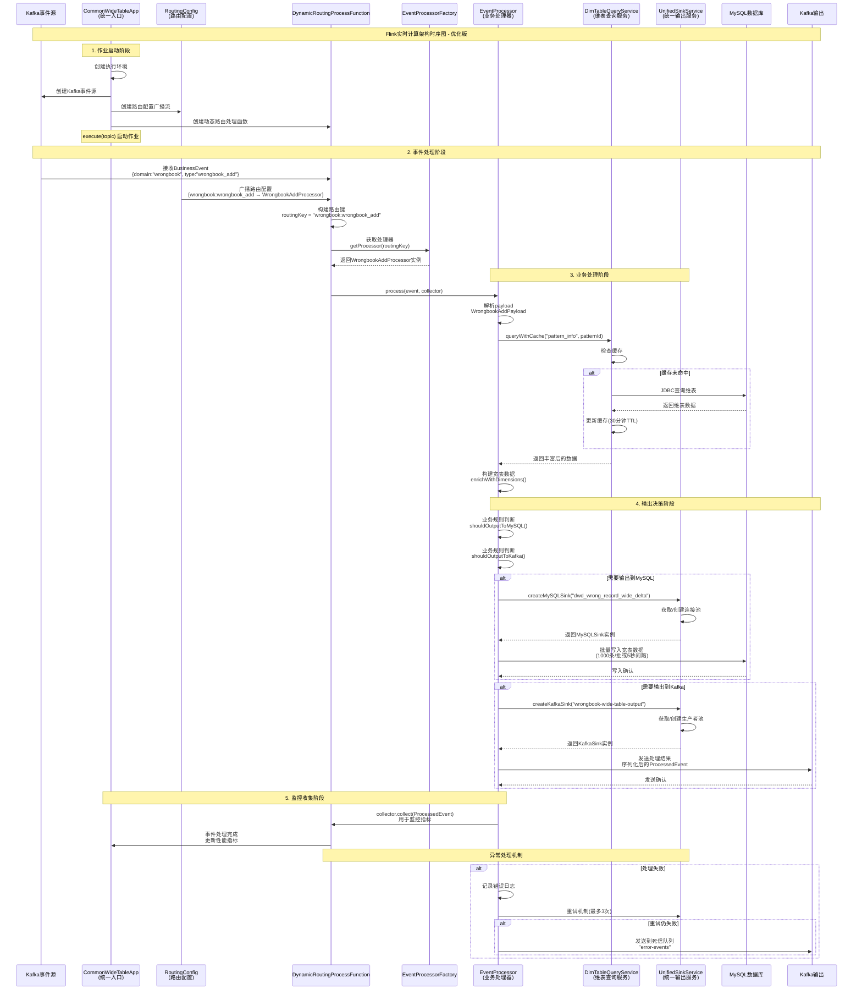

# Flink实时计算架构时序图 - Mermaid格式

## 📊 优化后架构完整时序图

## 🔍 时序图说明

### 📋 参与者说明
- **Kafka事件源**: 接收业务事件的数据源
- **CommonWideTableApp**: 统一的作业入口，负责路由转发
- **RoutingConfig**: 动态路由配置，支持热更新
- **DynamicRoutingProcessFunction**: 核心路由处理函数
- **EventProcessorFactory**: 处理器工厂，负责创建处理器实例
- **EventProcessor**: 业务处理器，负责具体业务逻辑和输出决策
- **DimTableQueryService**: 维表查询服务，提供缓存功能
- **UnifiedSinkService**: 统一输出服务，封装MySQL和Kafka输出
- **MySQL数据库**: 宽表数据存储
- **Kafka输出**: 下游数据传输

### 🚀 处理流程
1. **作业启动**: 创建执行环境和各种数据流
2. **事件接收**: 从Kafka接收业务事件
3. **动态路由**: 根据事件类型路由到对应处理器
4. **业务处理**: 执行具体业务逻辑，包括维表查询
5. **输出决策**: 根据业务规则决定输出目标
6. **数据输出**: 写入MySQL和/或Kafka
7. **监控收集**: 收集处理指标和性能数据
8. **异常处理**: 完善的错误处理和重试机制

### ✅ 关键特性
- **职责分离**: 入口类只负责路由，处理器负责业务和输出
- **统一输出**: UnifiedSinkService提供统一的输出服务
- **缓存优化**: 维表查询自动缓存，提升性能
- **灵活配置**: 支持动态路由配置热更新
- **错误处理**: 完整的重试机制和死信队列
