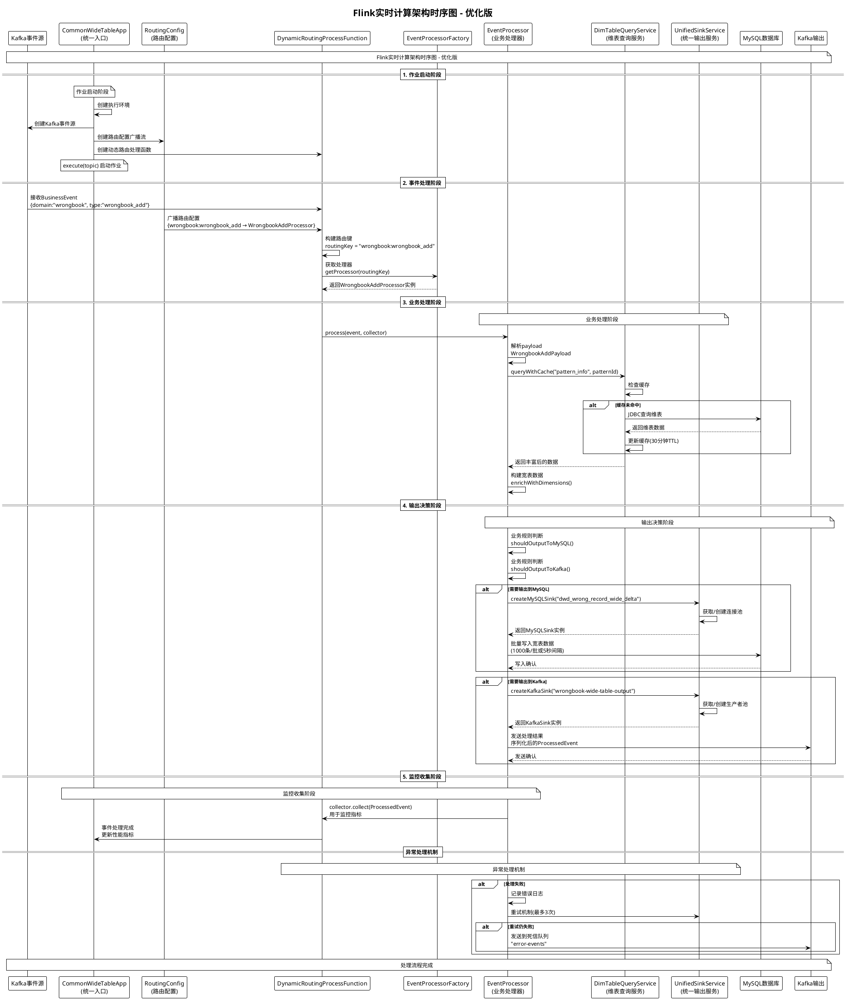

# Flink实时计算架构时序图 - PlantUML格式

## 📊 优化后架构完整时序图



## 🔍 PlantUML时序图详解

### 📋 核心组件职责

#### 🚀 **CommonWideTableApp (统一入口)**
- **职责**: 作业启动和路由转发
- **特点**: 极简设计，一行代码启动作业
- **使用**: `CommonWideTableApp.execute("wrongbook")`

#### 🔄 **DynamicRoutingProcessFunction (动态路由)**
- **职责**: 根据事件类型动态路由到对应处理器
- **路由键**: `domain:type` 格式 (如 `wrongbook:wrongbook_add`)
- **特点**: 支持热更新，无需重启作业

#### ⚙️ **EventProcessor (业务处理器)**
- **职责**: 业务逻辑处理 + 输出决策 + 数据输出
- **接口**: `process(BusinessEvent event, Collector<ProcessedEvent> collector)`
- **特点**: 自主决定输出目标和策略

#### 💾 **DimTableQueryService (维表查询服务)**
- **职责**: 提供缓存的维表查询服务
- **缓存**: 30分钟TTL，支持并发访问
- **性能**: 大幅减少数据库查询压力

#### 📤 **UnifiedSinkService (统一输出服务)**
- **职责**: 封装MySQL和Kafka输出逻辑
- **特性**: 连接池管理、批量处理、错误重试
- **优势**: 消除代码冗余，统一配置管理

### 🚀 处理流程详解

#### **阶段1: 作业启动**
```java
// 超简单的启动方式
public static void main(String[] args) throws Exception {
    CommonWideTableApp.execute("wrongbook");
}
```

#### **阶段2: 事件路由**
```
事件: {domain:"wrongbook", type:"wrongbook_add"}
路由键: "wrongbook:wrongbook_add"
处理器: WrongbookAddProcessor
```

#### **阶段3: 业务处理**
```java
@ProcessorConfig(eventTypes = {"wrongbook:wrongbook_add"})
public class WrongbookAddProcessor implements EventProcessor {
    @Override
    public void process(BusinessEvent event, Collector<ProcessedEvent> collector) {
        // 1. 解析payload
        // 2. 查询维表
        // 3. 构建宽表数据
        // 4. 输出决策
        // 5. 数据输出
    }
}
```

#### **阶段4: 输出决策**
```java
// 业务规则决定输出目标
if (shouldOutputToMySQL(payload)) {
    outputToMySQL(processedEvent);
}

if (shouldOutputToKafka(payload)) {
    outputToKafka(processedEvent);
}
```

#### **阶段5: 监控收集**
```java
// 收集监控指标
collector.collect(new ProcessedEvent(event, wideTableData, null));
```

### 🔧 关键技术特性

#### ✅ **性能优化**
- **连接池**: MySQL和Kafka连接复用
- **批量处理**: 智能批量写入(1000条/批或5秒间隔)
- **缓存机制**: 维表查询缓存(30分钟TTL)
- **异步处理**: 非阻塞的输出操作

#### ✅ **可靠性保证**
- **重试机制**: 最多3次重试
- **死信队列**: 处理失败事件存储
- **事务保证**: MySQL批量写入事务
- **监控指标**: 完整的性能和错误监控

#### ✅ **扩展性设计**
- **新增处理器**: 只需实现EventProcessor接口
- **配置热更新**: 路由配置30秒内生效
- **多输出支持**: 同时支持MySQL和Kafka输出
- **插件化架构**: 高度模块化的组件设计

### 🎯 使用示例

#### 新增业务处理器
```java
@ProcessorConfig(eventTypes = {"user:user_register"})
public class UserRegisterProcessor implements EventProcessor {
    
    private final UnifiedSinkService sinkService = UnifiedSinkService.getInstance();
    
    @Override
    public void process(BusinessEvent event, Collector<ProcessedEvent> collector) {
        // 1. 业务逻辑处理
        UserRegisterPayload payload = parsePayload(event);
        
        // 2. 构建宽表数据
        Map<String, Object> userData = buildUserData(payload);
        
        // 3. 输出决策和执行
        outputToMySQL(userData);
        if (isVipUser(payload)) {
            outputToKafka(userData);
        }
        
        // 4. 监控收集
        collector.collect(new ProcessedEvent(event, userData, null));
    }
}
```

**这个优化后的架构实现了真正的职责分离、高性能和易扩展！** 🚀
