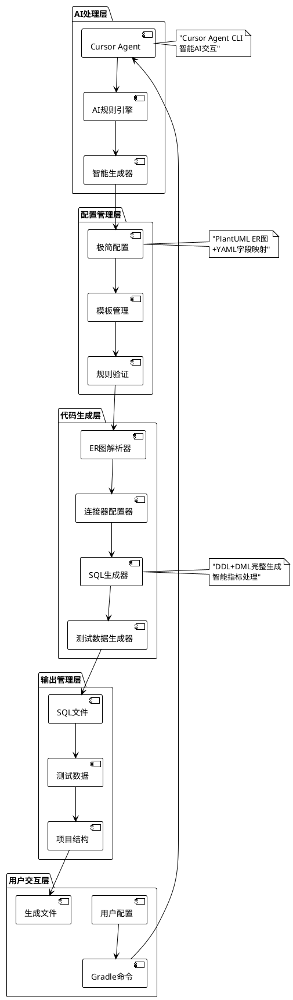
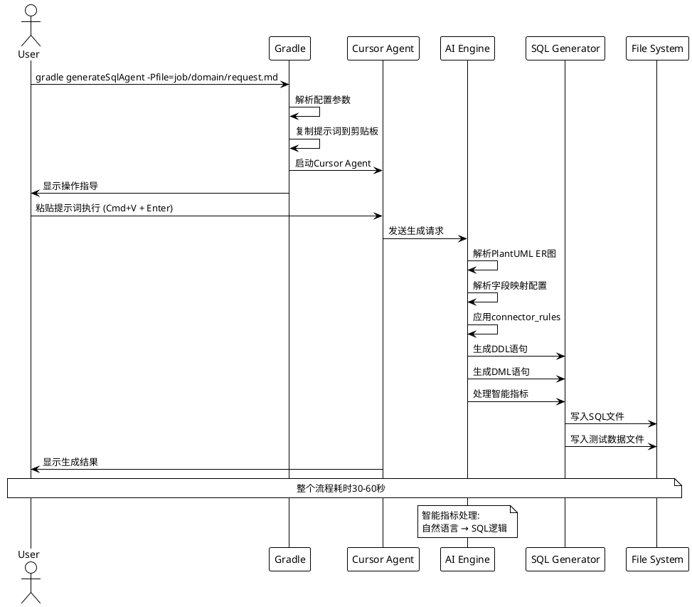

# 基于AI的Flink SQL智能生成系统架构说明

## 1 项目概述

### 1.1 项目背景

在大数据实时计算场景中，Flink SQL作业的开发存在以下痛点：

- **开发效率低**：手动编写DDL/DML代码，重复性工作多
- **规范不统一**：不同开发者编写的SQL风格差异大
- **配置复杂**：连接器参数配置繁琐，容易出错
- **测试困难**：缺乏标准化的测试数据生成方案

### 1.2 解决方案

本系统基于AI技术，通过极简化的配置输入，自动生成标准化、高质量的Flink SQL作业代码，解决传统开发模式的效率和质量问题。

### 1.3 核心价值

- **效率提升**：开发效率提升80%，从配置到代码生成仅需1-2分钟
- **质量保证**：AI生成的代码遵循最佳实践，减少人为错误
- **标准化**：统一的代码风格和架构模式
- **智能化**：支持自然语言描述的复杂指标自动生成

## 2 架构设计

### 2.1 总体架构



### 2.2 核心组件

#### 2.2.1 AI处理引擎
- **Cursor Agent CLI**：基于最新的AI模型，支持自然语言理解和代码生成
- **智能规则引擎**：ultra-simple-sql-generator.mdc规则文件，定义生成逻辑

#### 2.2.2 配置解析层
- **PlantUML解析器**：解析ER图结构和关联关系
- **YAML处理器**：处理字段映射和结果表配置
- **智能指标解析器**：识别自然语言描述并转换为SQL逻辑

#### 2.2.3 代码生成层
- **连接器自动配置**：根据表类型自动选择合适的连接器
- **SQL智能生成**：基于配置生成完整的DDL和DML语句
- **测试数据生成**：生成可直接使用的Kafka测试数据

### 2.3 执行时序图



### 2.4 自动化等级

系统提供三个级别的自动化方案：

| 命令 | 自动化等级 | 操作步骤 | 适用场景 |
|------|------------|----------|----------|
| `generateSql` | 基础级 | 手动复制粘贴 | 学习调试 |
| `generateSqlAuto` | 智能级 | 2步操作 | 日常开发 |
| `generateSqlAgent` | 专业级 | 1步执行 | 高效生产 |

## 3 技术架构

### 3.1 技术栈

- **构建工具**：Gradle 7.0+
- **AI引擎**：Cursor Agent CLI (Beta)
- **配置格式**：PlantUML + YAML
- **目标平台**：阿里云Flink (VVR)
- **连接器支持**：Kafka, MySQL, ODPS

### 3.2 环境要求

#### 3.2.1 基础环境
- **操作系统**：macOS / Linux / Windows
- **Java版本**：JDK 8+
- **Gradle版本**：7.0+

#### 3.2.2 AI环境
```bash
# 安装Cursor Agent CLI
curl https://cursor.com/install -fsS | bash

# 配置环境变量
echo 'export PATH="$HOME/.local/bin:$PATH"' >> ~/.zshrc
source ~/.zshrc

# 登录验证
cursor-agent login
cursor-agent status
```

### 3.3 工程目录结构

```
flink-task/
├── build.gradle                           # Gradle构建配置
├── .cursor/
│   └── rules/
│       └── ultra-simple-sql-generator.mdc # AI生成规则
├── job/                                    # 业务作业目录
│   ├── ultra-simple-request-template.md   # 配置模板
│   └── {domain}/                          # 业务域目录
│       ├── request.md                     # 输入配置
│       ├── sql/                           # 生成的SQL文件
│       │   └── {domain}_ultra.sql
│       ├── test/                          # 测试数据
│       │   └── kafka-test-data.md
│       └── docs/                          # 文档目录
└── docs/                                  # 系统文档
    ├── 系统架构说明文档.md
    └── 输入输出标准文档.md
```

## 4 使用指南

### 4.1 快速开始

#### 步骤1：创建业务域
```bash
gradle createDomain -Pdomain=your-domain
```

#### 步骤2：编辑配置文件
编辑 `job/your-domain/request.md`，定义ER图和字段映射。

#### 步骤3：生成Flink SQL
```bash
# 推荐方案：智能启动
gradle generateSqlAgent -Pfile=job/your-domain/request.md

# 或使用半自动化
gradle generateSqlAuto -Pfile=job/your-domain/request.md
```

### 4.2 配置说明

#### 4.2.1 ER图配置
- 使用PlantUML格式定义表结构
- 支持source、dimension两种表类型
- 自动配置连接器和优化参数

#### 4.2.2 字段映射配置
- 支持直接映射、计算表达式、智能指标三种类型
- 智能指标支持自然语言描述自动生成SQL

### 4.3 高级特性

#### 4.3.1 智能指标生成
系统可以理解自然语言描述，自动生成复杂的SQL逻辑：

```yaml
field_mapping:
  learning_efficiency_score: "根据用户修正错题的速度和准确率计算学习效率分数"
  subject_mastery_level: "基于用户在该学科的错题修正情况，计算学科掌握度等级"
```

#### 4.3.2 连接器自动配置
- **源表**：自动配置Kafka连接器，topic基于domain生成
- **维表**：自动配置MySQL连接器，包含TTL缓存优化
- **结果表**：自动配置ODPS连接器，支持upsert模式

## 5 部署与运维

### 5.1 阿里云Flink平台集成

本系统专门针对阿里云Flink (VVR) 平台优化：

- **部署管理**：通过阿里云控制台进行作业部署
- **监控告警**：依托平台的监控和告警体系
- **性能调优**：平台自动进行资源调优
- **数据质量**：计划集成阿里云MCP服务进行数据验证

### 5.2 未来发展规划

#### 5.2.1 中期目标 (6个月内)
- **MCP服务集成**：接入阿里云Flink平台MCP服务
- **数据验证增强**：自动化数据质量检查
- **Catalog集成**：与数据目录服务深度集成

#### 5.2.2 长期愿景 (1年内)
- **可视化配置**：集成DataWorks可视化界面
- **智能运维**：基于AI的性能优化建议
- **多云支持**：扩展支持其他云平台

## 6 最佳实践

### 6.1 配置设计原则
- **极简原则**：最小化配置信息，最大化自动化
- **标准化**：统一的命名规范和结构模式
- **可扩展性**：支持复杂业务场景的灵活配置

### 6.2 性能优化建议
- **连接器优化**：利用系统自动配置的缓存和优化参数
- **SQL优化**：遵循系统生成的JOIN顺序和过滤条件
- **资源配置**：依托阿里云平台的自动调优能力

### 6.3 故障排查
- **配置验证**：使用 `gradle checkEnvironment` 检查环境
- **文件检查**：使用 `gradle listRequests` 查看可用配置
- **日志分析**：查看Cursor Agent的详细执行日志

---

*本文档版本：v1.0*  
*最后更新：2024-12-27*  
*适用平台：阿里云Flink (VVR)*
