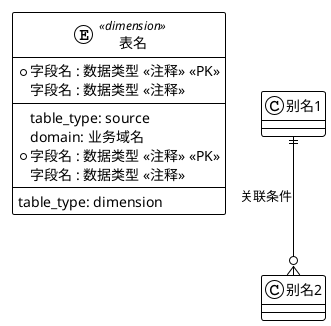

# Flink SQL智能生成系统输入输出标准

## 1 输入规范

### 1.1 输入文件格式

#### 1.1.1 文件命名规范
- **标准文件名**：`request.md`
- **文件路径**：`job/{业务域}/request.md`
- **编码格式**：UTF-8
- **换行符**：LF (Linux格式)

#### 1.1.2 文件结构规范

```markdown
# {业务域}Flink SQL生成需求模板

## 📊 ER图定义
{PlantUML ER图}

## 🔄 字段映射定义  
{YAML配置}
```

### 1.2 PlantUML ER图规范

#### 1.2.1 基础语法结构



#### 1.2.2 表类型定义

| 表类型 | 标识符 | 连接器 | 说明 |
|--------|---------|---------|------|
| 源表 | `<<source>>` | Kafka | 事件流数据源 |
| 维表 | `<<dimension>>` | MySQL | 维度数据，支持查找 |

**注意**：结果表不在ER图中定义，通过字段映射配置指定。

#### 1.2.3 字段定义规范

```plantuml
entity "示例表" as example {
  * id : string <<主键ID>> <<PK>>           # 主键字段
  name : string <<名称>>                   # 普通字段
  amount : decimal(10,2) <<金额>>          # 数值字段
  created_time : timestamp <<创建时间>>     # 时间字段
  --
  table_type: source|dimension
  domain: 业务域 (仅源表需要)
}
```

#### 1.2.4 关联关系规范

```plantuml
' 基础关联
源表 ||--o{ 维表 : "payload.字段 = 维表.字段"

' 复杂关联
源表 ||--o{ 维表 : "payload.字段 = 维表.字段 AND 维表.状态 = 1"
```

### 1.3 YAML字段映射规范

#### 1.3.1 结果表配置

```yaml
# 结果表配置
result_table:
  table_name: "表名"                    # 必填：结果表名
  table_type: "result"                  # 固定值
  connector: "odps"                     # 固定值：ODPS连接器
  primary_key: ["字段1", "字段2"]        # 必填：主键字段列表
```

#### 1.3.2 字段映射配置

```yaml
# 字段映射配置
field_mapping:
  # 1. 直接映射
  字段名: "payload.源字段"               # 源表payload字段
  字段名: "维表名.字段名"                # 维表字段
  
  # 2. 计算表达式
  字段名: "CASE WHEN 条件 THEN 值1 ELSE 值2 END"
  字段名: "TO_TIMESTAMP_LTZ(payload.时间戳, 0)"
  
  # 3. 智能指标 (自然语言描述)
  字段名: "根据用户行为数据计算活跃度评分，考虑登录频次和使用时长"
  字段名: "基于交易记录分析用户风险等级，综合金额和频次"
```

#### 1.3.3 字段映射类型详解

| 映射类型 | 格式 | 示例 | 说明 |
|----------|------|------|------|
| Payload字段 | `payload.字段名` | `payload.userId` | 直接取源表payload中的字段 |
| 维表字段 | `表名.字段名` | `user_info.user_name` | 取维表关联后的字段 |
| SQL表达式 | 完整SQL | `CASE WHEN...` | 直接的SQL计算表达式 |
| 智能指标 | 自然语言 | `根据...计算...` | AI自动生成复杂逻辑 |

### 1.4 输入验证规则

#### 1.4.1 必填项检查
- PlantUML ER图必须包含至少一个源表
- result_table配置必须完整
- field_mapping必须包含至少一个字段映射

#### 1.4.2 格式验证
- PlantUML语法正确性
- YAML格式正确性
- 字段名命名规范 (小写字母+下划线)

## 2 输出规范

### 2.1 输出文件结构

```
job/{业务域}/
├── sql/
│   └── {业务域}_ultra.sql              # 生成的Flink SQL文件
├── test/
│   └── kafka-test-data.md              # Kafka测试数据文件
└── docs/
    └── {可选文档文件}
```

### 2.2 SQL文件输出规范

#### 2.2.1 文件头注释
```sql
-- =============================================================================
-- {业务域}实时宽表作业 (极简版生成)
-- 业务描述: 基于ultra-simple-sql-generator.mdc生成的完整Flink SQL作业
-- 生成时间: YYYY-MM-DD
-- 输入配置: job/{业务域}/request.md
-- =============================================================================
```

#### 2.2.2 DDL语句结构

**源表DDL示例**：
```sql
-- 源表定义 - BusinessEvent (自动配置Kafka连接器)
CREATE TEMPORARY TABLE BusinessEvent (
    domain STRING COMMENT '业务域',
    type STRING COMMENT '事件类型', 
    payload STRING COMMENT '业务载荷JSON',
    event_time TIMESTAMP(3) COMMENT '事件时间',
    processing_time AS PROCTIME(),
    WATERMARK FOR event_time AS event_time - INTERVAL '5' SECOND
) WITH (
    'connector' = 'kafka',
    'topic' = '{业务域}-events',
    'properties.bootstrap.servers' = 'localhost:9092',
    'scan.startup.mode' = 'latest-offset',
    'format' = 'json',
    'json.timestamp-format.standard' = 'ISO-8601'
);
```

**维表DDL示例**：
```sql
-- 维表定义 - user_info (自动配置MySQL连接器+TTL)
CREATE TEMPORARY TABLE user_info (
    user_id STRING NOT NULL COMMENT '用户ID',
    user_name STRING COMMENT '用户名',
    PRIMARY KEY (user_id) NOT ENFORCED
) WITH (
    'connector' = 'jdbc',
    'url' = 'jdbc:mysql://localhost:3306/database',
    'table-name' = 'user_info',
    'lookup.cache.ttl' = '30 min',
    'lookup.cache.max-rows' = '100000'
);
```

**结果表DDL示例**：
```sql
-- 结果表定义 - {结果表名} (自动配置ODPS连接器)
CREATE TEMPORARY TABLE {结果表名} (
    user_id STRING NOT NULL COMMENT '用户ID',
    user_name STRING COMMENT '用户名',
    efficiency_score DECIMAL(5,2) COMMENT '效率评分',
    PRIMARY KEY (user_id) NOT ENFORCED
) WITH (
    'connector' = 'odps',
    'project' = 'your_project',
    'tableName' = '{结果表名}',
    'accessId' = '${ODPS_ACCESS_ID}',
    'accessKey' = '${ODPS_ACCESS_KEY}',
    'endpoint' = 'http://service.odps.aliyun.com/api'
);
```

#### 2.2.3 DML语句结构

```sql
-- 业务逻辑SQL
INSERT INTO {结果表名}
SELECT 
    JSON_VALUE(be.payload, '$.userId') AS user_id,
    ui.user_name AS user_name,
    CASE 
        WHEN JSON_VALUE(be.payload, '$.actionType') = 'login' THEN 10
        WHEN JSON_VALUE(be.payload, '$.actionType') = 'purchase' THEN 20
        ELSE 5
    END AS efficiency_score
FROM BusinessEvent be
LEFT JOIN user_info FOR SYSTEM_TIME AS OF be.processing_time ui
    ON ui.user_id = JSON_VALUE(be.payload, '$.userId')
WHERE be.domain = '{业务域}'
    AND be.type = '{事件类型}';
```

### 2.3 测试数据文件规范

#### 2.3.1 文件格式
- **文件名**：`kafka-test-data.md`
- **格式**：Markdown + JSON代码块
- **用途**：可直接复制到阿里云Kafka平台使用

#### 2.3.2 内容结构

```markdown
# {业务域}Kafka测试数据

## 测试数据说明
本文件包含用于测试{业务描述}的Kafka消息数据。数据格式为JSON，符合BusinessEvent表结构要求。

## 使用方法
1. 复制以下JSON数据
2. 登录阿里云Kafka控制台
3. 进入消息发送页面
4. 粘贴数据并发送

## 单条测试数据
\```json
{
  "domain": "{业务域}",
  "type": "{事件类型}",
  "payload": {
    "userId": "user_001",
    "actionType": "login",
    "timestamp": 1703123456789
  },
  "event_time": "2024-12-27T12:00:00.000Z"
}
\```

## 批量测试数据
\```json
[
  {
    "domain": "{业务域}",
    "type": "{事件类型}",
    "payload": {...},
    "event_time": "2024-12-27T12:00:00.000Z"
  },
  {...}
]
\```

## 维表测试数据
用于MySQL维表的测试数据：

\```sql
INSERT INTO user_info VALUES 
('user_001', '张三'),
('user_002', '李四');
\```

## 预期输出
执行上述测试数据后，结果表预期输出：

\```json
{
  "user_id": "user_001",
  "user_name": "张三", 
  "efficiency_score": 10.00
}
\```
```

### 2.4 输出质量标准

#### 2.4.1 代码质量
- **语法正确性**：生成的SQL符合Flink语法规范
- **性能优化**：包含必要的优化配置和参数
- **注释完整**：每个表和字段都有详细注释

#### 2.4.2 数据完整性
- **字段映射完整**：所有配置的字段都正确映射
- **类型转换正确**：数据类型转换准确无误
- **关联关系正确**：JOIN条件与ER图保持一致

#### 2.4.3 测试数据质量
- **数据合理性**：测试数据符合业务逻辑
- **覆盖完整性**：覆盖主要业务场景
- **格式标准化**：JSON格式规范，可直接使用

## 3 目录结构标准

### 3.1 项目根目录

```
flink-task/                                # 项目根目录
├── build.gradle                          # Gradle构建配置
├── gradle/                               # Gradle包装器
│   └── wrapper/
├── .cursor/                              # Cursor AI配置
│   └── rules/
│       └── ultra-simple-sql-generator.mdc
├── job/                                  # 业务作业目录
├── docs/                                 # 项目文档
└── README.md                             # 项目说明
```

### 3.2 业务域目录

```
job/{业务域}/                              # 单个业务域
├── request.md                            # 输入配置 (必须)
├── sql/                                  # SQL输出目录
│   ├── {业务域}_ultra.sql                # 生成的SQL文件
│   └── {业务域}_v2.sql                   # 历史版本 (可选)
├── test/                                 # 测试目录
│   ├── kafka-test-data.md                # Kafka测试数据
│   └── expected-output.json              # 预期输出 (可选)
├── docs/                                 # 业务文档 (可选)
│   ├── business-requirements.md          # 业务需求
│   └── data-model.md                     # 数据模型
└── temp/                                 # 临时文件 (可选)
    └── debug/                            # 调试文件
```

### 3.3 标准化命名规范

#### 3.3.1 目录命名
- 使用小写字母和连字符：`user-profile`, `order-analysis`
- 避免特殊字符和空格
- 长度控制在2-20个字符

#### 3.3.2 文件命名
- **配置文件**：`request.md` (固定)
- **SQL文件**：`{业务域}_ultra.sql`
- **测试数据**：`kafka-test-data.md` (固定)
- **历史版本**：`{业务域}_v{版本号}.sql`

#### 3.3.3 表名和字段命名
- 使用小写字母和下划线：`user_profile`, `order_amount`
- 表名采用业务含义命名：`dwd_user_behavior_wide`
- 字段名具有明确业务含义：`user_id`, `order_total_amount`

## 4 最佳实践

### 4.1 输入配置最佳实践

#### 4.1.1 ER图设计原则
- **简洁性**：只包含必要的表和关联关系
- **清晰性**：表名和字段名具有明确的业务含义
- **一致性**：命名规范在整个项目中保持一致

#### 4.1.2 字段映射设计原则
- **完整性**：覆盖结果表的所有字段
- **准确性**：映射关系与业务逻辑保持一致
- **可维护性**：复杂逻辑用自然语言描述，便于理解

### 4.2 输出验证最佳实践

#### 4.2.1 SQL验证
- 在Flink SQL Client中验证语法
- 检查连接器配置的有效性
- 验证数据类型转换的正确性

#### 4.2.2 测试数据验证
- 使用真实的业务场景数据
- 验证JSON格式的有效性
- 确保数据覆盖主要业务路径

### 4.3 版本管理最佳实践

#### 4.3.1 配置版本管理
- 对`request.md`进行版本控制
- 重大变更时创建新版本分支
- 保留历史版本用于回滚

#### 4.3.2 输出版本管理
- 生成新版本时保留旧版本文件
- 使用版本号命名：`v1`, `v2`, `v3`
- 在文件头注释中记录变更说明

---

*本文档版本：v1.0*  
*最后更新：2024-12-27*  
*配套系统：Flink SQL智能生成系统*
