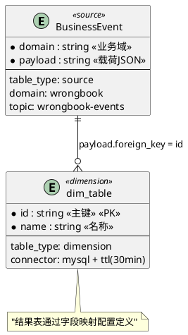

# 极简版Flink SQL生成器使用指南

## 🎯 核心特性

### ✅ 极简配置
- **只需要**: ER图 + 字段映射
- **自动生成**: 完整DDL + DML + JSON测试数据
- **智能连接器**: 根据表类型自动配置连接器

### ✅ 连接器规则
- **源表** (table_type: source) → Kafka连接器 (topic: {domain}-events)
- **维表** (table_type: dimension) → MySQL连接器 + 30分钟TTL缓存
- **结果表** (table_type: result) → ODPS连接器 + upsert模式

## 📝 使用步骤

### 1. 创建极简配置文件
文件名格式: `{domain}-request-ultra.md` 或 `ultra-simple-request.md`

**ER图定义 (PlantUML格式, 仅源表/维表)**:


**结果表和字段映射定义 (YAML格式)**:
```yaml
# 结果表配置
result_table:
  table_name: "result_table"
  table_type: "result"
  connector: "odps"
  primary_key: ["id"]

# 字段映射配置
field_mapping:
  id: "payload.id"                    # 直接映射
  name: "dim_table.name"              # 维表字段
  computed: "CASE payload.status WHEN 1 THEN '有效' ELSE '无效' END"  # 计算字段
  efficiency_score: "根据用户操作速度和准确率计算效率分数"  # 智能指标描述
```

### 2. 使用AI规则生成SQL
基于 `ultra-simple-sql-generator.mdc` 规则自动生成：

**生成内容**:
- ✅ 完整的Flink SQL文件 (DDL + DML)
- ✅ 自动推断的结果表结构
- ✅ 智能生成的指标计算SQL
- ✅ 自动配置的连接器参数
- ✅ Markdown格式的JSON测试数据文件

### 3. 部署和测试
1. **SQL部署**: 将生成的SQL提交到阿里云VVR平台
2. **数据测试**: 使用生成的JSON数据在阿里云Kafka平台发送测试消息
3. **监控验证**: 在VVR平台监控作业运行状态

## 📊 错题本示例

### 输入配置 (极简版)
文件: `job/wrongbook/wrongbook-request-ultra.md`

**配置内容**:
- **PlantUML ER图**: 1个源表 + 3个维表 (不包含结果表)
- **结果表配置**: 通过result_table YAML配置定义
- **字段映射**: 16个基础字段 + 4个智能指标字段
- **关联关系**: 3个可视化JOIN链
- **智能指标**: 自然语言描述自动生成SQL

### 生成结果
1. **SQL文件**: `job/wrongbook/sql/wrongbook_ultra_v3.sql`
   - 完整的DDL语句 (源表+维表+自动推断结果表)
   - 智能的DML逻辑 (3层JOIN + 智能指标计算)
   - 自动的连接器配置

2. **测试数据**: `job/wrongbook/test/kafka-test-data.md`
   - 10条标准测试消息 (markdown格式)
   - 覆盖不同学科和修正结果
   - 单条和批量两种格式
   - 可直接复制到阿里云Kafka平台

## 🔧 连接器自动配置详情

### 源表连接器 (Kafka)
```sql
WITH (
    'connector' = 'kafka',
    'topic' = '{domain}-events',           -- 基于domain自动生成
    'properties.bootstrap.servers' = 'kafka-cluster:9092',
    'scan.startup.mode' = 'latest-offset',
    'format' = 'json'
)
```

### 维表连接器 (MySQL + TTL)
```sql  
WITH (
    'connector' = 'jdbc',
    'lookup.cache.ttl' = '30 min',         -- 自动添加TTL
    'lookup.cache.max-rows' = '100000',    -- 自动添加缓存
    'url' = 'jdbc:mysql://mysql-host:3306/db',
    'table-name' = '{table_name}'
)
```

### 结果表连接器 (ODPS)
```sql
WITH (
    'connector' = 'odps',
    'project' = 'flink_project', 
    'tableName' = '{table_name}',
    'sink.operation' = 'upsert'            -- 自动配置upsert
)
```

## 🎯 字段映射规则

### 基础映射
```yaml
field_name: "payload.field"              # 直接取payload字段 → JSON_VALUE(payload, '$.field')
field_name: "table.field"                # 取维表字段 → table.field
```

### 计算字段
```yaml
computed_field: "CASE payload.status WHEN 1 THEN '有效' ELSE '无效' END"
time_field: "TO_TIMESTAMP_LTZ(payload.timestamp, 0)"
cast_field: "CAST(payload.number AS BIGINT)"
```

### 智能指标字段 (AI自动生成SQL)
```yaml
efficiency_score: "根据用户操作速度和准确率计算效率分数，操作越快且准确率越高得分越高"
mastery_level: "基于用户在该领域的表现情况，计算掌握度等级，分为初级、中级、高级"
trend_analysis: "分析用户的学习趋势，通过时间序列数据计算进步幅度"
```

**智能指标生成原理**:
- 识别描述中的关键词："计算"、"分析"、"根据"、"基于"
- 自动匹配SQL模式：聚合函数、CASE表达式、窗口函数
- 生成复杂的业务逻辑SQL代码

## 📋 JSON测试数据格式

### Markdown文件结构
生成的测试数据文件包含:
- **单条测试数据**: 用于逐条验证
- **批量测试数据**: 用于批量发送
- **使用说明**: 详细的操作步骤
- **数据统计**: 测试覆盖情况

### 标准JSON格式
```json
{
  "domain": "{domain}",                   // 与PlantUML中domain一致
  "type": "{domain}_fix",                 // 事件类型
  "payload": {                            // 业务载荷
    "field1": "value1",
    "field2": 123,
    "timestamp": 1703123456000
  },
  "event_time": "2024-12-27T09:00:00.000Z"  // 事件时间
}
```

### 使用方法
1. 打开生成的 `.md` 测试数据文件
2. 复制所需的JSON数据 (单条或批量)
3. 登录阿里云Kafka控制台
4. 选择对应的topic (如: wrongbook-events)
5. 粘贴JSON数据发送消息
6. 在VVR平台观察作业处理结果

## 🚀 优势对比

### 传统模式 vs 极简模式

| 对比项 | 传统模式 | 极简模式 |
|--------|----------|----------|
| **配置复杂度** | 312行复杂配置 | PlantUML ER图+字段映射 |
| **ER图可视化** | 需要手工画图 | PlantUML自动生成图表(仅源表/维表) |
| **结果表配置** | 需要手工设计表结构 | 根据字段映射自动推断 |
| **连接器配置** | 手工配置各种参数 | 根据表类型自动配置 |
| **SQL生成** | 需要手工编写DDL+DML | 完全自动生成 |
| **指标计算** | 需要编写复杂SQL逻辑 | 基于自然语言描述智能生成 |
| **测试数据** | 需要编写Java测试代码 | 自动生成markdown格式JSON |
| **开发时间** | 2-3小时 | 10-15分钟 |
| **维护成本** | 高 (多个文件) | 低 (单一配置) |

### 适用场景
- ✅ **标准OLAP场景**: 事件流 + 维表关联 + 宽表生成
- ✅ **快速原型开发**: 需要快速验证业务逻辑
- ✅ **批量作业生成**: 多个相似作业的快速生成
- ❌ **复杂流式计算**: 需要复杂窗口函数或状态管理
- ❌ **特殊连接器**: 需要非标准连接器配置

## 🔍 故障排查

### 常见问题
1. **连接器配置错误**: 检查table_type是否正确设置
2. **字段映射错误**: 确认payload.field格式和维表字段名
3. **JSON格式错误**: 验证生成的JSON是否符合标准格式
4. **JOIN关系错误**: 检查relationships中的字段名是否匹配

### 调试建议
1. 先在VVR平台验证SQL语法
2. 使用少量测试数据验证业务逻辑
3. 检查维表缓存是否生效
4. 监控作业的背压和吞吐量

---

*基于ultra-simple-sql-generator.mdc v1.0生成*
