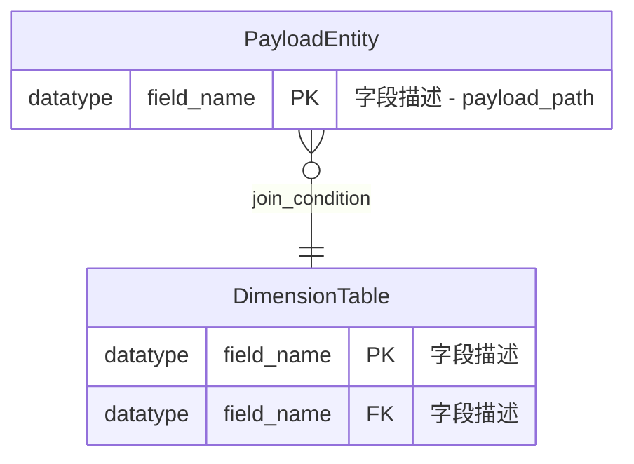

# ER图知识库管理使用指南 v1.0

## 📖 概述

本指南介绍如何使用基于 AI Agent 的智能ER图知识库管理系统。该系统能够根据request文件自动维护ER关系图，检测冲突并生成异常报告，确保整个系统的数据模型一致性和完整性。

## 🎯 核心功能

### 🗄️ 知识库管理
- **动态更新**: 基于request文件自动更新ER图结构
- **版本控制**: 追踪ER图的演化历史和变更
- **分层组织**: 全局表、业务域表、关联关系的层次化管理
- **一致性维护**: 确保跨业务域的数据模型一致性

### 🔍 智能解析
- **Request文件解析**: 自动解析ER图定义和表结构
- **Payload结构识别**: 专门处理BusinessEvent.payload字段结构
- **关联关系提取**: 智能识别JOIN条件和外键关系
- **业务规则理解**: 解析复杂的业务逻辑和约束条件

### 🚨 冲突检测
- **结构冲突**: 字段类型、主键约束、外键关系冲突
- **逻辑冲突**: JOIN条件不一致、业务规则矛盾
- **命名冲突**: 表名、字段名冲突检测
- **兼容性检查**: 数据类型兼容性和转换可行性

### 📊 ER图生成
- **标准化输出**: Mermaid格式的标准ER图
- **结构完整**: 包含表结构、字段定义、关联关系
- **过滤策略**: 只输出源表Payload和维表，不包含结果表
- **可视化友好**: 清晰的关联关系和业务规则注释

## 🏗️ 知识库架构

### 目录结构
```
job/knowledge-base/
├── er-schemas/                    # ER图定义目录
│   ├── global/                   # 全局共享表定义
│   │   ├── BusinessEvent.md      # 标准事件流表结构
│   │   └── common-dimensions.md  # 通用维表定义
│   ├── domains/                  # 业务域ER图
│   │   ├── wrongbook/           # 错题本业务域
│   │   │   ├── source-payload.md    # Payload字段定义
│   │   │   ├── dimension-tables.md  # 维表定义
│   │   │   ├── relationships.md     # 关联关系定义
│   │   │   └── generated-er-diagram-v3.md # 生成的完整ER图
│   │   ├── user-stats/          # 用户统计业务域
│   │   └── {other-domains}/     # 其他业务域
│   └── consolidated/             # 整合后的全局ER图
│       ├── master-schema.md     # 主数据模型
│       └── relationship-matrix.md # 关联关系矩阵
├── conflict-reports/             # 冲突报告目录
│   ├── conflict-report-template.md # 冲突报告模板
│   └── resolution-history.md    # 冲突解决历史
└── evolution-tracking/           # 演化追踪目录
    ├── version-history.md       # 版本变更历史
    └── migration-guides.md      # 迁移指南
```

### 知识库元数据
```yaml
# 每个ER图文件的标准元数据
metadata:
  domain: "wrongbook"
  version: "3.0"
  last_updated: "2024-12-27T15:30:00Z"
  source_file: "job/wrongbook/wrongbook-request-v3.md"
  checksum: "sha256:abc123..."
  dependencies: ["tower_pattern", "tower_teaching_type"]
  conflict_status: "clean" # clean | conflicted | resolved
```

## 🚀 使用方式

### 方式1：基于 Cursor 规则的智能处理

**适用场景**: 开发阶段，利用 Cursor 的 AI 能力进行智能ER图管理

```bash
# 1. 创建或修改 request 文件
code job/{domain}/{domain}-request-v3.md

# 2. 在 Cursor 中使用 AI 功能，基于规则进行ER图更新
# 规则文件会自动应用：
# - .cursor/rules/intelligent-er-knowledge-base.mdc

# 3. AI 会自动分析并更新知识库
```

**AI 提示示例**:
```
请基于 intelligent-er-knowledge-base.mdc 规则处理这个 wrongbook-request-v3.md 文件，
更新ER图知识库并生成标准的 Mermaid ER图。

请重点关注：
1. 解析Payload字段结构
2. 检测与现有知识库的冲突
3. 更新维表定义和关联关系
4. 生成完整的ER图（不包含结果表）
5. 如有冲突，生成异常报告
```

### 方式2：手动知识库管理

**适用场景**: 需要精确控制知识库更新过程

```bash
# 1. 查看现有知识库状态
ls job/knowledge-base/er-schemas/domains/

# 2. 检查特定业务域的ER图
cat job/knowledge-base/er-schemas/domains/wrongbook/generated-er-diagram-v3.md

# 3. 手动更新知识库文件
code job/knowledge-base/er-schemas/domains/{domain}/

# 4. 生成冲突检测报告（如需要）
# 使用AI Agent进行冲突检测分析
```

### 方式3：自动化集成

**未来扩展**: 可集成到CI/CD流水线

```yaml
# CI/CD 配置示例
er_knowledge_base_check:
  stage: "validation"
  script:
    - "ai-agent validate-er --domain ${DOMAIN} --request-file ${REQUEST_FILE}"
    - "ai-agent update-knowledge-base --auto-resolve-conflicts false"
  artifacts:
    paths:
      - "job/knowledge-base/conflict-reports/"
  only:
    changes:
      - "job/**/flink-sql-request-v3.md"
```

## 📋 工作流程

### 新业务域ER图处理

#### 步骤1：请求解析
1. **读取输入**: 解析 `{domain}-request-v3.md` 文件
2. **结构提取**: 提取ER图定义、表结构、关联关系
3. **标准化**: 统一字段类型、表名、关联条件格式

#### 步骤2：冲突检测  
1. **知识库查询**: 检索现有相关ER图定义
2. **差异分析**: 识别新输入与现有结构的差异
3. **冲突分类**: 按严重程度分类冲突（Critical/Warning/Info）

#### 步骤3：处理决策
1. **无冲突**: 直接更新知识库，生成ER图
2. **有冲突**: 生成冲突报告，等待人工决策
3. **部分冲突**: 应用自动解决策略，记录变更

#### 步骤4：知识库更新
1. **文件生成**: 生成标准化的ER图文件
2. **元数据更新**: 更新版本信息和依赖关系
3. **索引维护**: 更新全局关联矩阵

### 冲突检测和解决

#### 常见冲突类型
```yaml
conflict_types:
  field_type_mismatch:
    example: "tower_pattern.id: STRING -> BIGINT"
    severity: "HIGH"
    auto_resolution: false
    
  join_condition_change:
    example: "pt.id = ttp.pt_id -> pt.pattern_id = ttp.pt_id"
    severity: "MEDIUM"
    auto_resolution: true
    
  missing_required_field:
    example: "tower_teaching_type missing chapter_id"
    severity: "HIGH"
    auto_resolution: false
    
  business_rule_contradiction:
    example: "章节匹配规则冲突"
    severity: "MEDIUM"
    auto_resolution: false
```

#### 解决策略
```yaml
resolution_strategies:
  type_migration:
    description: "数据类型迁移"
    applicability: "兼容类型转换"
    steps: ["备份", "转换脚本", "验证", "部署"]
    
  version_branching:
    description: "版本分支"
    applicability: "重大结构变更"
    steps: ["创建新版本", "并行维护", "逐步迁移"]
    
  field_mapping:
    description: "字段映射"
    applicability: "字段名变更"
    steps: ["创建映射", "更新引用", "验证正确性"]
    
  rule_override:
    description: "规则覆盖"
    applicability: "业务规则变更"
    steps: ["业务确认", "更新规则", "影响评估"]
```

## 📊 ER图生成规范

### 输出格式标准

#### Mermaid ER图结构


#### 字段描述规范
```yaml
field_description_format:
  payload_fields:
    format: "{business_meaning} - {json_path}"
    example: "修正记录ID - payload.id"
    
  dimension_fields:
    format: "{business_meaning}"
    example: "题型ID"
    
  relationship_labels:
    format: "{join_condition}"
    example: "patternId = id"
```

### 过滤规则

#### 包含的实体
```yaml
included_entities:
  source_payload:
    description: "BusinessEvent.payload中的字段结构"
    representation: "虚拟实体，展示payload结构"
    
  dimension_tables:
    description: "所有相关的维表"
    inclusion_criteria: "在JOIN中被引用"
    
  junction_tables:
    description: "多对多关联的中间表"
    special_handling: "突出显示软删除字段"
```

#### 排除的实体
```yaml
excluded_entities:
  result_tables:
    description: "结果表不在ER图范围内"
    reason: "关注数据来源，不关注输出"
    
  technical_tables:
    description: "纯技术性的配置表"
    examples: ["system_config", "audit_log"]
    
  business_event_table:
    description: "BusinessEvent表本身"
    reason: "只关注payload内容，不关注容器"
```

## 🔧 配置和定制

### 知识库配置

#### 全局设置
```yaml
# job/knowledge-base/config/global-config.yml
knowledge_base_config:
  default_version: "1.0"
  conflict_detection: "strict"
  auto_resolution: false
  backup_enabled: true
  
  entity_naming:
    payload_suffix: "Payload"
    table_prefix: ""
    relationship_delimiter: "_to_"
    
  validation_rules:
    field_name_pattern: "^[a-zA-Z][a-zA-Z0-9_]*$"
    table_name_pattern: "^[a-z][a-z0-9_]*$"
    max_relationship_depth: 5
```

#### 业务域特定配置
```yaml
# job/knowledge-base/er-schemas/domains/{domain}/config.yml
domain_config:
  domain: "wrongbook"
  payload_entity_name: "WrongbookFixPayload"
  
  special_rules:
    chapter_matching:
      enabled: true
      applicable_subjects: ["CHINESE", "ENGLISH"]
      
  field_mappings:
    subject_enum:
      MATH: "数学"
      ENGLISH: "英语"
      CHINESE: "语文"
      
  monitoring:
    join_success_rate_threshold: 0.95
    data_quality_threshold: 0.99
```

### 冲突检测配置

#### 检测规则设置
```yaml
conflict_detection_config:
  severity_levels:
    CRITICAL:
      - "primary_key_conflict"
      - "foreign_key_reference_error"
      - "circular_dependency"
      
    HIGH:
      - "field_type_mismatch"
      - "missing_required_field"
      - "data_constraint_violation"
      
    MEDIUM:
      - "join_condition_mismatch"
      - "business_rule_contradiction"
      
    LOW:
      - "naming_convention_deviation"
      - "documentation_mismatch"
      
  auto_resolution_rules:
    field_type_compatible:
      - "STRING -> VARCHAR"
      - "INT -> BIGINT"
      - "TIMESTAMP -> TIMESTAMP_LTZ"
      
    join_condition_update:
      - "field_name_change"
      - "alias_update"
```

## 📈 监控和维护

### 知识库健康度监控

#### 关键指标
```yaml
health_metrics:
  completeness:
    description: "知识库覆盖率"
    calculation: "已建模业务域 / 总业务域"
    target: "> 90%"
    
  consistency:
    description: "跨域一致性"
    calculation: "一致性检查通过 / 总检查项"
    target: "> 95%"
    
  freshness:
    description: "数据新鲜度"
    calculation: "最近更新时间距今"
    target: "< 7 days"
    
  conflict_rate:
    description: "冲突发生率"
    calculation: "有冲突的更新 / 总更新数"
    target: "< 5%"
```

#### 自动化检查
```yaml
automated_checks:
  daily_checks:
    - "referential_integrity_validation"
    - "orphaned_entity_detection"
    - "naming_convention_compliance"
    
  weekly_checks:
    - "cross_domain_consistency_check"
    - "performance_impact_assessment"
    - "documentation_completeness_review"
    
  monthly_checks:
    - "full_knowledge_base_audit"
    - "version_history_cleanup"
    - "migration_guide_update"
```

### 维护任务

#### 定期维护
```yaml
maintenance_tasks:
  knowledge_base_cleanup:
    frequency: "monthly"
    tasks:
      - "删除过期版本文件"
      - "合并重复实体定义"
      - "优化关联关系矩阵"
      
  performance_optimization:
    frequency: "quarterly"
    tasks:
      - "重建知识库索引"
      - "优化查询性能"
      - "压缩历史数据"
      
  documentation_update:
    frequency: "as_needed"
    tasks:
      - "更新使用指南"
      - "补充最佳实践"
      - "维护FAQ文档"
```

## 🚨 故障排查

### 常见问题

**Q1: ER图生成失败**
```
症状: AI Agent无法生成有效的ER图
可能原因:
1. request文件格式错误
2. 存在无法解析的复杂结构
3. 知识库索引损坏

解决步骤:
1. 验证request文件的YAML语法
2. 检查ER图定义的完整性
3. 重建知识库索引
4. 查看详细错误日志
```

**Q2: 冲突检测报告过多**
```
症状: 系统检测到大量冲突，难以处理
可能原因:
1. 检测规则过于严格
2. 历史数据不一致
3. 业务规则发生重大变更

解决步骤:
1. 调整冲突检测阈值
2. 批量处理历史不一致
3. 与业务团队确认变更策略
4. 考虑版本分支方案
```

**Q3: 知识库性能下降**
```
症状: ER图查询和更新响应缓慢
可能原因:
1. 知识库文件过大
2. 关联关系过于复杂
3. 缺少必要的索引

解决步骤:
1. 清理冗余历史数据
2. 优化关联关系结构
3. 重建或优化索引
4. 考虑知识库分片
```

## 📚 最佳实践

### 设计原则

1. **模块化管理**: 按业务域组织ER图，降低耦合度
2. **版本控制**: 严格的版本管理，支持回滚和迁移
3. **标准化**: 统一的命名规范和结构定义
4. **文档化**: 完整的元数据和业务含义说明
5. **自动化**: 尽可能自动化冲突检测和解决

### 开发建议

1. **增量更新**: 优先选择增量更新而非全量替换
2. **向后兼容**: 新版本应该向后兼容，避免破坏性变更
3. **业务验证**: 重大变更需要业务团队确认
4. **测试验证**: 在测试环境充分验证后再应用到生产
5. **监控告警**: 建立完善的监控体系，及时发现问题

### 运维要点

1. **备份策略**: 定期备份知识库，确保数据安全
2. **性能监控**: 监控查询性能，及时优化
3. **容量规划**: 合理规划存储和计算资源
4. **安全控制**: 实施适当的访问控制和权限管理
5. **灾难恢复**: 制定完整的灾难恢复计划

---

## 📖 相关文档

- [ER知识库管理规则](../.cursor/rules/intelligent-er-knowledge-base.mdc)
- [冲突报告模板](../knowledge-base/conflict-reports/conflict-report-template.md)
- [错题本ER图示例](../knowledge-base/er-schemas/domains/wrongbook/generated-er-diagram-v3.md)
- [验证工作流指南](./validation-workflow-guide.md)

---

*此指南基于 AI Agent v1.0 智能ER知识库管理系统设计*
*持续更新中，欢迎反馈和建议*
