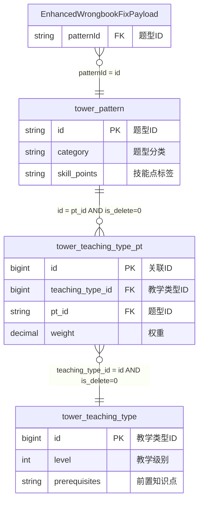

# 新错题本增强版业务域 - 维表结构定义

## 📋 基本信息

```yaml
metadata:
  domain: "new-wrongbook"
  description: "新错题本增强版业务域的维表结构定义，支持智能分析和学习路径优化"
  version: "3.0"
  last_updated: "2024-12-27T12:25:00Z"
  source_file: "job/new-wrongbook/new-wrongbook-request-v3.md"
  enhancement_level: "extended_from_wrongbook"
  conflict_status: "clean"
```

## 🏗️ 维表结构定义

### 维表1: tower_pattern (题型模式表) - 增强版

#### DDL定义
```sql
CREATE TABLE `vvp`.`default`.`tower_pattern` (
    `id` STRING NOT NULL,
    `name` STRING,
    `type` INT,
    `subject` STRING,
    `difficulty` DECIMAL(5, 3),
    `modify_time` BIGINT,
    `category` STRING,          -- 🚀 新增：题型分类
    `skill_points` STRING,      -- 🚀 新增：技能点标签
    PRIMARY KEY (id) NOT ENFORCED
) COMMENT '题型模式表(增强版)'
WITH (
    'connector' = 'jdbc',
    'lookup.cache.max-rows' = '150000',    -- 🚀 增强：缓存容量提升
    'lookup.cache.ttl' = '45 min',         -- 🚀 增强：缓存时间延长
    'password' = '******',
    'table-name' = 'tower_pattern',
    'url' = 'jdbc:mysql://pc-bp1ivlu7lykwyzx9x.rwlb.rds.aliyuncs.com:3306/tower',
    'username' = 'zstt_server'
);
```

#### 字段说明
| 字段名 | 数据类型 | 约束 | 说明 | 变更状态 | 示例值 |
|--------|----------|------|------|----------|--------|
| `id` | STRING | PK, NOT NULL | 题型唯一标识 | 不变 | `pattern_001` |
| `name` | STRING | NULL | 题型名称 | 不变 | `选择题基础` |
| `type` | INT | NULL | 题型类型编码 | 不变 | `1` |
| `subject` | STRING | NULL | 适用学科 | 不变 | `MATH` |
| `difficulty` | DECIMAL(5,3) | NULL | 难度系数 | 不变 | `0.650` |
| `modify_time` | BIGINT | NULL | 修改时间戳 | 不变 | `1703664000000` |
| `category` | STRING | NULL | 题型分类 | 🚀 新增 | `基础选择`, `计算题`, `应用题` |
| `skill_points` | STRING | NULL | 技能点标签 | 🚀 新增 | `代数运算,逻辑推理,空间想象` |

#### 业务规则
```yaml
business_rules:
  category_classification:
    valid_categories: ["基础选择", "计算题", "应用题", "理解题", "分析题", "综合题", "实验题", "创新题"]
    mapping_logic: |
      category = CASE 
        WHEN type IN (1, 2) THEN '基础选择'
        WHEN type IN (3, 4) THEN '计算题'
        WHEN type IN (5, 6) THEN '应用题'
        ELSE '综合题'
      END
      
  skill_points_format:
    format: "技能点1,技能点2,技能点3"
    max_skills: 5
    examples: ["代数运算,逻辑推理", "词汇理解,文本分析", "力学分析,公式运用"]
    
  difficulty_enhancement:
    precision: "DECIMAL(5,3)"
    range: "[0.000, 1.000]"
    interpretation:
      0.0_0.3: "简单"
      0.3_0.6: "中等" 
      0.6_0.8: "困难"
      0.8_1.0: "极难"
```

---

### 维表2: tower_teaching_type_pt (教学类型关联表) - 增强版

#### DDL定义
```sql
CREATE TABLE `vvp`.`default`.`tower_teaching_type_pt` (
    `id` BIGINT NOT NULL,
    `teaching_type_id` BIGINT,
    `pt_id` STRING,
    `order_num` INT,
    `is_delete` TINYINT,
    `modify_time` TIMESTAMP(3),
    `weight` DECIMAL(3,2),      -- 🚀 新增：权重系数
    PRIMARY KEY (id) NOT ENFORCED
) COMMENT '教学类型模式关联表(增强版)'
WITH (
    'connector' = 'jdbc',
    'lookup.cache.max-rows' = '150000',    -- 🚀 增强：缓存容量提升
    'lookup.cache.ttl' = '45 min',         -- 🚀 增强：缓存时间延长
    'password' = '******',
    'table-name' = 'tower_teaching_type_pt',
    'url' = 'jdbc:mysql://pc-bp1ivlu7lykwyzx9x.rwlb.rds.aliyuncs.com:3306/tower',
    'username' = 'zstt_server'
);
```

#### 字段说明
| 字段名 | 数据类型 | 约束 | 说明 | 变更状态 | 示例值 |
|--------|----------|------|------|----------|--------|
| `id` | BIGINT | PK, NOT NULL | 关联记录唯一ID | 不变 | `1001` |
| `teaching_type_id` | BIGINT | FK | 教学类型ID | 不变 | `2001` |
| `pt_id` | STRING | FK | 题型ID | 不变 | `pattern_001` |
| `order_num` | INT | NULL | 排序号 | 不变 | `1` |
| `is_delete` | TINYINT | NOT NULL | 删除标识 | 不变 | `0` |
| `modify_time` | TIMESTAMP(3) | NULL | 修改时间 | 不变 | `2024-12-27 12:00:00` |
| `weight` | DECIMAL(3,2) | NULL | 权重系数 | 🚀 新增 | `1.20`, `0.80` |

#### 业务规则
```yaml
business_rules:
  weight_calculation:
    range: "[0.10, 2.00]"
    default_value: 1.00
    interpretation:
      "< 0.5": "低权重，辅助性题型"
      "0.5 - 1.5": "标准权重，常规题型"
      "> 1.5": "高权重，核心题型"
      
  relationship_validation:
    foreign_key_constraints:
      teaching_type_id: "MUST EXIST in tower_teaching_type.id"
      pt_id: "MUST EXIST in tower_pattern.id"
    unique_constraint: "(teaching_type_id, pt_id)"
    soft_delete_filter: "is_delete = 0"
```

---

### 维表3: tower_teaching_type (教学类型表) - 增强版

#### DDL定义
```sql
CREATE TABLE `vvp`.`default`.`tower_teaching_type` (
    `id` BIGINT NOT NULL,
    `chapter_id` STRING,
    `teaching_type_name` STRING,
    `is_delete` TINYINT,
    `modify_time` TIMESTAMP(3),
    `level` INT,               -- 🚀 新增：教学级别
    `prerequisites` STRING,    -- 🚀 新增：前置知识点
    PRIMARY KEY (id) NOT ENFORCED
) COMMENT '教学类型表(增强版)'
WITH (
    'connector' = 'jdbc',
    'lookup.cache.max-rows' = '150000',    -- 🚀 增强：缓存容量提升
    'lookup.cache.ttl' = '45 min',         -- 🚀 增强：缓存时间延长
    'password' = '******',
    'table-name' = 'tower_teaching_type',
    'url' = 'jdbc:mysql://pc-bp1ivlu7lykwyzx9x.rwlb.rds.aliyuncs.com:3306/tower',
    'username' = 'zstt_server'
);
```

#### 字段说明
| 字段名 | 数据类型 | 约束 | 说明 | 变更状态 | 示例值 |
|--------|----------|------|------|----------|--------|
| `id` | BIGINT | PK, NOT NULL | 教学类型唯一ID | 不变 | `2001` |
| `chapter_id` | STRING | NULL | 章节ID | 不变 | `ch001` |
| `teaching_type_name` | STRING | NULL | 教学类型名称 | 不变 | `数学基础运算` |
| `is_delete` | TINYINT | NOT NULL | 删除标识 | 不变 | `0` |
| `modify_time` | TIMESTAMP(3) | NULL | 修改时间 | 不变 | `2024-12-27 12:00:00` |
| `level` | INT | NULL | 教学级别 | 🚀 新增 | `1`, `2`, `3` |
| `prerequisites` | STRING | NULL | 前置知识点 | 🚀 新增 | `数学基础概念,代数运算` |

#### 业务规则
```yaml
business_rules:
  level_system:
    level_1: "基础级别 - 入门概念和基本技能"
    level_2: "中级级别 - 综合应用和技能提升"
    level_3: "高级级别 - 深度理解和创新应用"
    range: "[1, 3]"
    default_value: 1
    
  prerequisites_format:
    format: "前置知识点1,前置知识点2,前置知识点3"
    max_prerequisites: 5
    examples: ["数学基础概念", "基础词汇,语法基础", "物理概念,数学公式"]
    null_allowed: true
    meaning_when_null: "无前置要求"
    
  chapter_matching_rules:
    language_subjects: ["CHINESE", "ENGLISH"]
    matching_required: |
      IF payload.subject IN ('CHINESE', 'ENGLISH') THEN
        tt.chapter_id = payload.chapterId
      ELSE
        tt.chapter_id CAN BE DIFFERENT
```

---

## 🔗 维表间关联关系

### 关联链路图


### JOIN条件定义
```yaml
join_conditions:
  step_1_payload_to_pattern:
    condition: "payload.patternId = pt.id"
    type: "LEFT JOIN"
    purpose: "获取题型基础信息和增强字段"
    
  step_2_pattern_to_teaching_type_pt:
    condition: "pt.id = ttp.pt_id AND ttp.is_delete = 0"
    type: "LEFT JOIN"
    purpose: "获取教学类型关联和权重信息"
    
  step_3_teaching_type_pt_to_teaching_type:
    condition: "ttp.teaching_type_id = tt.id AND tt.is_delete = 0"
    type: "LEFT JOIN" 
    purpose: "获取教学类型详细信息和级别"
```

---

## 🚀 性能优化配置

### 缓存策略 (增强版)
```yaml
cache_optimization:
  previous_config:
    max_rows: 100000
    ttl: "30 min"
    
  enhanced_config:
    max_rows: 150000      # +50% 容量提升
    ttl: "45 min"         # +50% 时间延长
    hit_ratio_target: "> 98%"
    
  cache_warming:
    strategy: "预热高频访问的pattern和teaching_type"
    schedule: "每天凌晨2点执行"
    priority_patterns: "基于最近7天访问频率排序"
```

### 索引优化建议
```yaml
index_recommendations:
  tower_pattern:
    primary_index: "id"
    secondary_indexes: 
      - "subject, difficulty"
      - "category, type"
      
  tower_teaching_type_pt:
    primary_index: "id"
    secondary_indexes:
      - "pt_id, is_delete"
      - "teaching_type_id, is_delete"
      
  tower_teaching_type:
    primary_index: "id"
    secondary_indexes:
      - "chapter_id, is_delete"
      - "level, is_delete"
```

---

## 📊 数据质量监控

### 数据完整性检查
```yaml
data_integrity_checks:
  tower_pattern:
    required_fields: ["id", "name"]
    range_validations:
      difficulty: "[0.000, 1.000]"
    enum_validations:
      category: ["基础选择", "计算题", "应用题", "理解题", "分析题", "综合题", "实验题", "创新题"]
      
  tower_teaching_type_pt:
    required_fields: ["id", "teaching_type_id", "pt_id", "is_delete"]
    range_validations:
      weight: "[0.10, 2.00]"
    relationship_validations:
      foreign_key_existence: "> 99.5%"
      
  tower_teaching_type:
    required_fields: ["id", "teaching_type_name", "is_delete"]
    range_validations:
      level: "[1, 3]"
    format_validations:
      prerequisites: "逗号分隔的知识点列表"
```

### 缓存性能监控
```yaml
cache_monitoring:
  metrics:
    hit_ratio:
      target: "> 98%"
      alert_threshold: "< 95%"
      
    cache_size_utilization:
      target: "70%-90%"
      alert_threshold: "> 95%"
      
    average_lookup_time:
      target: "< 5ms"
      alert_threshold: "> 10ms"
      
  alerts:
    cache_miss_spike:
      condition: "hit_ratio < 90% for 5 minutes"
      action: "检查数据变更和缓存配置"
      
    cache_full:
      condition: "utilization > 95%"
      action: "考虑增加缓存容量"
```

---

## 🔧 兼容性分析

### 与原wrongbook维表的对比
```yaml
compatibility_analysis:
  tower_pattern:
    backward_compatible: true
    new_fields: ["category", "skill_points"]
    changed_configs: ["cache.max-rows", "cache.ttl"]
    migration_impact: "无影响，新字段允许NULL"
    
  tower_teaching_type_pt:
    backward_compatible: true
    new_fields: ["weight"]
    changed_configs: ["cache.max-rows", "cache.ttl"]
    migration_impact: "无影响，新字段允许NULL"
    
  tower_teaching_type:
    backward_compatible: true
    new_fields: ["level", "prerequisites"]
    changed_configs: ["cache.max-rows", "cache.ttl"]
    migration_impact: "无影响，新字段允许NULL"
```

### 数据迁移策略
```yaml
migration_strategy:
  phase_1_preparation:
    - "备份现有维表数据"
    - "验证新字段的业务逻辑"
    - "测试缓存配置变更"
    
  phase_2_deployment:
    - "部署新版本维表结构"
    - "向后兼容模式运行"
    - "逐步填充新字段数据"
    
  phase_3_optimization:
    - "启用新增功能特性"
    - "优化缓存策略"
    - "监控性能指标"
```

---

## 📚 相关文档

- [源表Payload结构定义](./source-payload.md)
- [关联关系详细说明](./relationships.md)
- [原wrongbook维表对比](../wrongbook/dimension-tables.md)
- [性能优化指南](../../../docs/performance-optimization.md)

---

*此文档定义了新错题本增强版业务域的维表结构，在保持向后兼容的基础上，增强了缓存配置并新增了智能分析相关字段*
