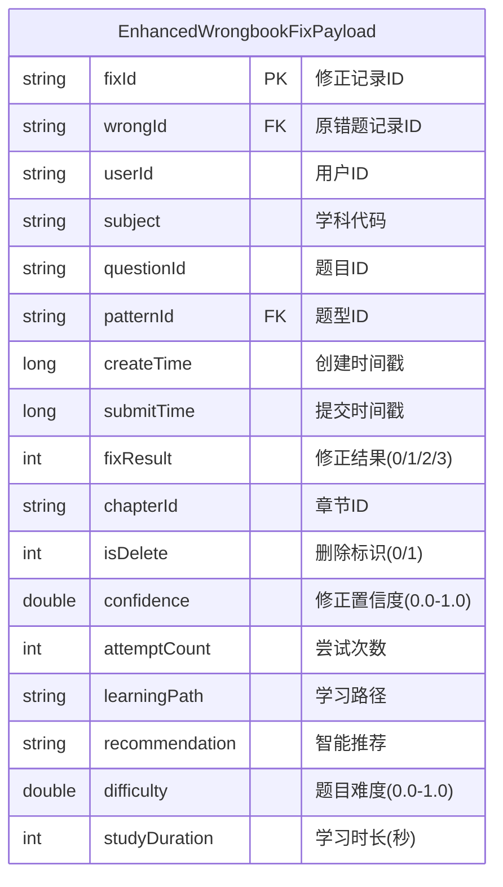

# 新错题本增强版业务域 - 源表Payload结构定义

## 📋 基本信息

```yaml
metadata:
  domain: "new-wrongbook"
  entity_name: "EnhancedWrongbookFixPayload"
  description: "增强版错题修正记录的事件Payload结构，支持智能推荐和学习分析"
  version: "3.0"
  last_updated: "2024-12-27T12:20:00Z"
  source_file: "job/new-wrongbook/new-wrongbook-request-v3.md"
  checksum: "sha256:new_wrongbook_payload_v3"
  conflict_status: "clean"
  enhancement_type: "extended_from_wrongbook"
```

## 🏗️ Payload结构定义

### Java类定义
```java
public class EnhancedWrongbookFixPayload {
    // 基础字段 (继承自WrongbookFixPayload)
    private String fixId;           // 修正记录ID (主键)
    private String wrongId;         // 原错题记录ID (外键)
    private String userId;          // 用户ID
    private String subject;         // 学科代码
    private String questionId;      // 题目ID
    private String patternId;       // 题型ID (外键)
    private long createTime;        // 创建时间戳
    private long submitTime;        // 提交时间戳
    private int fixResult;          // 修正结果 (0=未订正, 1=已订正, 2=部分订正, 3=需要复习)
    private String chapterId;       // 章节ID (语文英语科目需要)
    private int isDelete;           // 删除标识 (0=有效, 1=删除)
    
    // 🚀 新增智能分析字段
    private double confidence;      // 修正置信度 (0.0-1.0)
    private int attemptCount;       // 尝试次数
    private String learningPath;    // 学习路径 (adaptive, standard, remedial, guided, interactive, spaced_repetition, intensive, accelerated)
    private String recommendation;  // 智能推荐内容
    private double difficulty;      // 题目难度 (0.0-1.0)
    private int studyDuration;      // 学习时长(秒)
}
```

### Mermaid ER图表示


## 📊 字段详细说明

### 基础字段 (与原wrongbook兼容)
| 字段名 | 数据类型 | 约束 | 说明 | 示例值 | 变更状态 |
|--------|----------|------|------|--------|----------|
| `fixId` | string | PK, NOT NULL | 修正记录的唯一标识 | `fix_20241227_001` | 不变 |
| `wrongId` | string | FK | 关联的原始错题记录ID | `wrong_123456` | 不变 |
| `userId` | string | NOT NULL | 执行修正的用户ID | `user_789012` | 不变 |
| `subject` | string | NOT NULL | 学科代码 | `MATH`, `ENGLISH`, `HISTORY` | 扩展 |
| `questionId` | string | NOT NULL | 关联的题目ID | `q_456789` | 不变 |
| `patternId` | string | FK | 关联的题型ID | `pattern_123` | 不变 |
| `createTime` | long | NOT NULL | 错题创建时间戳(毫秒) | `1703123456000` | 不变 |
| `submitTime` | long | NOT NULL | 修正提交时间戳(毫秒) | `1703123456789` | 不变 |
| `fixResult` | int | NOT NULL | 修正结果状态 | `0`, `1`, `2`, `3` | 扩展 |
| `chapterId` | string | NULL | 章节ID(语文英语必需) | `chapter_001` | 不变 |
| `isDelete` | int | NOT NULL | 软删除标识 | `0`, `1` | 不变 |

### 新增智能分析字段
| 字段名 | 数据类型 | 约束 | 说明 | 示例值 | 用途 |
|--------|----------|------|------|--------|------|
| `confidence` | double | NULL, 0.0-1.0 | 修正置信度 | `0.85` | 掌握度评估 |
| `attemptCount` | int | NULL, ≥1 | 尝试次数 | `3` | 学习效果分析 |
| `learningPath` | string | NULL | 学习路径类型 | `adaptive` | 个性化推荐 |
| `recommendation` | string | NULL | AI推荐内容 | `继续练习相似题型` | 智能推荐 |
| `difficulty` | double | NULL, 0.0-1.0 | 题目难度 | `0.7` | 难度分析 |
| `studyDuration` | int | NULL, ≥0 | 学习时长(秒) | `180` | 学习效率分析 |

## 🔗 业务规则定义

### 数据约束 (增强版)
```yaml
business_constraints:
  primary_key:
    field: "fixId"
    generation_rule: "fix_{timestamp}_{sequence}"
    uniqueness: "global"
    
  foreign_keys:
    wrongId:
      references: "wrong_question_record.id"
      constraint: "MUST_EXIST"
      cascade: "NO_ACTION"
      
    patternId:
      references: "tower_pattern.id"  
      constraint: "MUST_EXIST"
      cascade: "NO_ACTION"
      
  required_fields:
    always_required: ["fixId", "userId", "subject", "questionId", "patternId", "createTime", "submitTime", "fixResult", "isDelete"]
    conditionally_required:
      chapterId:
        condition: "subject IN ('CHINESE', 'ENGLISH')"
        description: "语文和英语科目必须提供章节ID"
        
  new_field_constraints:
    confidence:
      range: "[0.0, 1.0]"
      null_handling: "DEFAULT 0.0"
      description: "置信度必须在0到1之间"
      
    attemptCount:
      range: "[1, 10]"
      null_handling: "DEFAULT 1"
      description: "尝试次数必须为正整数，建议不超过10次"
      
    difficulty:
      range: "[0.0, 1.0]"
      null_handling: "DEFAULT 0.5"
      description: "难度系数必须在0到1之间"
      
    studyDuration:
      range: "[0, 7200]"
      null_handling: "DEFAULT 0"
      description: "学习时长不超过2小时(7200秒)"
```

### 业务逻辑验证 (增强版)
```yaml
validation_rules:
  subject_validation:
    valid_values: ["MATH", "ENGLISH", "CHINESE", "PHYSICS", "CHEMISTRY", "BIOLOGY", "AOSHU", "SCIENCE", "HISTORY", "GEOGRAPHY", "POLITICS"]
    case_sensitive: true
    enhancement: "新增历史、地理、政治学科支持"
    
  fixResult_validation:
    valid_values: [0, 1, 2, 3]
    descriptions:
      0: "未订正"
      1: "已订正"
      2: "部分订正"  # 新增
      3: "需要复习"  # 新增
    enhancement: "支持更细粒度的修正状态"
    
  learningPath_validation:
    valid_values: ["adaptive", "standard", "remedial", "guided", "interactive", "spaced_repetition", "intensive", "accelerated"]
    null_allowed: true
    default_value: "standard"
    descriptions:
      adaptive: "自适应学习路径"
      standard: "标准学习路径"
      remedial: "补救学习路径"
      guided: "指导式学习路径"
      interactive: "互动式学习路径"
      spaced_repetition: "间隔重复学习"
      intensive: "强化学习路径"
      accelerated: "加速学习路径"
      
  confidence_validation:
    range_validation: "confidence BETWEEN 0.0 AND 1.0"
    business_rule: |
      IF fixResult = 1 AND confidence < 0.3 THEN
        WARN "低置信度的订正结果需要复查"
      ELSIF fixResult = 0 AND confidence > 0.7 THEN
        WARN "高置信度但未订正的异常情况"
        
  smart_analysis_validation:
    mastery_assessment: |
      is_mastered = CASE 
        WHEN fixResult = 1 AND confidence >= 0.8 AND attemptCount <= 2 THEN true
        WHEN fixResult = 1 AND confidence >= 0.6 AND attemptCount <= 3 THEN true
        ELSE false
      END
      
    next_review_calculation: |
      next_review_time = CASE 
        WHEN fixResult = 1 AND confidence >= 0.8 THEN TIMESTAMPADD(DAY, 7, submitTime)
        WHEN fixResult = 1 AND confidence >= 0.6 THEN TIMESTAMPADD(DAY, 3, submitTime)
        WHEN fixResult = 0 THEN TIMESTAMPADD(DAY, 1, submitTime)
        ELSE TIMESTAMPADD(DAY, 2, submitTime)
      END
```

## 🔄 关联关系定义 (与原wrongbook兼容)

### 直接关联 (不变)
```yaml
direct_relationships:
  to_pattern:
    source_field: "patternId"
    target_table: "tower_pattern"
    target_field: "id"
    relationship_type: "many_to_one"
    join_condition: "payload.patternId = pt.id"
    description: "修正记录关联到题型"
    enhancement_note: "维表结构已增强，新增category和skill_points字段"
```

### 间接关联路径 (兼容并增强)
```yaml
indirect_relationships:
  to_teaching_type:
    path: 
      - source: "EnhancedWrongbookFixPayload.patternId"
      - via: "tower_pattern.id"
      - to: "tower_teaching_type_pt.pt_id"
      - via: "tower_teaching_type_pt.teaching_type_id"
      - to: "tower_teaching_type.id"
    full_join_condition: |
      payload.patternId = pt.id
      AND pt.id = ttp.pt_id AND ttp.is_delete = 0
      AND ttp.teaching_type_id = tt.id AND tt.is_delete = 0
    description: "修正记录通过题型关联到教学类型"
    enhancement: "维表新增level和prerequisites字段，权重字段weight"
```

## 📈 数据质量要求 (增强版)

### 完整性要求
```yaml
data_quality_requirements:
  completeness:
    required_fields_presence: "> 99.8%"
    valid_foreign_key_references: "> 99.5%"
    smart_fields_availability: "> 85%"  # 新增字段允许较低覆盖率
    
  accuracy:
    subject_enum_compliance: "100%"
    time_sequence_correctness: "> 99.9%"
    fixResult_value_compliance: "100%"
    confidence_range_compliance: "> 99.5%"  # 新增
    difficulty_range_compliance: "> 99.5%"  # 新增
    
  consistency:
    chapter_matching_for_language_subjects: "> 99%"
    delete_flag_consistency: "> 99.9%"
    confidence_result_consistency: "> 95%"  # 新增：置信度与结果的一致性
    learning_path_effectiveness: "> 90%"    # 新增：学习路径有效性
```

## 🚀 智能分析功能

### 掌握度评估算法
```yaml
mastery_assessment:
  input_factors:
    - confidence: "置信度 (权重: 0.4)"
    - attemptCount: "尝试次数 (权重: 0.3)"
    - fixResult: "修正结果 (权重: 0.2)"
    - difficulty: "题目难度 (权重: 0.1)"
    
  evaluation_rules:
    high_mastery:
      condition: "confidence >= 0.8 AND attemptCount <= 2 AND fixResult = 1"
      review_interval: "7 days"
      
    medium_mastery:
      condition: "confidence >= 0.6 AND attemptCount <= 3 AND fixResult = 1"
      review_interval: "3 days"
      
    low_mastery:
      condition: "confidence < 0.6 OR attemptCount > 3 OR fixResult != 1"
      review_interval: "1 day"
```

### 个性化推荐算法
```yaml
recommendation_engine:
  learning_path_suggestion:
    adaptive:
      trigger: "confidence变化 > 0.2"
      action: "动态调整学习内容难度"
      
    remedial:
      trigger: "attemptCount > 3 AND confidence < 0.5"
      action: "推荐基础概念复习"
      
    accelerated:
      trigger: "confidence > 0.9 AND attemptCount = 1"
      action: "推荐挑战性题目"
      
  content_recommendation:
    similar_patterns: "基于patternId推荐相似题型"
    skill_reinforcement: "基于skill_points推荐技能强化"
    difficulty_progression: "基于difficulty推荐难度递进"
```

---

## 🔄 与原wrongbook的兼容性分析

### ✅ 完全兼容字段
- 所有原有11个基础字段保持不变
- 数据类型、约束条件完全一致
- 关联关系逻辑完全兼容

### 📈 扩展增强字段
- **subject**: 新增3个学科(HISTORY, GEOGRAPHY, POLITICS)
- **fixResult**: 新增2个状态(2=部分订正, 3=需要复习)
- **新增6个智能分析字段**: 完全新增，不影响现有逻辑

### 🔧 迁移策略
```yaml
migration_strategy:
  backward_compatibility: "100%"
  forward_compatibility: "部分兼容，需要新增字段处理"
  
  data_migration:
    existing_data: "无需修改，新字段使用默认值"
    new_features: "逐步启用智能分析功能"
    
  system_migration:
    phase_1: "部署新版本，向后兼容模式"
    phase_2: "逐步启用智能分析功能"
    phase_3: "完全切换到增强版"
```

---

## 📚 相关文档

- [新错题本业务逻辑说明](../../../docs/new-wrongbook-business-logic.md)
- [智能分析算法文档](../../../docs/smart-analysis-algorithms.md)
- [原wrongbook兼容性说明](../wrongbook/source-payload.md)
- [维表增强定义](./dimension-tables.md)

---

*此文档定义了新错题本增强版业务域中源表Payload的完整结构，在保持与原wrongbook完全兼容的基础上，新增了智能分析和个性化推荐功能*
