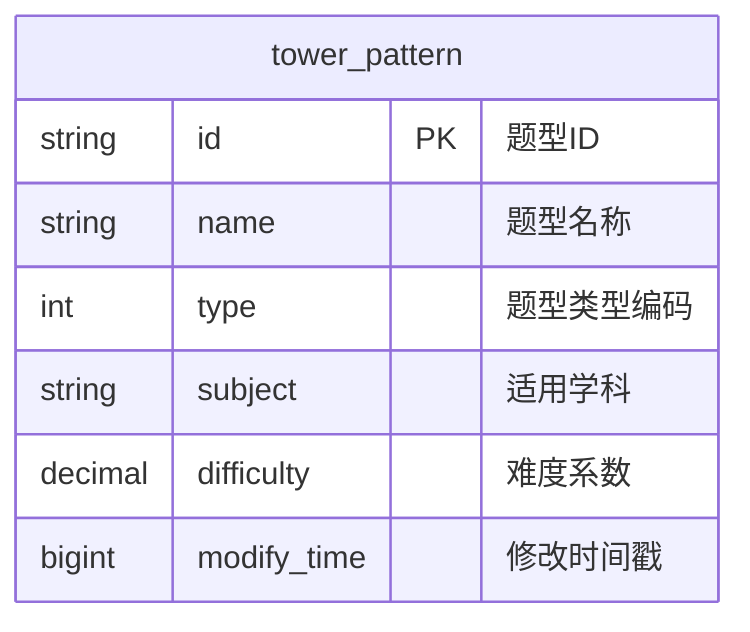
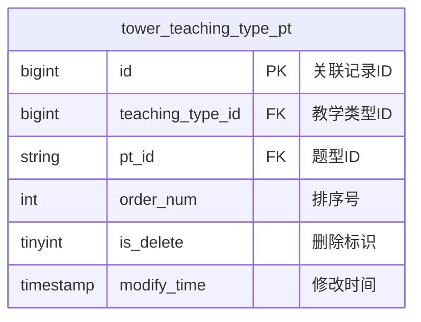
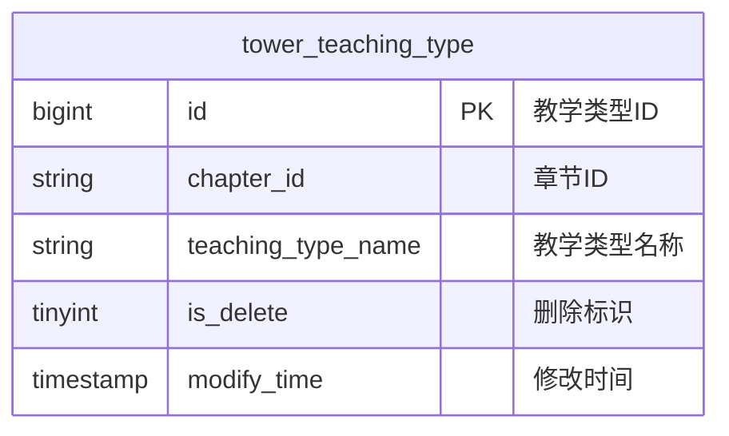
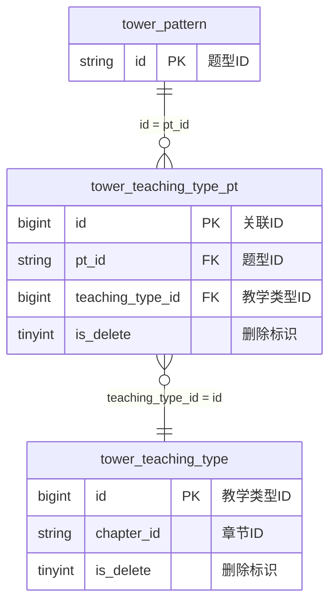

# 错题本业务域 - 维表结构定义

## 📋 基本信息

```yaml
metadata:
  domain: "wrongbook"
  description: "错题本业务域相关的维表结构定义"
  version: "3.0"
  last_updated: "2024-12-27T15:30:00Z"
  source_file: "job/wrongbook/wrongbook-request-v3.md"
  tables_count: 3
  conflict_status: "clean"
```

## 🏗️ 维表列表

### 1. tower_pattern (题型模式表)

```yaml
table_metadata:
  table_name: "tower_pattern"
  table_type: "dimension"
  description: "题型模式定义表，包含题型的基本信息和属性"
  business_purpose: "为错题修正提供题型维度信息"
  update_frequency: "daily"
  cache_strategy: "30min_ttl_100k_rows"
```

#### 表结构
```sql
CREATE TABLE `vvp`.`default`.`tower_pattern` (
    `id` STRING NOT NULL COMMENT '题型ID，全局唯一标识',
    `name` STRING COMMENT '题型名称，如"加减法混合运算"',
    `type` INT COMMENT '题型类型编码',
    `subject` STRING COMMENT '适用学科，如MATH、ENGLISH',
    `difficulty` DECIMAL(5, 3) COMMENT '难度系数，范围0.000-9.999',
    `modify_time` BIGINT COMMENT '最后修改时间戳',
    PRIMARY KEY (id) NOT ENFORCED
) COMMENT '题型模式表'
WITH (
    'connector' = 'jdbc',
    'lookup.cache.max-rows' = '100000',
    'lookup.cache.ttl' = '30 min',
    'table-name' = 'tower_pattern',
    'url' = 'jdbc:mysql://pc-bp1ivlu7lykwyzx9x.rwlb.rds.aliyuncs.com:3306/tower'
);
```

#### Mermaid ER图表示


#### 字段详细说明
| 字段名 | 数据类型 | 约束 | 说明 | 示例值 | 业务含义 |
|--------|----------|------|------|--------|----------|
| `id` | STRING | PK, NOT NULL | 题型唯一标识 | `pattern_001` | 全局唯一的题型ID |
| `name` | STRING | NULL | 题型名称 | `加减法混合运算` | 人类可读的题型描述 |
| `type` | INT | NULL | 题型类型编码 | `1`, `2`, `3` | 题型分类的数值编码 |
| `subject` | STRING | NULL | 适用学科 | `MATH`, `ENGLISH` | 与Payload.subject对应 |
| `difficulty` | DECIMAL(5,3) | NULL | 难度系数 | `2.500`, `7.800` | 题型难度评估，0-9.999 |
| `modify_time` | BIGINT | NULL | 修改时间戳 | `1703123456000` | 记录最后更新时间 |

---

### 2. tower_teaching_type_pt (教学类型题型关联表)

```yaml
table_metadata:
  table_name: "tower_teaching_type_pt"
  table_type: "dimension"
  description: "教学类型与题型的多对多关联表"
  business_purpose: "建立教学类型和题型之间的关联关系"
  update_frequency: "hourly"
  cache_strategy: "30min_ttl_100k_rows"
  filter_condition: "is_delete = 0"
```

#### 表结构
```sql
CREATE TABLE `vvp`.`default`.`tower_teaching_type_pt` (
    `id` BIGINT NOT NULL COMMENT '关联记录ID，自增主键',
    `teaching_type_id` BIGINT COMMENT '教学类型ID，外键',
    `pt_id` STRING COMMENT '题型ID，外键，对应tower_pattern.id',
    `order_num` INT COMMENT '排序号，用于教学顺序',
    `is_delete` TINYINT COMMENT '删除标识，0=有效 1=删除',
    `modify_time` TIMESTAMP(3) COMMENT '修改时间',
    PRIMARY KEY (id) NOT ENFORCED
) COMMENT '教学类型题型关联表'
WITH (
    'connector' = 'jdbc',
    'lookup.cache.max-rows' = '100000',
    'lookup.cache.ttl' = '30 min',
    'table-name' = 'tower_teaching_type_pt',
    'url' = 'jdbc:mysql://pc-bp1ivlu7lykwyzx9x.rwlb.rds.aliyuncs.com:3306/tower'
);
```

#### Mermaid ER图表示


#### 字段详细说明
| 字段名 | 数据类型 | 约束 | 说明 | 示例值 | 业务含义 |
|--------|----------|------|------|--------|----------|
| `id` | BIGINT | PK, NOT NULL | 关联记录主键 | `100001` | 自增的关联记录标识 |
| `teaching_type_id` | BIGINT | FK | 教学类型ID | `2001` | 指向tower_teaching_type.id |
| `pt_id` | STRING | FK | 题型ID | `pattern_001` | 指向tower_pattern.id |
| `order_num` | INT | NULL | 排序号 | `1`, `2`, `3` | 在教学类型中的顺序 |
| `is_delete` | TINYINT | NULL | 删除标识 | `0`, `1` | 软删除标记 |
| `modify_time` | TIMESTAMP(3) | NULL | 修改时间 | `2024-12-27 15:30:00.123` | 记录更新时间 |

---

### 3. tower_teaching_type (教学类型表)

```yaml
table_metadata:
  table_name: "tower_teaching_type"
  table_type: "dimension"
  description: "教学类型定义表，包含教学类型的基本信息"
  business_purpose: "为错题修正提供教学类型维度信息，支持章节匹配"
  update_frequency: "daily"
  cache_strategy: "30min_ttl_100k_rows"
  filter_condition: "is_delete = 0"
```

#### 表结构
```sql
CREATE TABLE `vvp`.`default`.`tower_teaching_type` (
    `id` BIGINT NOT NULL COMMENT '教学类型ID，主键',
    `chapter_id` STRING COMMENT '章节ID，用于语文英语科目匹配',
    `teaching_type_name` STRING COMMENT '教学类型名称',
    `is_delete` TINYINT COMMENT '删除标识，0=有效 1=删除',
    `modify_time` TIMESTAMP(3) COMMENT '修改时间',
    PRIMARY KEY (id) NOT ENFORCED
) COMMENT '教学类型表'
WITH (
    'connector' = 'jdbc',
    'lookup.cache.max-rows' = '100000',
    'lookup.cache.ttl' = '30 min',
    'table-name' = 'tower_teaching_type',
    'url' = 'jdbc:mysql://pc-bp1ivlu7lykwyzx9x.rwlb.rds.aliyuncs.com:3306/tower'
);
```

#### Mermaid ER图表示


#### 字段详细说明
| 字段名 | 数据类型 | 约束 | 说明 | 示例值 | 业务含义 |
|--------|----------|------|------|--------|----------|
| `id` | BIGINT | PK, NOT NULL | 教学类型主键 | `3001` | 教学类型唯一标识 |
| `chapter_id` | STRING | NULL | 章节ID | `chapter_001` | 对应的教材章节标识 |
| `teaching_type_name` | STRING | NULL | 教学类型名称 | `基础概念讲解` | 人类可读的教学类型 |
| `is_delete` | TINYINT | NULL | 删除标识 | `0`, `1` | 软删除标记 |
| `modify_time` | TIMESTAMP(3) | NULL | 修改时间 | `2024-12-27 15:30:00.123` | 记录更新时间 |

## 🔗 维表间关联关系

### 关联关系图


### 关联关系详细定义
```yaml
relationships:
  pattern_to_teaching_type_pt:
    source_table: "tower_pattern"
    source_field: "id"
    target_table: "tower_teaching_type_pt"
    target_field: "pt_id"
    relationship_type: "one_to_many"
    join_condition: "pt.id = ttp.pt_id"
    additional_filter: "ttp.is_delete = 0"
    description: "一个题型可以对应多个教学类型"
    
  teaching_type_pt_to_teaching_type:
    source_table: "tower_teaching_type_pt"
    source_field: "teaching_type_id"
    target_table: "tower_teaching_type"
    target_field: "id"
    relationship_type: "many_to_one"
    join_condition: "ttp.teaching_type_id = tt.id"
    additional_filter: "tt.is_delete = 0"
    description: "多个关联记录指向一个教学类型"
```

## 📊 业务规则和约束

### 数据完整性约束
```yaml
integrity_constraints:
  foreign_key_constraints:
    tower_teaching_type_pt.pt_id:
      references: "tower_pattern.id"
      enforcement: "application_level"
      on_delete: "NO_ACTION"
      
    tower_teaching_type_pt.teaching_type_id:
      references: "tower_teaching_type.id" 
      enforcement: "application_level"
      on_delete: "NO_ACTION"
      
  unique_constraints:
    tower_teaching_type_pt_unique:
      fields: ["teaching_type_id", "pt_id"]
      description: "同一教学类型和题型只能有一个有效关联"
      condition: "is_delete = 0"
      
  check_constraints:
    is_delete_values:
      field: "is_delete"
      valid_values: [0, 1]
      tables: ["tower_teaching_type_pt", "tower_teaching_type"]
      
    order_num_positive:
      field: "order_num"
      condition: "order_num > 0"
      table: "tower_teaching_type_pt"
```

### 业务逻辑规则
```yaml
business_rules:
  chapter_matching_rule:
    description: "语文和英语科目需要进行章节匹配"
    condition: |
      IF payload.subject IN ('CHINESE', 'ENGLISH') THEN
        tt.chapter_id = payload.chapterId
      ELSE
        TRUE  -- 其他科目不需要章节匹配
    tables_involved: ["tower_teaching_type"]
    payload_fields: ["subject", "chapterId"]
    
  soft_delete_consistency:
    description: "删除标识的一致性要求"
    rules:
      - "如果教学类型被删除，相关的关联记录也应该被标记删除"
      - "查询时必须过滤is_delete=1的记录"
    enforcement: "application_level"
    
  cache_invalidation:
    description: "缓存失效策略"
    rules:
      - "当维表数据更新时，30分钟内缓存自动失效"
      - "删除操作立即失效相关缓存"
    monitoring: "cache_hit_rate > 90%"
```

## 📈 数据质量和监控

### 数据质量要求
```yaml
data_quality_requirements:
  completeness:
    tower_pattern:
      id_completeness: "100%"
      name_completeness: "> 95%"
      subject_completeness: "> 90%"
      
    tower_teaching_type:
      id_completeness: "100%"
      teaching_type_name_completeness: "> 98%"
      
  consistency:
    foreign_key_integrity:
      ttp_to_pattern: "> 99.5%"
      ttp_to_teaching_type: "> 99.5%"
      
    delete_flag_consistency: "> 99.9%"
    
  accuracy:
    subject_enum_compliance: "100%"
    difficulty_range_compliance: "100%"
```

### 监控指标
```yaml
monitoring_metrics:
  cache_performance:
    cache_hit_rate:
      target: "> 90%"
      alert_threshold: "< 80%"
    cache_eviction_rate:
      target: "< 5%"
      alert_threshold: "> 10%"
      
  join_performance:
    pattern_join_success_rate:
      target: "> 99%"
      alert_threshold: "< 95%"
    teaching_type_join_success_rate:
      target: "> 90%"
      alert_threshold: "< 85%"
      
  data_freshness:
    max_lag:
      target: "< 1 hour"
      alert_threshold: "> 4 hours"
    update_frequency:
      pattern_table: "daily"
      teaching_type_tables: "hourly"
```

## 🔧 技术实现细节

### 查询优化
```yaml
query_optimization:
  indexing_strategy:
    tower_pattern:
      primary_index: "id"
      secondary_indexes: ["subject", "type"]
      
    tower_teaching_type_pt:
      primary_index: "id"
      secondary_indexes: ["pt_id", "teaching_type_id", "is_delete"]
      
    tower_teaching_type:
      primary_index: "id"
      secondary_indexes: ["chapter_id", "is_delete"]
      
  join_optimization:
    recommended_join_order:
      1: "tower_pattern (filtered by subject if applicable)"
      2: "tower_teaching_type_pt (filtered by is_delete=0)"
      3: "tower_teaching_type (filtered by is_delete=0)"
    
    join_hints:
      - "USE INDEX (is_delete) for soft delete filtering"
      - "PREFER BROADCAST JOIN for small dimension tables"
```

### 缓存策略
```yaml
cache_configuration:
  global_settings:
    max_rows: 100000
    ttl: "30 min"
    eviction_policy: "LRU"
    
  table_specific:
    tower_pattern:
      estimated_size: "~50,000 rows"
      update_frequency: "daily"
      cache_priority: "high"
      
    tower_teaching_type_pt:
      estimated_size: "~200,000 rows"
      update_frequency: "hourly"
      cache_priority: "medium"
      
    tower_teaching_type:
      estimated_size: "~10,000 rows"
      update_frequency: "daily" 
      cache_priority: "high"
```

---

## 📚 相关文档

- [源表Payload结构](./source-payload.md)
- [关联关系详细说明](./relationships.md)
- [数据质量监控策略](../../../docs/data-quality-monitoring.md)
- [维表缓存最佳实践](../../../docs/dimension-table-caching.md)

---

*此文档定义了错题本业务域中所有维表的完整结构，是ER知识库维表管理的核心文档*
