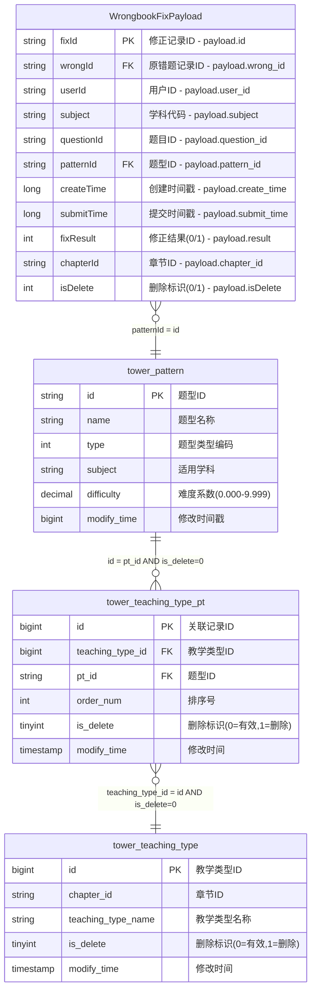

# 错题本业务域ER图 - 基于AI智能生成 v3.0

## 📋 生成信息

```yaml
generation_metadata:
  domain: "wrongbook"
  description: "基于wrongbook-request-v3.md自动生成的ER图"
  generation_method: "AI_Agent_intelligent_er_knowledge_base"
  input_file: "job/wrongbook/wrongbook-request-v3.md"
  generated_at: "2024-12-27T15:30:00Z"
  version: "3.0"
  conflict_status: "clean"
  knowledge_base_updated: true
```

## 🗺️ 完整ER关系图

### Mermaid ER图 (标准输出格式)


## 📊 实体详细说明

### 源表Payload实体

#### WrongbookFixPayload
```yaml
entity_type: "source_payload"
source: "BusinessEvent.payload"
extraction_method: "JSON_VALUE functions"

fields:
  fixId:
    json_path: "$.id"
    extraction: "JSON_VALUE(be.payload, '$.id')"
    business_meaning: "修正记录的唯一标识"
    is_primary_key: true
    
  wrongId:
    json_path: "$.wrong_id"
    extraction: "JSON_VALUE(be.payload, '$.wrong_id')"
    business_meaning: "关联的原始错题记录ID"
    is_foreign_key: true
    references: "wrong_question_record.id (隐式)"
    
  userId:
    json_path: "$.user_id"
    extraction: "JSON_VALUE(be.payload, '$.user_id')"
    business_meaning: "执行修正操作的用户ID"
    
  subject:
    json_path: "$.subject"
    extraction: "JSON_VALUE(be.payload, '$.subject')"
    business_meaning: "学科代码"
    valid_values: ["MATH", "ENGLISH", "CHINESE", "PHYSICS", "CHEMISTRY", "BIOLOGY", "AOSHU", "SCIENCE"]
    
  questionId:
    json_path: "$.question_id"
    extraction: "JSON_VALUE(be.payload, '$.question_id')"
    business_meaning: "关联的题目ID"
    
  patternId:
    json_path: "$.pattern_id"
    extraction: "JSON_VALUE(be.payload, '$.pattern_id')"
    business_meaning: "关联的题型ID"
    is_foreign_key: true
    references: "tower_pattern.id"
    
  createTime:
    json_path: "$.create_time"
    extraction: "TO_TIMESTAMP_LTZ(JSON_VALUE(be.payload, '$.create_time'), 0)"
    business_meaning: "错题创建时间戳"
    data_type: "timestamp_ltz"
    
  submitTime:
    json_path: "$.submit_time"
    extraction: "TO_TIMESTAMP_LTZ(JSON_VALUE(be.payload, '$.submit_time'), 0)"
    business_meaning: "修正提交时间戳"
    data_type: "timestamp_ltz"
    
  fixResult:
    json_path: "$.result"
    extraction: "CAST(JSON_VALUE(be.payload, '$.result') AS BIGINT)"
    business_meaning: "修正结果状态"
    valid_values: [0, 1]
    value_mapping: {"0": "未订正", "1": "订正"}
    
  chapterId:
    json_path: "$.chapter_id"
    extraction: "JSON_VALUE(be.payload, '$.chapter_id')"
    business_meaning: "章节ID (语文英语科目必需)"
    conditional_required: "subject IN ('CHINESE', 'ENGLISH')"
    
  isDelete:
    json_path: "$.isDelete"
    extraction: "CAST(JSON_VALUE(be.payload, '$.isDelete') AS INT)"
    business_meaning: "软删除标识"
    valid_values: [0, 1]
    filter_condition: "= 0"
```

### 维表实体

#### tower_pattern (题型表)
```yaml
entity_type: "dimension_table"
business_purpose: "提供题型的基本信息和属性"
cache_strategy: "30min TTL, 100k rows"

key_fields:
  primary_key: "id"
  business_key: "name"
  partition_key: "subject"
  
relationships:
  outgoing:
    - target: "tower_teaching_type_pt"
      via: "id -> pt_id"
      cardinality: "1:N"
```

#### tower_teaching_type_pt (关联表)
```yaml
entity_type: "dimension_table"
business_purpose: "建立题型与教学类型的多对多关联"
table_type: "junction_table"
soft_delete: true

key_fields:
  primary_key: "id"
  foreign_keys: ["pt_id", "teaching_type_id"]
  
filtering:
  active_records: "is_delete = 0"
  
relationships:
  incoming:
    - source: "tower_pattern"
      via: "pt_id <- id"
  outgoing:
    - target: "tower_teaching_type"
      via: "teaching_type_id -> id"
```

#### tower_teaching_type (教学类型表)
```yaml
entity_type: "dimension_table"
business_purpose: "提供教学类型详细信息，支持章节匹配"
soft_delete: true

key_fields:
  primary_key: "id"
  business_key: "teaching_type_name"
  chapter_key: "chapter_id"
  
special_rules:
  chapter_matching:
    condition: "subject IN ('CHINESE', 'ENGLISH')"
    requirement: "tt.chapter_id = payload.chapterId"
    description: "语文英语科目需要额外的章节匹配验证"
```

## 🔗 关联关系矩阵

### 关联路径分析
```yaml
relationship_paths:
  primary_path:
    description: "主要数据关联路径"
    path: "WrongbookFixPayload -> tower_pattern -> tower_teaching_type_pt -> tower_teaching_type"
    sql_implementation: |
      FROM BusinessEvent be
      LEFT JOIN tower_pattern pt ON pt.id = JSON_VALUE(be.payload, '$.pattern_id')
      LEFT JOIN tower_teaching_type_pt ttp ON ttp.pt_id = pt.id AND ttp.is_delete = 0
      LEFT JOIN tower_teaching_type tt ON tt.id = ttp.teaching_type_id AND tt.is_delete = 0
    
  alternative_paths:
    direct_pattern_lookup:
      description: "直接题型信息查询"
      path: "WrongbookFixPayload -> tower_pattern"
      use_case: "只需要题型基本信息时"
      
secondary_relationships:
  implicit_references:
    - source: "WrongbookFixPayload.wrongId"
      target: "wrong_question_record.id"
      type: "implicit_foreign_key"
      note: "隐式引用，不在当前ER图范围内"
      
    - source: "WrongbookFixPayload.userId"  
      target: "user_profile.id"
      type: "implicit_foreign_key"
      note: "隐式引用，不在当前ER图范围内"
```

### JOIN性能分析
```yaml
join_performance:
  pattern_join:
    type: "hash_join"
    expected_cardinality: "1:1"
    performance: "excellent"
    cache_hit_rate: "> 90%"
    
  teaching_type_pt_join:
    type: "hash_join"  
    expected_cardinality: "1:N (平均1:2)"
    performance: "good"
    note: "可能导致记录数增加"
    
  teaching_type_join:
    type: "hash_join"
    expected_cardinality: "N:1"
    performance: "good"
    filter_efficiency: "high (is_delete=0)"
```

## 🚨 业务规则和约束

### 数据完整性规则
```yaml
integrity_rules:
  referential_integrity:
    patternId_validation:
      rule: "payload.patternId MUST exist in tower_pattern.id"
      enforcement: "application_level"
      error_handling: "log_and_skip"
      
  data_consistency:
    time_sequence:
      rule: "createTime <= submitTime"
      validation: "automatic"
      
    subject_consistency:
      rule: "payload.subject should align with pattern.subject"
      enforcement: "warning_only"
      
  business_logic:
    chapter_matching:
      rule: |
        IF payload.subject IN ('CHINESE', 'ENGLISH') THEN
          tt.chapter_id = payload.chapterId
        ELSE
          TRUE
      description: "语文英语科目的特殊章节匹配要求"
      impact: "records not matching will be filtered out"
      
    soft_delete_consistency:
      rule: "Only process records with isDelete = 0"
      applied_to: ["payload", "dimension_tables"]
```

### 数据质量要求
```yaml
quality_requirements:
  completeness:
    required_fields: ["fixId", "userId", "subject", "patternId", "createTime", "submitTime", "fixResult"]
    completion_rate: "> 99.8%"
    
  accuracy:
    enum_compliance:
      subject_values: "100%"
      fixResult_values: "100%"
      
  consistency:
    foreign_key_resolution:
      pattern_resolution_rate: "> 99%"
      teaching_type_resolution_rate: "> 90%"
      
    chapter_matching_compliance: "> 95%"
```

## 📈 知识库更新状态

### 本次更新内容
```yaml
knowledge_base_updates:
  new_entities:
    - "WrongbookFixPayload (Payload结构定义)"
    
  updated_entities:
    - "tower_pattern (补充了subject字段的枚举值)"
    - "tower_teaching_type (增加了chapter_matching规则)"
    
  new_relationships:
    - "WrongbookFixPayload -> tower_pattern"
    - "tower_pattern -> tower_teaching_type_pt -> tower_teaching_type"
    
  business_rules_added:
    - "语文英语科目章节匹配规则"
    - "软删除过滤规则"
    - "时间序列验证规则"
```

### 版本演化信息
```yaml
version_evolution:
  previous_version: "2.0"
  current_version: "3.0"
  major_changes:
    - "引入了BusinessEvent.payload结构解析"
    - "标准化了软删除处理逻辑"
    - "增强了章节匹配业务规则"
    - "优化了关联关系定义"
    
  backward_compatibility: true
  breaking_changes: []
  
  migration_notes:
    - "无需数据迁移，仅新增业务规则"
    - "现有SQL查询保持兼容"
    - "监控指标可能需要调整"
```

## 🔧 技术实现要点

### JSON Payload解析
```sql
-- Payload字段提取示例
SELECT 
  -- 基础字段提取
  JSON_VALUE(be.payload, '$.id') as fix_id,
  JSON_VALUE(be.payload, '$.pattern_id') as pattern_id,
  JSON_VALUE(be.payload, '$.subject') as subject,
  
  -- 类型转换
  CAST(JSON_VALUE(be.payload, '$.result') AS BIGINT) as fix_result,
  TO_TIMESTAMP_LTZ(JSON_VALUE(be.payload, '$.create_time'), 0) as create_time,
  
  -- 条件字段提取
  CASE 
    WHEN JSON_VALUE(be.payload, '$.subject') IN ('CHINESE', 'ENGLISH') 
    THEN JSON_VALUE(be.payload, '$.chapter_id')
    ELSE NULL 
  END as chapter_id

FROM BusinessEvent be
WHERE be.domain = 'wrongbook' AND be.type = 'wrongbook_fix'
  AND JSON_VALUE(be.payload, '$.isDelete') = '0';
```

### 维表缓存配置
```yaml
cache_configuration:
  tower_pattern:
    cache_mode: "lookup_cache"
    max_rows: 100000
    ttl: "30 min"
    
  tower_teaching_type_pt:
    cache_mode: "lookup_cache"
    max_rows: 100000
    ttl: "30 min"
    
  tower_teaching_type:
    cache_mode: "lookup_cache"
    max_rows: 100000
    ttl: "30 min"
```

### 监控和告警
```yaml
monitoring_points:
  data_quality:
    - "payload解析成功率 > 99.9%"
    - "pattern关联成功率 > 99%"
    - "teaching_type关联成功率 > 90%"
    
  performance:
    - "缓存命中率 > 90%"
    - "JOIN延迟 < 100ms P95"
    - "端到端处理延迟 < 5s"
    
  business_rules:
    - "章节匹配合规率 > 95%"
    - "软删除过滤效果监控"
    - "时间序列验证通过率 > 99%"
```

---

## 📚 相关文档

- [源表Payload结构定义](./source-payload.md)
- [维表结构详细说明](./dimension-tables.md)
- [关联关系完整定义](./relationships.md)
- [ER知识库管理规则](../../../.cursor/rules/intelligent-er-knowledge-base.mdc)
- [原始请求文件](../../../wrongbook/wrongbook-request-v3.md)

---

*此ER图由 AI Agent 基于 intelligent-er-knowledge-base.mdc 规则智能生成*
*生成时间: 2024-12-27T15:30:00Z | 版本: v3.0 | 状态: 无冲突*
*该ER图已更新到知识库，可用于后续的SQL生成和验证工作流*
