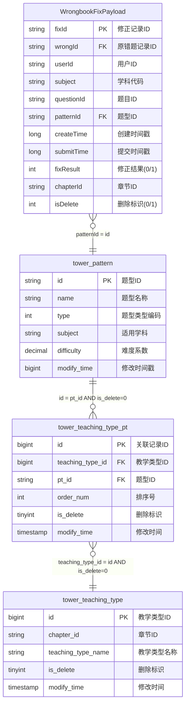

# 错题本业务域 - 关联关系定义

## 📋 基本信息

```yaml
metadata:
  domain: "wrongbook"
  description: "错题本业务域实体间的关联关系完整定义"
  version: "3.0"
  last_updated: "2024-12-27T15:30:00Z"
  source_file: "job/wrongbook/wrongbook-request-v3.md"
  total_relationships: 3
  conflict_status: "clean"
```

## 🗺️ 完整关联关系图



## 🔗 关联关系详细定义

### 1. Payload到Pattern的关联 (payload_to_pattern)

```yaml
relationship_metadata:
  relationship_id: "payload_to_pattern"
  relationship_name: "修正记录到题型的关联"
  relationship_type: "many_to_one"
  cardinality: "N:1"
  description: "多个修正记录可以指向同一个题型"
  business_meaning: "通过题型ID将修正记录与题型信息关联"
```

#### 关联定义
```yaml
relationship_definition:
  source_entity: "WrongbookFixPayload"
  source_field: "patternId"
  source_field_type: "string"
  
  target_entity: "tower_pattern"
  target_field: "id"
  target_field_type: "string"
  
  join_condition: "JSON_VALUE(be.payload, '$.pattern_id') = pt.id"
  join_type: "LEFT JOIN"
  
  flink_sql_implementation: |
    LEFT JOIN `vvp`.`default`.`tower_pattern` FOR SYSTEM_TIME AS OF PROCTIME() pt 
      ON pt.id = JSON_VALUE(be.payload, '$.pattern_id')
```

#### 业务规则
```yaml
business_rules:
  referential_integrity:
    enforcement: "application_level"
    description: "patternId必须在tower_pattern表中存在"
    validation_query: |
      SELECT COUNT(*) as missing_patterns
      FROM BusinessEvent be
      LEFT JOIN tower_pattern pt ON JSON_VALUE(be.payload, '$.pattern_id') = pt.id
      WHERE be.domain = 'wrongbook' AND be.type = 'wrongbook_fix'
        AND pt.id IS NULL
        
  data_consistency:
    subject_alignment:
      description: "Payload中的subject应该与pattern的subject一致"
      validation_rule: |
        JSON_VALUE(be.payload, '$.subject') = pt.subject
        OR pt.subject IS NULL  -- 允许pattern的subject为空
      tolerance_level: "warning"  # 不一致时警告但不阻塞
      
  performance_optimization:
    cache_strategy: "dimension_table_cache"
    cache_settings:
      ttl: "30 minutes"
      max_rows: 100000
    lookup_optimization: "FOR SYSTEM_TIME AS OF PROCTIME()"
```

---

### 2. Pattern到TeachingTypePt的关联 (pattern_to_teaching_type_pt)

```yaml
relationship_metadata:
  relationship_id: "pattern_to_teaching_type_pt"
  relationship_name: "题型到教学类型关联表的关联"
  relationship_type: "one_to_many"
  cardinality: "1:N"
  description: "一个题型可以对应多个教学类型关联记录"
  business_meaning: "通过中间表建立题型与教学类型的多对多关系"
```

#### 关联定义
```yaml
relationship_definition:
  source_entity: "tower_pattern"
  source_field: "id"
  source_field_type: "string"
  
  target_entity: "tower_teaching_type_pt"
  target_field: "pt_id"
  target_field_type: "string"
  
  join_condition: "pt.id = ttp.pt_id"
  join_type: "LEFT JOIN"
  additional_conditions:
    - "ttp.is_delete = 0"
  
  flink_sql_implementation: |
    LEFT JOIN `vvp`.`default`.`tower_teaching_type_pt` FOR SYSTEM_TIME AS OF PROCTIME() ttp 
      ON ttp.pt_id = pt.id 
      AND ttp.is_delete = 0
```

#### 业务规则
```yaml
business_rules:
  soft_delete_handling:
    description: "只关联未删除的记录"
    filter_condition: "ttp.is_delete = 0"
    impact: "确保不会关联到已删除的教学类型关联"
    
  multiple_mappings:
    description: "一个题型可以对应多个教学类型"
    handling_strategy: "left_join_all_matches"
    result_multiplication: true
    note: "可能导致结果记录数增加"
    
  order_preservation:
    description: "保持教学类型的顺序"
    order_field: "ttp.order_num"
    usage: "可用于教学顺序排列"
    
  referential_integrity:
    foreign_key_constraint:
      field: "ttp.pt_id"
      references: "tower_pattern.id"
      enforcement: "application_level"
```

---

### 3. TeachingTypePt到TeachingType的关联 (teaching_type_pt_to_teaching_type)

```yaml
relationship_metadata:
  relationship_id: "teaching_type_pt_to_teaching_type"
  relationship_name: "教学类型关联表到教学类型的关联"
  relationship_type: "many_to_one"
  cardinality: "N:1"
  description: "多个关联记录指向同一个教学类型"
  business_meaning: "通过教学类型ID获取教学类型的详细信息"
```

#### 关联定义
```yaml
relationship_definition:
  source_entity: "tower_teaching_type_pt"
  source_field: "teaching_type_id"
  source_field_type: "bigint"
  
  target_entity: "tower_teaching_type"
  target_field: "id"
  target_field_type: "bigint"
  
  join_condition: "ttp.teaching_type_id = tt.id"
  join_type: "LEFT JOIN"
  additional_conditions:
    - "tt.is_delete = 0"
  
  flink_sql_implementation: |
    LEFT JOIN `vvp`.`default`.`tower_teaching_type` FOR SYSTEM_TIME AS OF PROCTIME() tt 
      ON tt.id = ttp.teaching_type_id 
      AND tt.is_delete = 0
```

#### 业务规则
```yaml
business_rules:
  soft_delete_consistency:
    description: "确保只关联未删除的教学类型"
    filter_condition: "tt.is_delete = 0"
    cascade_effect: "如果教学类型被删除，相关数据将不会被关联"
    
  chapter_matching_requirement:
    description: "语文英语科目的特殊章节匹配规则"
    condition: |
      (JSON_VALUE(be.payload, '$.subject') NOT IN ('CHINESE', 'ENGLISH'))
      OR (JSON_VALUE(be.payload, '$.subject') IN ('CHINESE', 'ENGLISH') 
          AND tt.chapter_id = JSON_VALUE(be.payload, '$.chapter_id'))
    business_logic: "语文和英语科目必须匹配章节ID"
    impact: "不匹配的记录将被过滤"
    
  data_type_alignment:
    source_type: "bigint"
    target_type: "bigint"
    note: "数据类型一致，无需类型转换"
    
  referential_integrity:
    foreign_key_constraint:
      field: "ttp.teaching_type_id"
      references: "tower_teaching_type.id"
      enforcement: "application_level"
```

## 🔄 完整关联链路

### 数据流路径
```yaml
data_flow_path:
  step1:
    description: "从BusinessEvent.payload提取patternId"
    operation: "JSON_VALUE(be.payload, '$.pattern_id')"
    result: "string pattern_id"
    
  step2:
    description: "关联tower_pattern获取题型信息"
    operation: "LEFT JOIN tower_pattern pt ON pt.id = pattern_id"
    result: "题型基本信息 (name, subject, difficulty等)"
    
  step3:
    description: "关联tower_teaching_type_pt获取教学类型映射"
    operation: "LEFT JOIN tower_teaching_type_pt ttp ON ttp.pt_id = pt.id AND ttp.is_delete = 0"
    result: "教学类型关联信息 (teaching_type_id, order_num等)"
    
  step4:
    description: "关联tower_teaching_type获取教学类型详细信息"
    operation: "LEFT JOIN tower_teaching_type tt ON tt.id = ttp.teaching_type_id AND tt.is_delete = 0"
    result: "教学类型详细信息 (teaching_type_name, chapter_id等)"
    
  step5:
    description: "应用特殊业务规则"
    operation: "章节匹配过滤 (仅对语文英语科目)"
    result: "最终的关联结果"
```

### 完整SQL实现
```sql
-- 完整的关联链路SQL实现
SELECT 
  -- 源表字段
  JSON_VALUE(be.payload, '$.id') as fix_id,
  JSON_VALUE(be.payload, '$.pattern_id') as pattern_id,
  JSON_VALUE(be.payload, '$.subject') as subject,
  
  -- 题型信息
  pt.name as pattern_name,
  pt.difficulty as pattern_difficulty,
  
  -- 教学类型信息
  CAST(tt.id AS STRING) as teaching_type_id,
  tt.teaching_type_name,
  tt.chapter_id

FROM BusinessEvent be

-- 关联链路1: Payload -> Pattern
LEFT JOIN `vvp`.`default`.`tower_pattern` FOR SYSTEM_TIME AS OF PROCTIME() pt 
  ON pt.id = JSON_VALUE(be.payload, '$.pattern_id')

-- 关联链路2: Pattern -> TeachingTypePt  
LEFT JOIN `vvp`.`default`.`tower_teaching_type_pt` FOR SYSTEM_TIME AS OF PROCTIME() ttp 
  ON ttp.pt_id = pt.id 
  AND ttp.is_delete = 0

-- 关联链路3: TeachingTypePt -> TeachingType
LEFT JOIN `vvp`.`default`.`tower_teaching_type` FOR SYSTEM_TIME AS OF PROCTIME() tt 
  ON tt.id = ttp.teaching_type_id 
  AND tt.is_delete = 0

WHERE be.domain = 'wrongbook' 
  AND be.type = 'wrongbook_fix'
  AND JSON_VALUE(be.payload, '$.isDelete') = '0'
  
  -- 特殊业务规则：语文英语章节匹配
  AND (
    JSON_VALUE(be.payload, '$.subject') NOT IN ('CHINESE', 'ENGLISH')
    OR (
      JSON_VALUE(be.payload, '$.subject') IN ('CHINESE', 'ENGLISH') 
      AND tt.chapter_id = JSON_VALUE(be.payload, '$.chapter_id')
    )
  );
```

## 📊 关联质量监控

### 关联成功率监控
```yaml
join_success_monitoring:
  pattern_join_rate:
    description: "Payload到Pattern的关联成功率"
    calculation: "COUNT(pt.id IS NOT NULL) / COUNT(*)"
    target: "> 99%"
    alert_threshold: "< 95%"
    
  teaching_type_join_rate:
    description: "到教学类型的完整关联成功率"
    calculation: "COUNT(tt.id IS NOT NULL) / COUNT(*)"
    target: "> 90%"
    alert_threshold: "< 85%"
    reason_for_lower_target: "不是所有题型都有对应的教学类型"
    
  chapter_matching_compliance:
    description: "语文英语科目章节匹配合规率"
    calculation: |
      COUNT(CASE WHEN subject IN ('CHINESE','ENGLISH') 
                      AND tt.chapter_id = payload.chapter_id THEN 1 END) /
      COUNT(CASE WHEN subject IN ('CHINESE','ENGLISH') THEN 1 END)
    target: "> 95%"
    alert_threshold: "< 90%"
```

### 数据质量检查
```yaml
data_quality_checks:
  orphaned_records:
    description: "检查存在patternId但无法关联到pattern的记录"
    query: |
      SELECT COUNT(*) as orphaned_count
      FROM BusinessEvent be
      LEFT JOIN tower_pattern pt ON JSON_VALUE(be.payload, '$.pattern_id') = pt.id
      WHERE be.domain = 'wrongbook' AND pt.id IS NULL
    acceptable_threshold: "< 1%"
    
  cascade_deletion_impact:
    description: "检查软删除对关联的影响"
    metrics:
      - "删除标记为1的ttp记录数量"
      - "删除标记为1的tt记录数量"
      - "因删除而无法关联的payload记录数量"
    monitoring_frequency: "daily"
    
  referential_integrity:
    description: "外键引用完整性检查"
    checks:
      - source: "tower_teaching_type_pt.pt_id"
        target: "tower_pattern.id"
        type: "existence_check"
      - source: "tower_teaching_type_pt.teaching_type_id"
        target: "tower_teaching_type.id"
        type: "existence_check"
```

## 🚨 常见问题和解决方案

### 关联失败问题
```yaml
common_issues:
  pattern_not_found:
    symptom: "payload.pattern_id在tower_pattern中不存在"
    causes:
      - "数据同步延迟"
      - "pattern数据未及时更新"
      - "payload中的pattern_id格式错误"
    solutions:
      - "检查数据同步状态"
      - "验证pattern_id格式"
      - "添加数据质量监控"
      
  teaching_type_missing:
    symptom: "pattern存在但无对应的teaching_type"
    causes:
      - "题型尚未配置教学类型"
      - "关联记录被误删除"
      - "is_delete标记错误"
    solutions:
      - "确认业务逻辑是否允许无教学类型"
      - "检查删除操作的正确性"
      - "考虑默认教学类型策略"
      
  chapter_mismatch:
    symptom: "语文英语科目章节匹配失败"
    causes:
      - "payload.chapter_id与tt.chapter_id不匹配"
      - "章节数据维护不及时"
      - "章节映射规则变更"
    solutions:
      - "验证章节映射数据"
      - "检查章节维护流程"
      - "考虑容错机制"
```

### 性能优化建议
```yaml
performance_optimization:
  caching_strategy:
    recommendation: "维表缓存策略"
    settings:
      cache_size: "100,000 rows per table"
      ttl: "30 minutes"
      eviction_policy: "LRU"
      
  join_order_optimization:
    recommended_order:
      1: "BusinessEvent (源表，数据量最大)"
      2: "tower_pattern (按pattern_id过滤后数据量减少)"
      3: "tower_teaching_type_pt (进一步过滤)"
      4: "tower_teaching_type (最终维表)"
      
  index_suggestions:
    tower_pattern: ["id", "subject"]
    tower_teaching_type_pt: ["pt_id", "teaching_type_id", "is_delete"]
    tower_teaching_type: ["id", "chapter_id", "is_delete"]
```

---

## 📚 相关文档

- [源表Payload结构](./source-payload.md)
- [维表结构定义](./dimension-tables.md)
- [ER知识库管理规则](../../../.cursor/rules/intelligent-er-knowledge-base.mdc)
- [数据质量监控策略](../../../docs/data-quality-monitoring.md)

---

*此文档详细定义了错题本业务域中所有实体间的关联关系，是ER知识库关联管理的核心文档*
