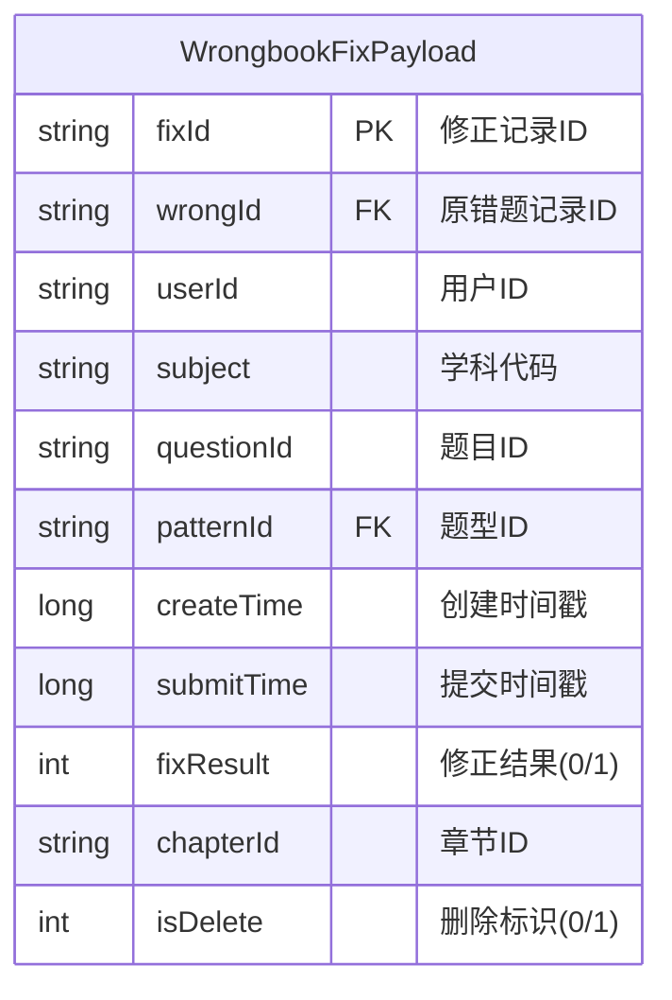

# 错题本业务域 - 源表Payload结构定义

## 📋 基本信息

```yaml
metadata:
  domain: "wrongbook"
  entity_name: "WrongbookFixPayload"
  description: "错题修正记录的事件Payload结构"
  version: "3.0"
  last_updated: "2024-12-27T15:30:00Z"
  source_file: "job/wrongbook/wrongbook-request-v3.md"
  checksum: "sha256:wrongbook_payload_v3"
  conflict_status: "clean"
```

## 🏗️ Payload结构定义

### Java类定义
```java
public class WrongbookFixPayload {
    private String fixId;           // 修正记录ID (主键)
    private String wrongId;         // 原错题记录ID (外键)
    private String userId;          // 用户ID
    private String subject;         // 学科代码
    private String questionId;      // 题目ID
    private String patternId;       // 题型ID (外键)
    private long createTime;        // 创建时间戳
    private long submitTime;        // 提交时间戳
    private int fixResult;          // 修正结果 (0=未订正, 1=订正)
    private String chapterId;       // 章节ID (语文英语科目需要)
    private int isDelete;           // 删除标识 (0=有效, 1=删除)
}
```

### Mermaid ER图表示


## 📊 字段详细说明

| 字段名 | 数据类型 | 约束 | 说明 | 示例值 | 关联关系 |
|--------|----------|------|------|--------|----------|
| `fixId` | string | PK, NOT NULL | 修正记录的唯一标识 | `fix_20241227_001` | - |
| `wrongId` | string | FK | 关联的原始错题记录ID | `wrong_123456` | → wrong_question_record.id |
| `userId` | string | NOT NULL | 执行修正的用户ID | `user_789012` | → user_profile.id |
| `subject` | string | NOT NULL | 学科代码 | `MATH`, `ENGLISH` | 枚举值 |
| `questionId` | string | NOT NULL | 关联的题目ID | `q_456789` | → question.id |
| `patternId` | string | FK | 关联的题型ID | `pattern_123` | → tower_pattern.id |
| `createTime` | long | NOT NULL | 错题创建时间戳(毫秒) | `1703123456000` | - |
| `submitTime` | long | NOT NULL | 修正提交时间戳(毫秒) | `1703123456789` | - |
| `fixResult` | int | NOT NULL | 修正结果状态 | `0`, `1` | 0=未订正, 1=订正 |
| `chapterId` | string | NULL | 章节ID(语文英语必需) | `chapter_001` | → chapter.id |
| `isDelete` | int | NOT NULL | 软删除标识 | `0`, `1` | 0=有效, 1=删除 |

## 🔗 业务规则定义

### 数据约束
```yaml
business_constraints:
  primary_key:
    field: "fixId"
    generation_rule: "fix_{timestamp}_{sequence}"
    uniqueness: "global"
    
  foreign_keys:
    wrongId:
      references: "wrong_question_record.id"
      constraint: "MUST_EXIST"
      cascade: "NO_ACTION"
      
    patternId:
      references: "tower_pattern.id"  
      constraint: "MUST_EXIST"
      cascade: "NO_ACTION"
      
  required_fields:
    always_required: ["fixId", "userId", "subject", "questionId", "patternId", "createTime", "submitTime", "fixResult", "isDelete"]
    conditionally_required:
      chapterId:
        condition: "subject IN ('CHINESE', 'ENGLISH')"
        description: "语文和英语科目必须提供章节ID"
```

### 业务逻辑验证
```yaml
validation_rules:
  subject_validation:
    valid_values: ["MATH", "ENGLISH", "CHINESE", "PHYSICS", "CHEMISTRY", "BIOLOGY", "AOSHU", "SCIENCE"]
    case_sensitive: true
    
  time_validation:
    createTime:
      rule: "createTime <= submitTime"
      error_message: "创建时间不能晚于提交时间"
    submitTime:
      rule: "submitTime <= CURRENT_TIMESTAMP"
      error_message: "提交时间不能是未来时间"
      
  fixResult_validation:
    valid_values: [0, 1]
    description: "0=未订正, 1=已订正"
    
  isDelete_validation:
    valid_values: [0, 1]
    description: "0=有效记录, 1=已删除"
    default_value: 0
    
  chapter_validation:
    rule: |
      IF subject IN ('CHINESE', 'ENGLISH') THEN
        chapterId IS NOT NULL AND chapterId != ''
      ELSE
        chapterId CAN BE NULL
```

## 🔄 关联关系定义

### 直接关联
```yaml
direct_relationships:
  to_pattern:
    source_field: "patternId"
    target_table: "tower_pattern"
    target_field: "id"
    relationship_type: "many_to_one"
    join_condition: "payload.patternId = pt.id"
    description: "修正记录关联到题型"
```

### 间接关联路径
```yaml
indirect_relationships:
  to_teaching_type:
    path: 
      - source: "WrongbookFixPayload.patternId"
      - via: "tower_pattern.id"
      - to: "tower_teaching_type_pt.pt_id"
      - via: "tower_teaching_type_pt.teaching_type_id"
      - to: "tower_teaching_type.id"
    full_join_condition: |
      payload.patternId = pt.id
      AND pt.id = ttp.pt_id AND ttp.is_delete = 0
      AND ttp.teaching_type_id = tt.id AND tt.is_delete = 0
    description: "修正记录通过题型关联到教学类型"
    
  chapter_matching_rule:
    condition: |
      (payload.subject NOT IN ('CHINESE', 'ENGLISH'))
      OR (payload.subject IN ('CHINESE', 'ENGLISH') AND tt.chapter_id = payload.chapterId)
    description: "语文英语科目需要额外的章节匹配验证"
```

## 📈 数据质量要求

### 完整性要求
```yaml
data_quality_requirements:
  completeness:
    required_fields_presence: "> 99.8%"
    valid_foreign_key_references: "> 99.5%"
    
  accuracy:
    subject_enum_compliance: "100%"
    time_sequence_correctness: "> 99.9%"
    fixResult_value_compliance: "100%"
    
  consistency:
    chapter_matching_for_language_subjects: "> 99%"
    delete_flag_consistency: "> 99.9%"
```

### 监控指标
```yaml
monitoring_metrics:
  payload_parsing_success_rate:
    target: "> 99.9%"
    alert_threshold: "< 99.5%"
    
  foreign_key_resolution_rate:
    patternId_resolution: "> 99.5%"
    target_table: "tower_pattern"
    
  business_rule_compliance:
    chapter_matching_compliance: "> 99%"
    time_validation_pass_rate: "> 99.8%"
```

## 🔧 技术实现细节

### JSON解析映射
```yaml
json_to_sql_mapping:
  field_extractions:
    fixId: "JSON_VALUE(payload, '$.id')"
    wrongId: "JSON_VALUE(payload, '$.wrong_id')"
    userId: "JSON_VALUE(payload, '$.user_id')"
    subject: "JSON_VALUE(payload, '$.subject')"
    questionId: "JSON_VALUE(payload, '$.question_id')"
    patternId: "JSON_VALUE(payload, '$.pattern_id')"
    createTime: "JSON_VALUE(payload, '$.create_time')"
    submitTime: "JSON_VALUE(payload, '$.submit_time')"
    fixResult: "JSON_VALUE(payload, '$.result')"
    chapterId: "JSON_VALUE(payload, '$.chapter_id')"
    isDelete: "JSON_VALUE(payload, '$.isDelete')"
    
  type_conversions:
    createTime: "TO_TIMESTAMP_LTZ(JSON_VALUE(payload, '$.create_time'), 0)"
    submitTime: "TO_TIMESTAMP_LTZ(JSON_VALUE(payload, '$.submit_time'), 0)"
    fixResult: "CAST(JSON_VALUE(payload, '$.result') AS BIGINT)"
    isDelete: "CAST(JSON_VALUE(payload, '$.isDelete') AS INT)"
```

### 过滤条件
```yaml
filtering_conditions:
  event_filtering:
    domain: "wrongbook"
    type: "wrongbook_fix"
    
  data_filtering:
    active_records: "JSON_VALUE(payload, '$.isDelete') = '0'"
    valid_subjects: "JSON_VALUE(payload, '$.subject') IN ('MATH', 'ENGLISH', 'CHINESE', 'PHYSICS', 'CHEMISTRY', 'BIOLOGY', 'AOSHU', 'SCIENCE')"
```

---

## 📚 相关文档

- [错题本业务逻辑说明](../../../docs/wrongbook-business-logic.md)
- [维表关联定义](./dimension-tables.md)
- [关联关系详细说明](./relationships.md)
- [数据质量监控](../../../docs/data-quality-monitoring.md)

---

*此文档定义了错题本业务域中源表Payload的完整结构，是ER知识库的重要组成部分*
