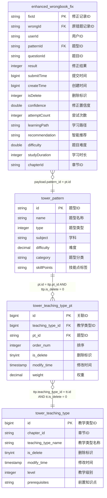

# 新错题本增强版实时宽表作业 v3.0

## 📋 作业基本信息

```yaml
job_info:
  name: "新错题本增强版实时宽表"
  description: "学生错题修正记录的增强版实时数据宽表处理，支持智能推荐和学习分析"
  domain: "new-wrongbook"
  event_type: "enhanced_fix"
  author: "ai-team"
  version: "3.0.0"
  create_date: "2024-12-27"
  enhancement: "添加智能推荐和学习路径分析功能"
```

## 🗄️ 源表配置

### BusinessEvent标准事件流
- **源表名**: BusinessEvent (统一事件流表)
- **事件过滤**: domain = 'new-wrongbook' AND type = 'enhanced_wrongbook_fix'
- **Payload结构**: EnhancedWrongbookFixPayload

**EnhancedWrongbookFixPayload数据结构**:
```java
public class EnhancedWrongbookFixPayload {
    private String fixId;
    private String wrongId;
    private String userId;
    private String subject;
    private String questionId;
    private String patternId;
    private long createTime;
    private long submitTime;
    private int fixResult;
    private String chapterId;
    private int isDelete;
    // 新增字段
    private double confidence;      // 修正置信度
    private int attemptCount;       // 尝试次数
    private String learningPath;    // 学习路径
    private String recommendation;  // 智能推荐
    private double difficulty;      // 题目难度
    private int studyDuration;      // 学习时长(秒)
}
```

## 🔗 维表配置

### 维表1: tower_pattern (题型模式表)
**维表结构**:
```sql
CREATE TABLE `vvp`.`default`.`tower_pattern` (
    `id` STRING NOT NULL,
    `name` STRING,
    `type` INT,
    `subject` STRING,
    `difficulty` DECIMAL(5, 3),
    `modify_time` BIGINT,
    `category` STRING,          -- 新增：题型分类
    `skill_points` STRING,      -- 新增：技能点标签
    PRIMARY KEY (id) NOT ENFORCED
) COMMENT '题型模式表'
WITH (
    'connector' = 'jdbc',
    'lookup.cache.max-rows' = '150000',
    'lookup.cache.ttl' = '45 min',
    'password' = '******',
    'table-name' = 'tower_pattern',
    'url' = 'jdbc:mysql://pc-bp1ivlu7lykwyzx9x.rwlb.rds.aliyuncs.com:3306/tower',
    'username' = 'zstt_server'
)
```

### 维表2: tower_teaching_type_pt (教学类型关联表)
- **过滤条件**: is_delete = 0

**维表结构**:
```sql
CREATE TABLE `vvp`.`default`.`tower_teaching_type_pt` (
    `id` BIGINT NOT NULL,
    `teaching_type_id` BIGINT,
    `pt_id` STRING,
    `order_num` INT,
    `is_delete` TINYINT,
    `modify_time` TIMESTAMP(3),
    `weight` DECIMAL(3,2),      -- 新增：权重
    PRIMARY KEY (id) NOT ENFORCED
) COMMENT '教学类型模式关联表'
WITH (
    'connector' = 'jdbc',
    'lookup.cache.max-rows' = '150000',
    'lookup.cache.ttl' = '45 min',
    'password' = '******',
    'table-name' = 'tower_teaching_type_pt',
    'url' = 'jdbc:mysql://pc-bp1ivlu7lykwyzx9x.rwlb.rds.aliyuncs.com:3306/tower',
    'username' = 'zstt_server'
)
```

### 维表3: tower_teaching_type (教学类型表)
- **过滤条件**: is_delete = 0

**维表结构**:
```sql
CREATE TABLE `vvp`.`default`.`tower_teaching_type` (
    `id` BIGINT NOT NULL,
    `chapter_id` STRING,
    `teaching_type_name` STRING,
    `is_delete` TINYINT,
    `modify_time` TIMESTAMP(3),
    `level` INT,               -- 新增：教学级别
    `prerequisites` STRING,    -- 新增：前置知识点
    PRIMARY KEY (id) NOT ENFORCED
) COMMENT '教学类型表'
WITH (
    'connector' = 'jdbc',
    'lookup.cache.max-rows' = '150000',
    'lookup.cache.ttl' = '45 min',
    'password' = '******',
    'table-name' = 'tower_teaching_type',
    'url' = 'jdbc:mysql://pc-bp1ivlu7lykwyzx9x.rwlb.rds.aliyuncs.com:3306/tower',
    'username' = 'zstt_server'
)
```

## 🎯 结果表配置

### 表名: dwd_enhanced_wrong_record_wide_delta
- **操作类型**: UPSERT
- **主键**: fix_id

**结果表结构**:
```sql
CREATE TABLE `vvp`.`default`.`dwd_enhanced_wrong_record_wide_delta` (
    `fix_id` STRING NOT NULL,
    `wrong_id` STRING,
    `user_id` STRING,
    `subject` STRING,
    `subject_name` STRING,
    `question_id` STRING,
    `pattern_id` STRING,
    `pattern_name` STRING,
    `pattern_category` STRING,
    `teaching_type_id` STRING,
    `teaching_type_name` STRING,
    `teaching_level` INT,
    `fix_result` INT,
    `fix_result_desc` STRING,
    `confidence` DOUBLE,
    `attempt_count` INT,
    `learning_path` STRING,
    `recommendation` STRING,
    `question_difficulty` DOUBLE,
    `study_duration` INT,
    `create_time` TIMESTAMP(3),
    `fix_time` TIMESTAMP(3),
    `skill_points` STRING,
    `pattern_weight` DECIMAL(3,2),
    `is_mastered` BOOLEAN,
    `next_review_time` TIMESTAMP(3),
    PRIMARY KEY (fix_id) NOT ENFORCED
) COMMENT '增强版错题本错题记录实时宽表'
WITH (
    'accessId' = 'LTAI5tHvJUm7fEzCfrFT3oam',
    'accessKey' = '******',
    'connector' = 'odps',
    'enableUpsert' = 'true',
    'endpoint' = 'http://service.cn-hangzhou.maxcompute.aliyun.com/api',
    'project' = 'zstt',
    'sink.operation' = 'upsert',
    'tableName' = 'dwd_enhanced_wrong_record_wide_delta',
    'upsert.write.bucket.num' = '32'
)
```

## 🔄 字段映射配置

### 基础字段映射
```yaml
field_mapping:
  # 从payload映射的字段
  fix_id: "payload.id"
  wrong_id: "payload.wrong_id"
  user_id: "payload.user_id"
  subject: "payload.subject"
  question_id: "payload.question_id"
  pattern_id: "payload.pattern_id"
  fix_result: "payload.result"
  confidence: "COALESCE(CAST(payload.confidence AS DOUBLE), 0.0)"
  attempt_count: "COALESCE(payload.attempt_count, 1)"
  learning_path: "COALESCE(payload.learning_path, 'standard')"
  recommendation: "COALESCE(payload.recommendation, '')"
  question_difficulty: "COALESCE(payload.difficulty, 0.5)"
  study_duration: "COALESCE(payload.study_duration, 0)"
  
  # 从维表映射的字段  
  pattern_name: "COALESCE(pt.name, '未知题型')"
  pattern_category: "COALESCE(pt.category, '其他')"
  teaching_type_id: "CAST(tt.id AS STRING)"
  teaching_type_name: "COALESCE(tt.teaching_type_name, '未分类')"
  teaching_level: "COALESCE(tt.level, 1)"
  skill_points: "COALESCE(pt.skill_points, '')"
  pattern_weight: "COALESCE(ttp.weight, 1.0)"
  
  # 计算字段
  subject_name: |
    CASE payload.subject
        WHEN 'ENGLISH' THEN '英语'
        WHEN 'BIOLOGY' THEN '生物'
        WHEN 'MATH' THEN '数学'
        WHEN 'PHYSICS' THEN '物理'
        WHEN 'CHEMISTRY' THEN '化学'
        WHEN 'AOSHU' THEN '数学思维'
        WHEN 'SCIENCE' THEN '科学'
        WHEN 'CHINESE' THEN '语文'
        WHEN 'HISTORY' THEN '历史'
        WHEN 'GEOGRAPHY' THEN '地理'
        WHEN 'POLITICS' THEN '政治'
        ELSE '其他'
    END
  
  create_time: "TO_TIMESTAMP_LTZ(payload.create_time, 0)"
  fix_time: "TO_TIMESTAMP_LTZ(payload.submit_time, 0)"
  
  fix_result_desc: |
    CASE payload.result
        WHEN 1 THEN '已订正'
        WHEN 0 THEN '未订正'
        WHEN 2 THEN '部分订正'
        WHEN 3 THEN '需要复习'
        ELSE '未知状态'
    END
  
  # 智能分析字段
  is_mastered: |
    CASE 
        WHEN payload.result = 1 AND payload.confidence >= 0.8 AND payload.attempt_count <= 2 THEN true
        WHEN payload.result = 1 AND payload.confidence >= 0.6 AND payload.attempt_count <= 3 THEN true
        ELSE false
    END
  
  next_review_time: |
    CASE 
        WHEN payload.result = 1 AND payload.confidence >= 0.8 THEN 
            TIMESTAMPADD(DAY, 7, TO_TIMESTAMP_LTZ(payload.submit_time, 0))
        WHEN payload.result = 1 AND payload.confidence >= 0.6 THEN 
            TIMESTAMPADD(DAY, 3, TO_TIMESTAMP_LTZ(payload.submit_time, 0))
        WHEN payload.result = 0 THEN 
            TIMESTAMPADD(DAY, 1, TO_TIMESTAMP_LTZ(payload.submit_time, 0))
        ELSE 
            TIMESTAMPADD(DAY, 2, TO_TIMESTAMP_LTZ(payload.submit_time, 0))
    END
```

## 🗺️ ER图定义

### 实体关系图 (Mermaid格式)


### 关联关系定义
```yaml
join_relationships:
  # 主要关联链路
  payload_to_pattern:
    source_table: "enhanced_wrongbook_fix"
    source_field: "payload.pattern_id"
    target_table: "tower_pattern"
    target_field: "id"
    join_type: "LEFT JOIN"
    description: "错题修正记录关联题型信息"
    
  pattern_to_teaching_type_pt:
    source_table: "tower_pattern"
    source_field: "id"
    target_table: "tower_teaching_type_pt"
    target_field: "pt_id"
    join_type: "LEFT JOIN"
    additional_condition: "ttp.is_delete = 0"
    description: "题型关联教学类型关系表"
    
  teaching_type_pt_to_teaching_type:
    source_table: "tower_teaching_type_pt"
    source_field: "teaching_type_id"
    target_table: "tower_teaching_type"
    target_field: "id"
    join_type: "LEFT JOIN"
    additional_condition: "tt.is_delete = 0"
    description: "教学类型关系表关联教学类型主表"

# 特殊业务规则
special_conditions:
  data_quality_filter:
    description: "数据质量过滤条件"
    condition: |
      payload.isDelete = 0 
      AND payload.user_id IS NOT NULL
      AND payload.pattern_id IS NOT NULL
      
  subject_chapter_matching:
    description: "语文英语科目需要额外章节匹配"
    condition: |
      (payload.subject NOT IN ('CHINESE', 'ENGLISH')
       OR (payload.subject IN ('CHINESE', 'ENGLISH') AND tt.chapter_id = payload.chapter_id))
       
  confidence_validation:
    description: "置信度有效性检查"
    condition: |
      (payload.confidence IS NULL OR (payload.confidence >= 0.0 AND payload.confidence <= 1.0))
      
  difficulty_validation:
    description: "难度值有效性检查"
    condition: |
      (payload.difficulty IS NULL OR (payload.difficulty >= 0.0 AND payload.difficulty <= 1.0))
      
  performance_optimization:
    description: "性能优化条件"
    condition: |
      pt.id IS NOT NULL OR ttp.pt_id IS NOT NULL
```

## 💬 备注说明

### 新增功能特性
- **智能推荐**: 基于学习路径和置信度进行个性化推荐
- **学习分析**: 通过尝试次数和学习时长分析学习效果
- **掌握度评估**: 综合多个维度判断知识点掌握情况
- **复习提醒**: 智能计算下次复习时间
- **技能点标签**: 支持细粒度的技能点追踪

### 业务逻辑增强
- 新增置信度和尝试次数字段，用于智能分析
- 增加学习路径跟踪，支持个性化学习
- 支持更多学科类型（历史、地理、政治等）
- 增强的修正状态（部分订正、需要复习）
- 智能的下次复习时间计算

### 数据质量要求
- 置信度值必须在0.0-1.0范围内
- 难度值必须在0.0-1.0范围内
- isDelete = 0 的记录才参与计算
- 必需字段：user_id, pattern_id不能为空
- 时间字段需要正确的时区转换
- 支持NULL值安全处理

### 性能优化
- 维表缓存时间优化为45分钟
- 缓存大小增加到150,000行
- 结果表分桶数量增加到32个
- 添加性能优化过滤条件