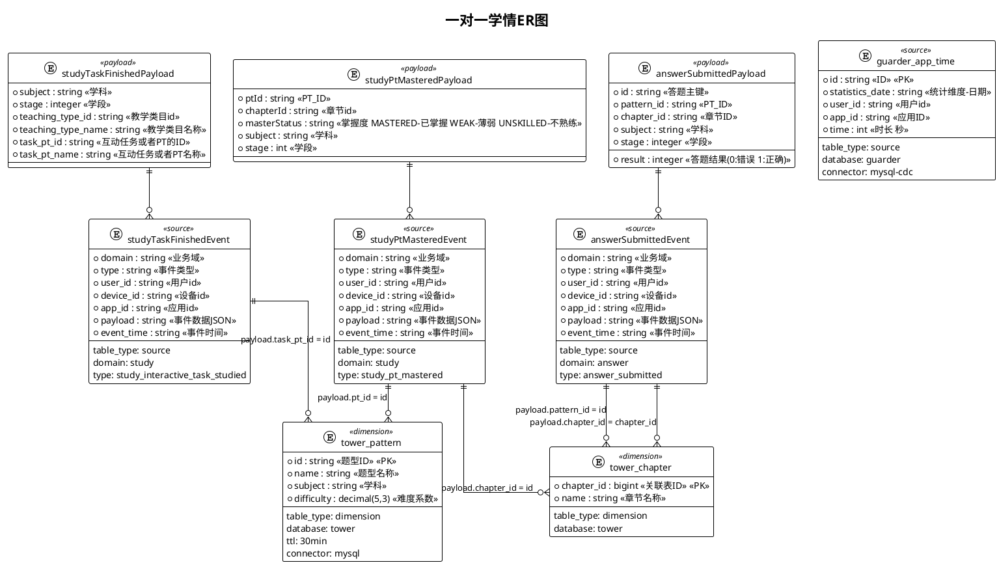

# 错题本修正记录极简配置

## 📊 ER图定义



## 🔄 字段映射定义

```yaml
# 结果表配置
result_table:
  table_name: "dws_study_pt_stats_delta"
  table_type: "result"
  connector: "mysql"
  database: "guarder"
  primary_key: ["user_id,current_day,subject,pt_id"]

# 字段映射配置
field_mapping:
  # 基础字段映射
  current_day: "ase.statistics_date"
  user_id: "ase.userId"
  subject: "ase.payload.subject"
  pt_id: "ase.payload.pattern_id"
  pt_name: "tp.name"
  master_status: : {
    "description": "当天用户pt的最新掌握度",
    "time_window": "当天",
    "dimensions": ["spme.user_id","spme.statistics_date","spme.payload.subject","spme.payload.pattern_id"],
    "filters": "如果已存在的状态为MASTERED，则不更新掌握度字段",
    "aggregation": "最新的一条记录的masterStatus"
  }
  difficulty: "tp.difficulty"
  answer_cnt: {
    "description": "当天用户pt下的答题数量统计",
    "time_window": "当天",
    "dimensions": ["ase.user_id","ase.statistics_date","ase.payload.subject","ase.payload.pattern_id"],
    "filters": "",
    "aggregation": "COUNT(DISTINCT ase.id)"
  }
  answer_right_cnt: {
    "description": "当天用户的答对数量统计",
    "time_window": "当天",
    "dimensions": ["ase.user_id","ase.statistics_date","ase.payload.subject","ase.payload.pattern_id"],
    "filters": "ase.result = 1",
    "aggregation": "COUNT(DISTINCT ase.id)"
  }
  chapter_id: "ase.payload.chapter_id"
  chapter_name: "tc.name"

```
