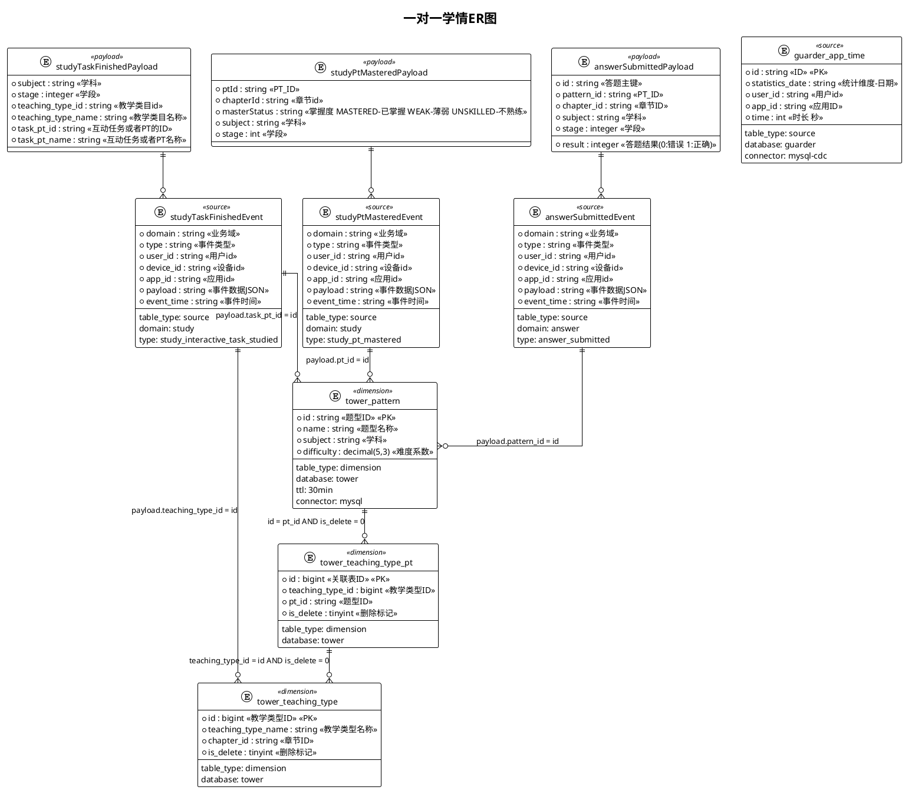

# 错题本修正记录极简配置

## 📊 ER图定义



## 🔄 字段映射定义

```yaml
# 结果表配置
result_table:
  table_name: "dws_study_stats_delta"
  table_type: "result"
  connector: "mysql"
  database: "guarder"
  primary_key: ["user_id,current_day,subject"]

# 字段映射配置
field_mapping:
  # 基础字段映射
  current_day: "time.statistics_date"
  user_id: "time.userId"
  subject: "(可以在配置中定义appId到subject的维度表) 根据time.appId获取学科
                当appId为
                com.jzx.client.math1v1
                com.jzx.client.math
                则学科为math
                
                当appId为
                com.jzx.client.chinese
                则学科为chinese
                
                当appId为
                com.jzx.client.english
                则学科为english
                当appId为
                com.jzx.client.physics
                com.jzx.client.physics1v1
                则学科为physics
                
                当appId为
                com.jzx.client.chemistry
                com.jzx.client.chemistry1v1
                则学科为chemistry
                
                当appId为
                com.jzx.client.biology
                com.jzx.client.biology1v1
                则学科为biology"
  study_time: "同一个学科下的sum(time.time)"
  answer_cnt: {
    "description": "当天用户的答题数量统计",
    "time_window": "当天",
    "dimensions": ["ase.user_id","ase.statistics_date","ase.payload.subject"],
    "filters": "",
    "aggregation": "COUNT"
  }
  answer_right_cnt: {
    "description": "当天用户的答对数量统计",
    "time_window": "当天",
    "dimensions": ["ase.user_id","ase.statistics_date","ase.payload.subject","ase.payload.id"],
    "filters": "ase.result = 1",
    "aggregation": "COUNT"
  }
  master_pt_cnt: {
    "description": "当天用户的掌握pt数量统计",
    "time_window": "当天",
    "dimensions": ["spme.user_id","spme.statistics_date","spme.payload.subject","spme.payload.ptId"],
    "filters": "spme.payload.masterStatus = 'MASTERED'",
    "aggregation": "COUNT"
  }
  study_task_count: {
    "description": "当天用户的互动任务数量统计",
    "time_window": "当天",
    "dimensions": ["stfe.user_id","stfe.statistics_date","stfe.payload.subject","stfe.payload.task_pt_id"],
    "filters": "stfe.payload.subject in ('chinese','english')",
    "aggregation": "COUNT"              
  }

  study_task_knowledge_explain_count: {
    "description": "当天用户的互动任务的知识点讲解数量统计",
    "time_window": "当天",
    "dimensions": ["stfe.user_id","stfe.statistics_date","stfe.payload.subject","stfe.payload.task_pt_id"],
    "filters": "stfe.payload.subject not in ('chinese','english') and stfe.payload.teaching_type_name = '知识点讲解'",
    "aggregation": "COUNT"
  }

  study_task_example_explain_count: {
    "description": "当天用户的互动任务的例题讲解数量统计",
    "time_window": "当天",
    "dimensions": ["stfe.user_id","stfe.statistics_date","stfe.payload.subject","stfe.payload.task_pt_id"],
    "filters": "stfe.payload.subject not in ('chinese','english') and stfe.payload.teaching_type_name = '例题讲解'",
    "aggregation": "COUNT"
  }

```
