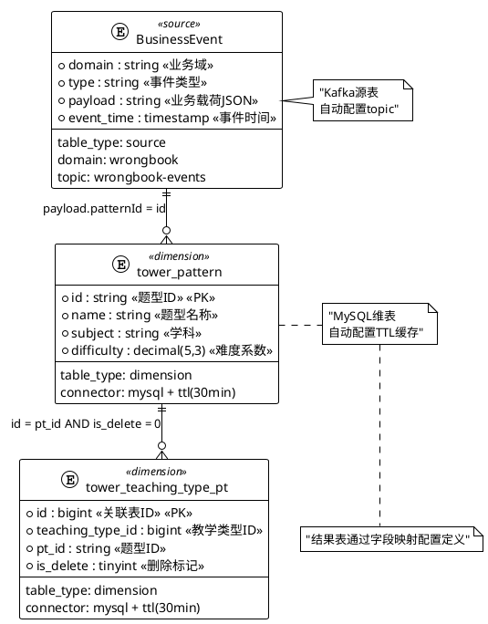

# 极简版Flink SQL生成需求模板

## 📊 ER图定义



## 🔄 字段映射定义

```yaml
# 结果表配置
result_table:
  table_name: "dwd_wrong_record_wide_delta"
  table_type: "result"
  connector: "odps"
  primary_key: ["id"]

# 字段映射配置
field_mapping:
  # 基础字段映射
  id: "payload.fixId"                       # 直接取payload字段
  user_id: "payload.userId"
  subject: "payload.subject"
  pattern_name: "tower_pattern.name"        # 维表字段
  fix_result: "payload.fixResult"
  
  # 计算字段映射
  subject_name: "CASE payload.subject WHEN 'MATH' THEN '数学' WHEN 'ENGLISH' THEN '英语' ELSE '' END"
  fix_time: "TO_TIMESTAMP_LTZ(payload.submitTime, 0)"
  
  # 指标描述映射 (AI智能生成SQL)
  learning_efficiency_score: "根据用户修正错题的速度和准确率计算学习效率分数，修正时间越短且成功修正得分越高"
  subject_mastery_level: "基于用户在该学科的错题修正情况，计算学科掌握度等级，分为初级、中级、高级"
  pattern_difficulty_trend: "分析用户在特定题型上的表现趋势，计算题型难度适应度"
```
