# 错题本修正记录实时宽表作业 v2.0

## 📋 作业基本信息

```yaml
job_info:
  name: "错题本修正记录实时宽表"
  description: "学生错题修正记录的实时数据宽表处理"
  domain: "wrongbook"
  event_type: "fix"
  author: "flink-team"
  version: "2.0.0"
  create_date: "2024-12-27"
```

## 🗄️ 源表配置

### BusinessEvent标准事件流
- **源表名**: BusinessEvent (统一事件流表)
- **事件过滤**: domain = 'wrongbook' AND type = 'wrongbook_fix'
- **Payload结构**: WrongbookFixPayload

**WrongbookFixPayload数据结构**:
```java
public class WrongbookFixPayload {
    private String id;
    private String answerDetail;
    private String answerImage;
    private String originWrongRecordId;
    private String patternId;
    private String questionId;
    private Integer result;
    private Long submitTime;
    private String userId;
    private String zpdPatternId;
    private String draftImage;
    private String wrongTagGroupId;
    private Integer correctStatues;
    private String tagGroup;
    private String comment;
    private Long createTime;
    private Integer isDelete;
}
```

## 🔗 维表配置

### 维表1: wrong_question_record
- **关联条件**: wqr.id = payload.originWrongRecordId AND payload.isDelete = 0

**维表结构**:
```sql
CREATE TABLE `vvp`.`default`.`wrong_question_record` (
    `id` STRING NOT NULL,
    `user_id` STRING,
    `question_id` STRING,
    `pattern_id` STRING,
    `subject` STRING,
    `chapter_id` STRING,
    `chapter_name` STRING,
    `study_stage` STRING,
    `course_type` STRING,
    `answer_record_id` STRING,
    `answer_image` STRING,
    `result` TINYINT,
    `correct_status` TINYINT,
    `origin` STRING,
    `tag_group` STRING,
    `draft_image` STRING,
    `q_type` INT,
    `zpd_pattern_id` STRING,
    `create_time` BIGINT,
    `submit_time` BIGINT,
    `is_delete` BOOLEAN,
    PRIMARY KEY (id) NOT ENFORCED
) COMMENT '错题记录表'
WITH (
    'connector' = 'jdbc',
    'lookup.cache.caching-missing-key' = 'false',
    'lookup.cache.max-rows' = '100000',
    'lookup.cache.ttl' = '10 min',
    'lookup.max-retries' = '3',
    'password' = '******',
    'table-name' = 'wrong_question_record',
    'url' = 'jdbc:mysql://pc-bp1ivlu7lykwyzx9x.rwlb.rds.aliyuncs.com:3306/shuxue',
    'username' = 'zstt_server'
)
```

### 维表2: tower_pattern
- **关联条件**: pt.id = wqr.pattern_id

**维表结构**:
```sql
CREATE TABLE `vvp`.`default`.`tower_pattern` (
    `id` STRING NOT NULL,
    `name` STRING,
    `type` INT,
    `subject` STRING,
    `difficulty` DECIMAL(5, 3),
    `modify_time` BIGINT,
    PRIMARY KEY (id) NOT ENFORCED
) COMMENT '题型模式表'
WITH (
    'connector' = 'jdbc',
    'lookup.cache.max-rows' = '100000',
    'lookup.cache.ttl' = '30 min',
    'password' = '******',
    'table-name' = 'tower_pattern',
    'url' = 'jdbc:mysql://pc-bp1ivlu7lykwyzx9x.rwlb.rds.aliyuncs.com:3306/tower',
    'username' = 'zstt_server'
)
```

### 维表3: tower_teaching_type_pt
- **关联条件**: ttp.pt_id = wqr.pattern_id AND ttp.is_delete = 0

**维表结构**:
```sql
CREATE TABLE `vvp`.`default`.`tower_teaching_type_pt` (
    `id` BIGINT NOT NULL,
    `teaching_type_id` BIGINT,
    `pt_id` STRING,
    `order_num` INT,
    `is_delete` TINYINT,
    `modify_time` TIMESTAMP(3),
    PRIMARY KEY (id) NOT ENFORCED
) COMMENT '教学类型模式关联表'
WITH (
    'connector' = 'jdbc',
    'lookup.cache.max-rows' = '100000',
    'lookup.cache.ttl' = '30 min',
    'password' = '******',
    'table-name' = 'tower_teaching_type_pt',
    'url' = 'jdbc:mysql://pc-bp1ivlu7lykwyzx9x.rwlb.rds.aliyuncs.com:3306/tower',
    'username' = 'zstt_server'
)
```

### 维表4: tower_teaching_type
- **关联条件**: tt.id = ttp.teaching_type_id AND tt.is_delete = 0

**维表结构**:
```sql
CREATE TABLE `vvp`.`default`.`tower_teaching_type` (
    `id` BIGINT NOT NULL,
    `chapter_id` STRING,
    `teaching_type_name` STRING,
    `is_delete` TINYINT,
    `modify_time` TIMESTAMP(3),
    PRIMARY KEY (id) NOT ENFORCED
) COMMENT '教学类型表'
WITH (
    'connector' = 'jdbc',
    'lookup.cache.max-rows' = '100000',
    'lookup.cache.ttl' = '30 min',
    'password' = '******',
    'table-name' = 'tower_teaching_type',
    'url' = 'jdbc:mysql://pc-bp1ivlu7lykwyzx9x.rwlb.rds.aliyuncs.com:3306/tower',
    'username' = 'zstt_server'
)
```

## 🎯 结果表配置

### 表名: dwd_wrong_record_wide_delta
- **操作类型**: INSERT
- **主键**: id

**结果表结构**:
```sql
CREATE TABLE `vvp`.`default`.`dwd_wrong_record_wide_delta` (
    `id` BIGINT NOT NULL,
    `wrong_id` STRING,
    `user_id` STRING,
    `subject` STRING,
    `subject_name` STRING,
    `question_id` STRING,
    `question` STRING,
    `pattern_id` STRING,
    `pattern_name` STRING,
    `teaching_type_id` STRING,
    `teaching_type_name` STRING,
    `collect_time` TIMESTAMP(3),
    `fix_id` STRING,
    `fix_time` TIMESTAMP(3),
    `fix_result` BIGINT,
    `fix_result_desc` STRING,
    PRIMARY KEY (id) NOT ENFORCED
) COMMENT '错题本错题记录实时宽表'
WITH (
    'accessId' = 'LTAI5tHvJUm7fEzCfrFT3oam',
    'accessKey' = '******',
    'connector' = 'odps',
    'enableUpsert' = 'true',
    'endpoint' = 'http://service.cn-hangzhou.maxcompute.aliyun.com/api',
    'project' = 'zstt',
    'sink.operation' = 'upsert',
    'tableName' = 'dwd_wrong_record_wide_delta',
    'upsert.write.bucket.num' = '16'
)
```

## 🔄 字段映射配置

### 基础字段映射
```yaml
field_mapping:
  # 从payload映射的字段
  id: "CAST(payload.id AS BIGINT)"
  wrong_id: "wqr.id"
  user_id: "wqr.user_id"
  subject: "wqr.subject"
  question_id: "wqr.question_id"
  pattern_id: "wqr.pattern_id"
  fix_id: "payload.id"
  fix_result: "payload.result"
  
  # 从维表映射的字段  
  pattern_name: "pt.name"
  teaching_type_id: "CAST(tt.id AS STRING)"
  teaching_type_name: "tt.teaching_type_name"
  
  # 计算字段
  subject_name: |
    CASE wqr.subject
        WHEN 'ENGLISH' THEN '英语'
        WHEN 'BIOLOGY' THEN '生物'
        WHEN 'math' THEN '数学'
        WHEN 'MATH' THEN '数学'
        WHEN 'PHYSICS' THEN '物理'
        WHEN 'CHEMISTRY' THEN '化学'
        WHEN 'AOSHU' THEN '数学思维'
        WHEN 'SCIENCE' THEN '科学'
        WHEN 'CHINESE' THEN '语文'
        ELSE ''
    END
  question: "CAST(NULL AS STRING)"
  collect_time: "TO_TIMESTAMP_LTZ(wqr.create_time, 0)"
  fix_time: "TO_TIMESTAMP_LTZ(payload.submit_time, 0)"
  fix_result_desc: |
    CASE payload.result
        WHEN 1 THEN '订正'
        WHEN 0 THEN '未订正'
        ELSE ''
    END
```

## 🗺️ ER图定义

### 实体关系图 (Mermaid格式)

```mermaid
erDiagram
    wrongbook_fix {
        string id PK "修正记录ID"
        string originWrongRecordId FK "原错题记录ID"
        string userId "用户ID"
        string patternId FK "题型ID"
        string questionId "题目ID"
        integer result "修正结果"
        bigint submitTime "提交时间"
        bigint createTime "创建时间"
        integer isDelete "删除标识"
    }
    
    wrong_question_record {
        string id PK "错题记录ID"
        string user_id "用户ID"
        string question_id "题目ID"
        string pattern_id FK "题型ID"
        string subject "学科"
        string chapter_id "章节ID"
        bigint create_time "创建时间"
        boolean is_delete "删除标识"
    }
    
    tower_pattern {
        string id PK "题型ID"
        string name "题型名称"
        integer type "题型类型"
        string subject "学科"
        decimal difficulty "难度"
    }
    
    tower_teaching_type_pt {
        bigint id PK "关联ID"
        bigint teaching_type_id FK "教学类型ID"
        string pt_id FK "题型ID"
        integer order_num "排序"
        tinyint is_delete "删除标识"
    }
    
    tower_teaching_type {
        bigint id PK "教学类型ID"
        string chapter_id "章节ID"
        string teaching_type_name "教学类型名称"
        tinyint is_delete "删除标识"
    }
    
    dwd_wrong_record_wide_delta {
        bigint id PK "宽表ID"
        string wrong_id "错题ID"
        string user_id "用户ID"
        string subject "学科"
        string subject_name "学科名称"
        string pattern_id "题型ID"
        string pattern_name "题型名称"
        string teaching_type_id "教学类型ID"
        string teaching_type_name "教学类型名称"
        timestamp collect_time "收集时间"
        timestamp fix_time "修正时间"
        bigint fix_result "修正结果"
        string fix_result_desc "修正结果描述"
    }

    %% 关系定义
    wrongbook_fix }o--|| wrong_question_record : "多对一(originWrongRecordId->id)"
    wrong_question_record }o--|| tower_pattern : "多对一(pattern_id->id)"
    tower_pattern ||--o{ tower_teaching_type_pt : "一对多(id->pt_id)"
    tower_teaching_type_pt }o--|| tower_teaching_type : "多对一(teaching_type_id->id)"
    
    %% 数据流关系 
    wrongbook_fix ||--|| dwd_wrong_record_wide_delta : "生成宽表"
    wrong_question_record ||--|| dwd_wrong_record_wide_delta : "提供错题信息"
    tower_pattern ||--|| dwd_wrong_record_wide_delta : "提供题型信息"
    tower_teaching_type ||--|| dwd_wrong_record_wide_delta : "提供教学类型信息"
```


### 表结构定义
```yaml
tables:
  source_table:
    name: "wrongbook_fix"
    type: "source"
    fields:
      - name: "id"
        type: "VARCHAR(255)"
        is_primary_key: true
      - name: "originWrongRecordId"
        type: "VARCHAR(255)"
        is_foreign_key: true
        references: "wrong_question_record.id"
      - name: "userId"
        type: "VARCHAR(255)"
      - name: "patternId"
        type: "VARCHAR(255)"
        is_foreign_key: true
        references: "tower_pattern.id"
        
  dimension_tables:
    - name: "wrong_question_record"
      type: "dimension"
      fields:
        - name: "id"
          type: "VARCHAR(255)"
          is_primary_key: true
        - name: "user_id"
          type: "VARCHAR(255)"
        - name: "pattern_id"
          type: "VARCHAR(255)"
          is_foreign_key: true
          references: "tower_pattern.id"
        - name: "subject"
          type: "VARCHAR(255)"
        - name: "chapter_id"
          type: "VARCHAR(255)"
          
    - name: "tower_pattern"
      type: "dimension"
      fields:
        - name: "id"
          type: "VARCHAR(255)"
          is_primary_key: true
        - name: "name"
          type: "VARCHAR(255)"
        - name: "subject"
          type: "VARCHAR(255)"
          
    - name: "tower_teaching_type_pt"
      type: "dimension"
      fields:
        - name: "id"
          type: "BIGINT"
          is_primary_key: true
        - name: "teaching_type_id"
          type: "BIGINT"
          is_foreign_key: true
          references: "tower_teaching_type.id"
        - name: "pt_id"
          type: "VARCHAR(255)"
          is_foreign_key: true
          references: "tower_pattern.id"
          
    - name: "tower_teaching_type"
      type: "dimension"
      fields:
        - name: "id"
          type: "BIGINT"
          is_primary_key: true
        - name: "teaching_type_name"
          type: "VARCHAR(255)"
        - name: "chapter_id"
          type: "VARCHAR(255)"
          
  result_table:
    name: "dwd_wrong_record_wide_delta"
    type: "result"
    fields:
      - name: "id"
        type: "BIGINT"
        is_primary_key: true
      - name: "wrong_id"
        type: "VARCHAR(255)"
      - name: "user_id"
        type: "VARCHAR(255)"
      - name: "subject_name"
        type: "VARCHAR(255)"
      - name: "pattern_name"
        type: "VARCHAR(255)"
      - name: "teaching_type_name"
        type: "VARCHAR(255)"
```

## 💬 备注说明

### 业务逻辑
- 学科名称需要中文转换显示
- 修正结果需要状态码转中文描述
- 语文和英语学科需要额外的章节匹配条件
- 过滤已删除的记录

### 数据质量要求
- originWrongRecordId必须存在于wrong_question_record表中
- isDelete = 0 的记录才参与计算
- 时间字段需要正确的时区转换
