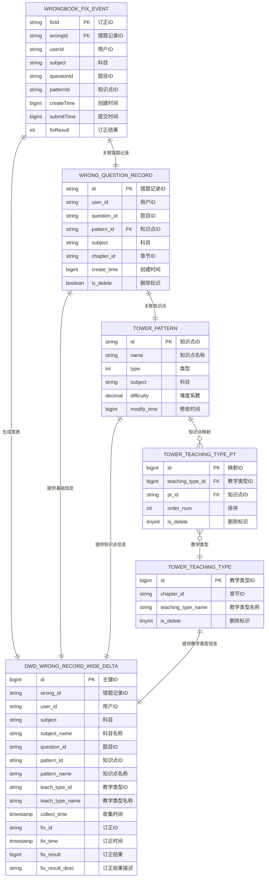

# 错题订正记录宽表作业生成请求

## 📋 作业基本信息

```yaml
job_info:
  name: "错题订正记录宽表作业"
  description: "实时处理错题订正记录，通过BusinessEvent标准事件流监听订正事件，关联错题记录、知识点、教学类型等维表，生成宽表数据输出到ODPS"
  domain: "wrongbook"
  event_type: "wrongbook_fix"
  author: "数据开发团队"
  version: "1.0.0"
  create_date: "2024-12-27"
```

## 🗄️ 源表配置

### BusinessEvent标准事件流
- **源表名**: BusinessEvent (统一事件流表)
- **事件过滤**: domain = 'wrongbook' AND type = 'wrongbook_fix'
- **Payload结构**: WrongbookFixPayload

**WrongbookFixPayload数据结构**:
```java
public class WrongbookFixPayload {
    private String fixId;
    private String wrongId;
    private String userId;
    private String subject;
    private String questionId;
    private String patternId;
    private long createTime;
    private long submitTime;
    private int fixResult;
}
```

**对应的JSON格式**:
```json
{
  "fixId": "fix_123456",
  "wrongId": "wrong_789012", 
  "userId": "user_345678",
  "subject": "math",
  "questionId": "question_901234",
  "patternId": "pattern_567890",
  "createTime": 1703123456000,
  "submitTime": 1703123456789,
  "fixResult": 1
}
```

## 🔗 维表配置

### 维表1: wrong_question_record
- **关联条件**: wqr.id = JSON_VALUE(payload, '$.wrongId')
- **过滤条件**: wqr.is_delete = 0
- **额外条件**: 无
- **别名**: wqr

**维表结构**:
```sql
CREATE TABLE `vvp`.`default`.`wrong_question_record` (
  `id` STRING NOT NULL,
  `user_id` STRING,
  `question_id` STRING,
  `pattern_id` STRING,
  `subject` STRING,
  `chapter_id` STRING,
  `chapter_name` STRING,
  `study_stage` STRING,
  `course_type` STRING,
  `answer_record_id` STRING,
  `answer_image` STRING,
  `result` TINYINT,
  `correct_status` TINYINT,
  `origin` STRING,
  `tag_group` STRING,
  `draft_image` STRING,
  `q_type` INT,
  `zpd_pattern_id` STRING,
  `create_time` BIGINT,
  `submit_time` BIGINT,
  `is_delete` BOOLEAN,
  PRIMARY KEY (id) NOT ENFORCED
)
COMMENT '错题记录维表'
WITH (
  'connector' = 'jdbc',
  'lookup.cache.caching-missing-key' = 'false',
  'lookup.cache.max-rows' = '100000',
  'lookup.cache.ttl' = '10 min',
  'lookup.max-retries' = '3',
  'password' = '******',
  'table-name' = 'wrong_question_record',
  'url' = 'jdbc:mysql://pc-bp1ivlu7lykwyzx9x.rwlb.rds.aliyuncs.com:3306/shuxue',
  'username' = 'zstt_server'
)
```

### 维表2: tower_pattern
- **关联条件**: pt.id = wqr.pattern_id
- **过滤条件**: 无
- **额外条件**: 无
- **别名**: pt

**维表结构**:
```sql
CREATE TABLE `vvp`.`default`.`tower_pattern` (
  `id` STRING NOT NULL,
  `name` STRING,
  `type` INT,
  `subject` STRING,
  `difficulty` DECIMAL(5, 3),
  `modify_time` BIGINT,
  PRIMARY KEY (id) NOT ENFORCED
)
COMMENT '知识点模式维表'
WITH (
  'connector' = 'jdbc',
  'lookup.cache.max-rows' = '100000',
  'lookup.cache.ttl' = '30 min',
  'password' = '******',
  'table-name' = 'tower_pattern',
  'url' = 'jdbc:mysql://pc-bp1ivlu7lykwyzx9x.rwlb.rds.aliyuncs.com:3306/tower',
  'username' = 'zstt_server'
)
```

### 维表3: tower_teaching_type_pt
- **关联条件**: ttp.pt_id = wqr.pattern_id
- **过滤条件**: ttp.is_delete = 0
- **额外条件**: 无
- **别名**: ttp

**维表结构**:
```sql
CREATE TABLE `vvp`.`default`.`tower_teaching_type_pt` (
  `id` BIGINT NOT NULL,
  `teaching_type_id` BIGINT,
  `pt_id` STRING,
  `order_num` INT,
  `is_delete` TINYINT,
  `modify_time` TIMESTAMP(3),
  PRIMARY KEY (id) NOT ENFORCED
)
COMMENT '教学类型-知识点映射维表'
WITH (
  'connector' = 'jdbc',
  'lookup.cache.max-rows' = '100000',
  'lookup.cache.ttl' = '30 min',
  'password' = '******',
  'table-name' = 'tower_teaching_type_pt',
  'url' = 'jdbc:mysql://pc-bp1ivlu7lykwyzx9x.rwlb.rds.aliyuncs.com:3306/tower',
  'username' = 'zstt_server'
)
```

### 维表4: tower_teaching_type
- **关联条件**: tt.id = ttp.teaching_type_id
- **过滤条件**: tt.is_delete = 0
- **额外条件**: 对于语文英语科目需额外匹配: tt.chapter_id = wqr.chapter_id
- **别名**: tt

**维表结构**:
```sql
CREATE TABLE `vvp`.`default`.`tower_teaching_type` (
  `id` BIGINT NOT NULL,
  `chapter_id` STRING,
  `teaching_type_name` STRING,
  `is_delete` TINYINT,
  `modify_time` TIMESTAMP(3),
  PRIMARY KEY (id) NOT ENFORCED
)
COMMENT '教学类型维表'
WITH (
  'connector' = 'jdbc',
  'lookup.cache.max-rows' = '100000',
  'lookup.cache.ttl' = '30 min',
  'password' = '******',
  'table-name' = 'tower_teaching_type',
  'url' = 'jdbc:mysql://pc-bp1ivlu7lykwyzx9x.rwlb.rds.aliyuncs.com:3306/tower',
  'username' = 'zstt_server'
)
```

## 🎯 结果表配置

### 表名: dwd_wrong_record_wide_delta
- **操作类型**: INSERT
- **主键**: id
- **分区字段**: 无

**结果表结构**:
```sql
CREATE TABLE `vvp`.`default`.`dwd_wrong_record_wide_delta` (
  `id` BIGINT NOT NULL,
  `wrong_id` STRING,
  `user_id` STRING,
  `subject` STRING,
  `subject_name` STRING,
  `question_id` STRING,
  `question` STRING,
  `pattern_id` STRING,
  `pattern_name` STRING,
  `teach_type_id` STRING,
  `teach_type_name` STRING,
  `collect_time` TIMESTAMP(3),
  `fix_id` STRING,
  `fix_time` TIMESTAMP(3),
  `fix_result` BIGINT,
  `fix_result_desc` STRING,
  PRIMARY KEY (id) NOT ENFORCED
)
COMMENT '错题本错题记录实时宽表'
WITH (
  'accessId' = 'LTAI5tHvJUm7fEzCfrFT3oam',
  'accessKey' = '******',
  'connector' = 'odps',
  'enableUpsert' = 'true',
  'endpoint' = 'http://service.cn-hangzhou.maxcompute.aliyun.com/api',
  'project' = 'zstt',
  'sink.operation' = 'upsert',
  'tableName' = 'dwd_wrong_record_wide_delta',
  'upsert.write.bucket.num' = '16'
)
```

## 🔄 字段映射配置

### 基础字段
- `id`: CAST(JSON_VALUE(payload, '$.fixId') AS BIGINT) - 使用订正记录ID作为主键
- `wrong_id`: wqr.id - 原始错题记录ID
- `user_id`: wqr.user_id - 用户ID
- `subject`: wqr.subject - 科目代码
- `question_id`: wqr.question_id - 题目ID
- `question`: CAST(NULL AS STRING) - 题目内容（暂时设为空）
- `pattern_id`: wqr.pattern_id - 知识点ID
- `pattern_name`: pt.name - 知识点名称
- `teach_type_id`: CAST(tt.id AS STRING) - 教学类型ID
- `teach_type_name`: tt.teaching_type_name - 教学类型名称
- `fix_id`: JSON_VALUE(payload, '$.fixId') - 订正记录ID
- `fix_result`: JSON_VALUE(payload, '$.fixResult') - 订正结果状态

### 转换字段
- `subject_name`: 科目名称中文转换
  - 'ENGLISH' -> '英语'
  - 'BIOLOGY' -> '生物'
  - 'math' -> '数学'
  - 'MATH' -> '数学'
  - 'PHYSICS' -> '物理'
  - 'CHEMISTRY' -> '化学'
  - 'AOSHU' -> '数学思维'
  - 'SCIENCE' -> '科学'
  - 'CHINESE' -> '语文'
  - 其他 -> ''

- `fix_result_desc`: 订正结果描述转换
  - 1 -> '订正'
  - 0 -> '未订正'
  - 其他 -> ''

### 计算字段
- `collect_time`: TO_TIMESTAMP_LTZ(wqr.create_time, 0) - 错题收集时间
- `fix_time`: TO_TIMESTAMP_LTZ(JSON_VALUE(payload, '$.submitTime'), 0) - 订正提交时间

## 📊 业务逻辑配置

### 标准过滤条件
```sql
-- 事件过滤
domain = 'wrongbook' AND type = 'wrongbook_fix'

-- 数据质量过滤 (注意：新payload结构中没有is_delete字段，只检查维表)
wqr.is_delete = 0
```

### 复杂业务规则
```sql
-- 科目特殊处理规则：语文英语需要额外章节匹配
(
  wqr.subject NOT IN ('CHINESE', 'ENGLISH')
  OR (
    wqr.subject IN ('CHINESE', 'ENGLISH') 
    AND tt.chapter_id = wqr.chapter_id
  )
)
```

## 🔧 性能优化配置

### JOIN优化策略
```yaml
join_optimization:
  source_daily_volume: 50000          # 源表日增量
  dim_table_sizes:
    wrong_question_record: 1000000    # 错题记录表
    tower_pattern: 50000              # 知识点表
    tower_teaching_type_pt: 100000    # 教学类型映射表
    tower_teaching_type: 10000        # 教学类型表
  
  indexed_fields:
    - wrong_question_record.id
    - tower_pattern.id
    - tower_teaching_type_pt.pt_id
    - tower_teaching_type.id
  
  join_order:
    - wrong_question_record           # 最重要的维表，优先JOIN
    - tower_pattern                   # 知识点信息
    - tower_teaching_type_pt          # 教学类型映射
    - tower_teaching_type             # 教学类型详情
```

### 查询优化配置
```yaml
query_optimization:
  early_filters:
    - "domain = 'wrongbook'"
    - "type = 'wrongbook_fix'"
    - "JSON_VALUE(payload, '$.is_delete') = '0'"
  
  select_fields:
    source: ["domain", "type", "payload", "eventId", "timestamp"]
    wrong_question_record: ["id", "user_id", "question_id", "pattern_id", "subject", "chapter_id", "create_time"]
    tower_pattern: ["id", "name"]
    tower_teaching_type_pt: ["teaching_type_id", "pt_id"]
    tower_teaching_type: ["id", "chapter_id", "teaching_type_name"]
  
  cache_config:
    ttl: "30 min"
    max_rows: 100000
    async_reload: true
```

## 🗺️ ER图配置

### 实体关系图 (Mermaid格式)


### 关系说明
```yaml
er_relationships:
  # 核心业务关系
  wrongbook_fix_to_record:
    description: "订正事件关联错题记录"
    cardinality: "N:1"
    join_condition: "JSON_VALUE(payload, '$.wrongId') = wqr.id"
    business_rule: "每个订正事件对应一个错题记录"
    
  record_to_pattern:
    description: "错题记录关联知识点"
    cardinality: "N:1"
    join_condition: "wqr.pattern_id = pt.id"
    business_rule: "每个错题记录关联一个知识点"
    
  pattern_to_teaching_type:
    description: "知识点与教学类型多对多关系"
    cardinality: "N:M"
    via_table: "tower_teaching_type_pt"
    join_condition: "pt.id = ttp.pt_id AND ttp.teaching_type_id = tt.id"
    business_rule: "知识点可以对应多个教学类型，教学类型也可以包含多个知识点"
    
  # 特殊业务规则
  subject_chapter_rule:
    description: "语文英语科目章节匹配规则"
    condition: "wqr.subject IN ('CHINESE', 'ENGLISH') AND tt.chapter_id = wqr.chapter_id"
    business_rule: "语文英语科目需要额外匹配章节ID"
```

## 📈 监控配置

### 数据质量监控
```yaml
data_quality:
  required_fields:
    - "JSON_VALUE(payload, '$.fixId') IS NOT NULL"
    - "JSON_VALUE(payload, '$.wrongId') IS NOT NULL"
    - "JSON_VALUE(payload, '$.userId') IS NOT NULL"
  
  value_ranges:
    - field: "JSON_VALUE(payload, '$.fixResult')"
      values: [0, 1]
    - field: "JSON_VALUE(payload, '$.submitTime')"
      min: 1000000000000
      max: 9999999999999
  
  uniqueness:
    - fields: ["JSON_VALUE(payload, '$.fixId')"]
      window: "1 day"
```

### 性能监控
```yaml
performance_monitoring:
  latency_targets:
    p95: "5 seconds"
    p99: "10 seconds"
  
  throughput_targets:
    min_rps: 50
    max_rps: 500
  
  resource_limits:
    cpu_utilization: 70%
    memory_utilization: 80%
    checkpoint_duration: "30 seconds"
```

## 💬 备注说明

### 特殊处理逻辑
- question字段暂时设为NULL，后续可能需要从其他源补充
- 时间字段统一转换为TIMESTAMP_LTZ类型，保证时区一致性
- 科目代码映射支持大小写混合，需要精确匹配
- 语文英语科目需要额外的章节ID匹配逻辑

### 已知限制
- 维表数据更新可能有延迟，缓存TTL需要根据业务需求调整
- 复杂的科目筛选逻辑可能影响查询性能，需要持续监控
- BusinessEvent payload为JSON格式，解析可能有性能开销

### 扩展计划
- 考虑添加数据血缘追踪
- 优化维表关联逻辑，减少不必要的JOIN
- 增加更多的数据质量检查规则
- 支持实时监控和告警机制