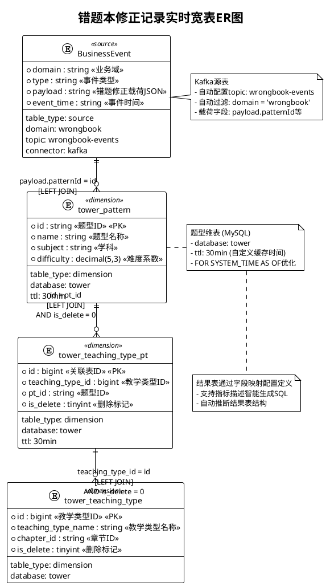

# 错题本修正记录极简配置

## 📊 ER图定义



## 🔄 字段映射定义

```yaml
# 结果表配置
result_table:
  table_name: "dwd_wrong_record_wide_delta"
  table_type: "result"
  connector: "mysql"
  database: "guarder"
  primary_key: ["id"]

# 字段映射配置
field_mapping:
  # 基础字段映射
  id: "payload.fixId"
  wrong_id: "payload.wrongId"
  user_id: "payload.userId"
  subject: "payload.subject"
  question_id: "payload.questionId"
  pattern_id: "payload.patternId"
  fix_id: "payload.fixId"
  fix_result: "payload.fixResult"
  
  # 维表字段映射
  pattern_name: "tower_pattern.name"
  teaching_type_id: "tower_teaching_type.id"
  teaching_type_name: "tower_teaching_type.teaching_type_name"
  
  # 计算字段
  subject_name: "CASE payload.subject WHEN 'ENGLISH' THEN '英语' WHEN 'BIOLOGY' THEN '生物' WHEN 'MATH' THEN '数学' WHEN 'PHYSICS' THEN '物理' WHEN 'CHEMISTRY' THEN '化学' WHEN 'CHINESE' THEN '语文' ELSE '' END"
  fix_result_desc: "CASE payload.fixResult WHEN 1 THEN '订正' WHEN 0 THEN '未订正' ELSE '' END"
  
  # 时间字段转换
  collect_time: "payload.createTime"
  fix_time: "payload.submitTime"
  
  # 智能指标字段 (基于描述生成SQL)
  learning_progress_score: "根据用户错题修正的时间间隔和修正成功率，计算学习进度分数，体现学习效果的提升趋势"
  subject_weakness_analysis: "基于用户在各学科的错题分布和修正情况，识别学科薄弱点并给出改进建议等级"
  pattern_mastery_index: "分析用户对特定题型的掌握程度，结合题型难度和修正历史，计算掌握度指数"
  study_efficiency_rating: "综合考虑修正时间、题型难度、学科分布，计算用户的学习效率评级"
```
