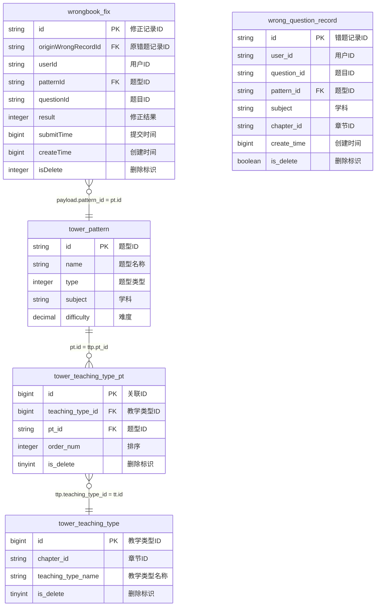

# 错题本修正记录实时宽表作业 v3.0

## 📋 作业基本信息

```yaml
job_info:
  name: "错题本修正记录实时宽表"
  description: "学生错题修正记录的实时数据宽表处理"
  domain: "wrongbook"
  event_type: "fix"
  author: "flink-team"
  version: "3.0.0"
  create_date: "2024-12-27"
```

## 🗄️ 源表配置

### BusinessEvent标准事件流
- **源表名**: BusinessEvent (统一事件流表)
- **事件过滤**: domain = 'wrongbook' AND type = 'wrongbook_fix'
- **Payload结构**: WrongbookFixPayload

**WrongbookFixPayload数据结构**:
```java
public class WrongbookFixPayload {
    private String fixId;
    private String wrongId;
    private String userId;
    private String subject;
    private String questionId;
    private String patternId;
    private long createTime;
    private long submitTime;
    private int fixResult;
}
```

## 🔗 维表配置

### 维表2: tower_pattern

**维表结构**:
```sql
CREATE TABLE `vvp`.`default`.`tower_pattern` (
    `id` STRING NOT NULL,
    `name` STRING,
    `type` INT,
    `subject` STRING,
    `difficulty` DECIMAL(5, 3),
    `modify_time` BIGINT,
    PRIMARY KEY (id) NOT ENFORCED
) COMMENT '题型模式表'
WITH (
    'connector' = 'jdbc',
    'lookup.cache.max-rows' = '100000',
    'lookup.cache.ttl' = '30 min',
    'password' = '******',
    'table-name' = 'tower_pattern',
    'url' = 'jdbc:mysql://pc-bp1ivlu7lykwyzx9x.rwlb.rds.aliyuncs.com:3306/tower',
    'username' = 'zstt_server'
)
```

### 维表3: tower_teaching_type_pt
- **过滤条件**: is_delete = 0

**维表结构**:
```sql
CREATE TABLE `vvp`.`default`.`tower_teaching_type_pt` (
    `id` BIGINT NOT NULL,
    `teaching_type_id` BIGINT,
    `pt_id` STRING,
    `order_num` INT,
    `is_delete` TINYINT,
    `modify_time` TIMESTAMP(3),
    PRIMARY KEY (id) NOT ENFORCED
) COMMENT '教学类型模式关联表'
WITH (
    'connector' = 'jdbc',
    'lookup.cache.max-rows' = '100000',
    'lookup.cache.ttl' = '30 min',
    'password' = '******',
    'table-name' = 'tower_teaching_type_pt',
    'url' = 'jdbc:mysql://pc-bp1ivlu7lykwyzx9x.rwlb.rds.aliyuncs.com:3306/tower',
    'username' = 'zstt_server'
)
```

### 维表4: tower_teaching_type
- **过滤条件**: is_delete = 0

**维表结构**:
```sql
CREATE TABLE `vvp`.`default`.`tower_teaching_type` (
    `id` BIGINT NOT NULL,
    `chapter_id` STRING,
    `teaching_type_name` STRING,
    `is_delete` TINYINT,
    `modify_time` TIMESTAMP(3),
    PRIMARY KEY (id) NOT ENFORCED
) COMMENT '教学类型表'
WITH (
    'connector' = 'jdbc',
    'lookup.cache.max-rows' = '100000',
    'lookup.cache.ttl' = '30 min',
    'password' = '******',
    'table-name' = 'tower_teaching_type',
    'url' = 'jdbc:mysql://pc-bp1ivlu7lykwyzx9x.rwlb.rds.aliyuncs.com:3306/tower',
    'username' = 'zstt_server'
)
```

## 🎯 结果表配置

### 表名: dwd_wrong_record_wide_delta
- **操作类型**: INSERT
- **主键**: id

**结果表结构**:
```sql
CREATE TABLE `vvp`.`default`.`dwd_wrong_record_wide_delta` (
    `id` BIGINT NOT NULL,
    `wrong_id` STRING,
    `user_id` STRING,
    `subject` STRING,
    `subject_name` STRING,
    `question_id` STRING,
    `question` STRING,
    `pattern_id` STRING,
    `pattern_name` STRING,
    `teaching_type_id` STRING,
    `teaching_type_name` STRING,
    `collect_time` TIMESTAMP(3),
    `fix_id` STRING,
    `fix_time` TIMESTAMP(3),
    `fix_result` BIGINT,
    `fix_result_desc` STRING,
    PRIMARY KEY (id) NOT ENFORCED
) COMMENT '错题本错题记录实时宽表'
WITH (
    'accessId' = 'LTAI5tHvJUm7fEzCfrFT3oam',
    'accessKey' = '******',
    'connector' = 'odps',
    'enableUpsert' = 'true',
    'endpoint' = 'http://service.cn-hangzhou.maxcompute.aliyun.com/api',
    'project' = 'zstt',
    'sink.operation' = 'upsert',
    'tableName' = 'dwd_wrong_record_wide_delta',
    'upsert.write.bucket.num' = '16'
)
```

## 🔄 字段映射配置

### 基础字段映射
```yaml
field_mapping:
  # 从payload映射的字段
  id: "CAST(payload.id AS BIGINT)"
  wrong_id: "payload.wrong_id"
  user_id: "payload.user_id"
  subject: "payload.subject"
  question_id: "payload.question_id"
  pattern_id: "payload.pattern_id"
  fix_id: "payload.id"
  fix_result: "payload.result"
  
  # 从维表映射的字段  
  pattern_name: "pt.name"
  teaching_type_id: "CAST(tt.id AS STRING)"
  teaching_type_name: "tt.teaching_type_name"
  
  # 计算字段
  subject_name: |
    CASE payload.subject
        WHEN 'ENGLISH' THEN '英语'
        WHEN 'BIOLOGY' THEN '生物'
        WHEN 'math' THEN '数学'
        WHEN 'MATH' THEN '数学'
        WHEN 'PHYSICS' THEN '物理'
        WHEN 'CHEMISTRY' THEN '化学'
        WHEN 'AOSHU' THEN '数学思维'
        WHEN 'SCIENCE' THEN '科学'
        WHEN 'CHINESE' THEN '语文'
        ELSE ''
    END
  question: "CAST(NULL AS STRING)"
  collect_time: "TO_TIMESTAMP_LTZ(payload.create_time, 0)"
  fix_time: "TO_TIMESTAMP_LTZ(payload.submit_time, 0)"
  fix_result_desc: |
    CASE payload.result
        WHEN 1 THEN '订正'
        WHEN 0 THEN '未订正'
        ELSE ''
    END
```

## 🗺️ ER图定义

### 实体关系图 (Mermaid格式)


### 关联关系定义
```yaml
join_relationships:
  # 源表到维表的关联
  source_to_wrong_record:
    source_table: "wrongbook_fix"
    source_field: "payload.originWrongRecordId"
    target_table: "wrong_question_record"
    target_field: "id"
    join_type: "LEFT JOIN"
    additional_condition: "payload.isDelete = 0"
    
  # 维表之间的关联
  wrong_record_to_pattern:
    source_table: "wrong_question_record"
    source_field: "pattern_id"
    target_table: "tower_pattern"
    target_field: "id"
    join_type: "LEFT JOIN"
    
  pattern_to_teaching_type_pt:
    source_table: "tower_pattern"
    source_field: "id"
    target_table: "tower_teaching_type_pt"
    target_field: "pt_id"
    join_type: "LEFT JOIN"
    additional_condition: "ttp.is_delete = 0"
    
  teaching_type_pt_to_teaching_type:
    source_table: "tower_teaching_type_pt"
    source_field: "teaching_type_id"
    target_table: "tower_teaching_type"
    target_field: "id"
    join_type: "LEFT JOIN"
    additional_condition: "tt.is_delete = 0"

# 特殊业务规则
special_conditions:
  subject_chapter_matching:
    description: "语文英语科目需要额外章节匹配"
    condition: |
      (payload.subject NOT IN ('CHINESE', 'ENGLISH')
       OR (payload.subject IN ('CHINESE', 'ENGLISH') AND tt.chapter_id = payload.chapter_id))
```

## 💬 备注说明

### 业务逻辑
- 学科名称需要中文转换显示
- 修正结果需要状态码转中文描述
- 语文和英语学科需要额外的章节匹配条件
- 过滤已删除的记录

### 数据质量要求
- originWrongRecordId必须存在于wrong_question_record表中
- isDelete = 0 的记录才参与计算
- 时间字段需要正确的时区转换
