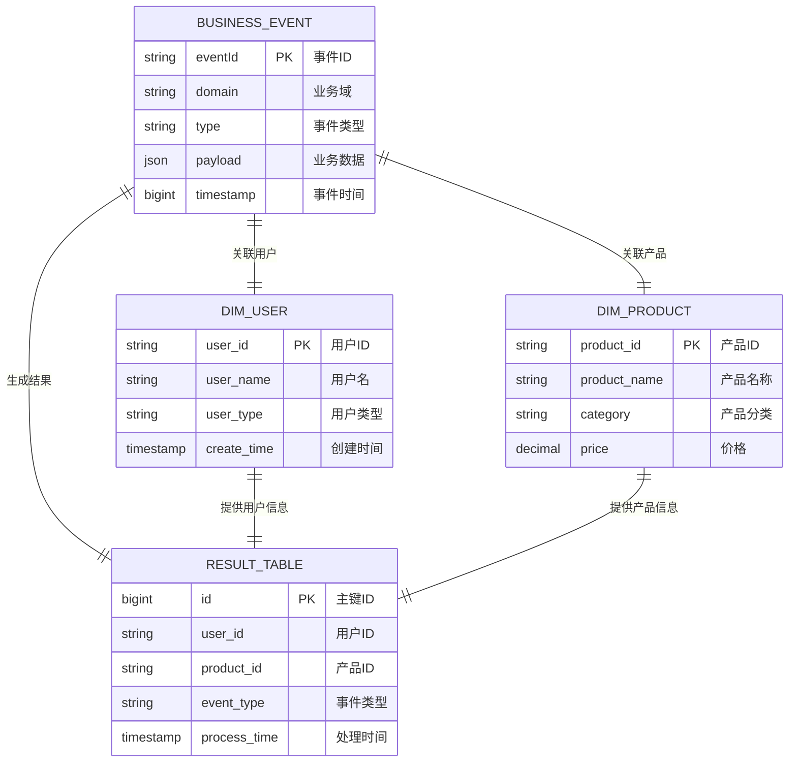

# Flink SQL作业生成请求模板

## 📋 作业基本信息

```yaml
job_info:
  name: "作业名称"
  description: "业务描述"
  domain: "业务域名"
  event_type: "事件类型"
  author: "开发者"
  version: "1.0.0"
  create_date: "2024-12-27"
```

## 🗄️ 源表配置

### BusinessEvent标准事件流
- **源表名**: biz_statistic_{domain} (业务域事件流表，BusinessEvent结构)
- **事件过滤**: 基于domain和type字段过滤
- **Payload结构**: 具体的业务数据结构

**Payload数据结构**:
```json
{
  "field1": "string",
  "field2": 123,
  "field3": 1234567890,
  "field4": true,
  // 更多业务字段...
}
```

## 🔗 维表配置

### 维表1: [维表名称]
- **关联条件**: 关联字段映射 (如: 维表.id = payload.origin_id)
- **过滤条件**: 维表过滤条件
- **额外条件**: 其他关联条件
- **别名**: 表别名

**维表结构**:
```sql
CREATE TABLE `catalog`.`database`.`table_name` (
  `field1` TYPE NOT NULL,
  `field2` TYPE,
  -- 完整字段定义
  PRIMARY KEY (field1) NOT ENFORCED
)
WITH (
  'connector' = 'jdbc',
  'lookup.cache.ttl' = '30 min',
  'lookup.cache.max-rows' = '100000',
  -- 更多连接器配置
)
```

### 维表2: [维表名称]
- **关联条件**: 关联字段映射
- **过滤条件**: 维表过滤条件
- **别名**: 表别名

**维表结构**: (同上格式)

## 🎯 结果表配置

### 表名: [结果表名称]
- **操作类型**: INSERT/UPSERT
- **主键**: 结果表主键
- **分区字段**: 分区配置 (如果有)

**结果表结构**:
```sql
CREATE TABLE `catalog`.`database`.`result_table_name` (
  `field1` TYPE NOT NULL,
  `field2` TYPE,
  `field3` TYPE,
  -- 完整字段定义
  PRIMARY KEY (field1) NOT ENFORCED
)
COMMENT '结果表描述'
WITH (
  'connector' = 'odps',
  -- 连接器配置
)
```

## 🔄 字段映射配置

### 基础字段
- `target_field1`: payload.source_field1 - 从payload直接提取
- `target_field2`: dim_table.field2 - 从维表获取
- `target_field3`: payload.source_field3 - 从payload提取（AI会自动处理类型转换）

### 转换字段
- `enum_field`: 枚举值转换
  - 'CODE1' -> '中文描述1'
  - 'CODE2' -> '中文描述2'
  - 默认值 -> ''

### 计算字段
- `timestamp_field`: TO_TIMESTAMP_LTZ(payload.create_time) - 时间字段转换
- `computed_field`: CASE WHEN condition THEN value1 ELSE value2 END

## 📊 业务逻辑配置

### 标准过滤条件
```sql
-- 事件过滤
domain = 'your_domain' AND type = 'your_event_type'

-- 数据质量过滤
payload.is_delete = 0
AND payload.status IS NOT NULL
```

### 复杂业务规则
```sql
-- 示例：条件组合逻辑
(
  payload.category NOT IN ('EXCLUDE1', 'EXCLUDE2')
  OR (
    payload.category IN ('SPECIAL1', 'SPECIAL2') 
    AND dim_table.special_flag = '1'
  )
)
```

## 🔧 性能优化配置

### JOIN优化策略
```yaml
join_optimization:
  # 预期数据量 (影响JOIN策略选择)
  source_daily_volume: 100000        # 源表日增量
  dim_table_sizes:
    table1: 10000                    # 维表1总量
    table2: 50000                    # 维表2总量
  
  # 关联字段索引情况
  indexed_fields:
    - table1.id
    - table2.foreign_key
  
  # JOIN顺序建议 (小表在前)
  join_order:
    - table1  # 最小维表
    - table2  # 中等维表
    - table3  # 较大维表
```

### 查询优化配置
```yaml
query_optimization:
  # 重要过滤条件 (尽早过滤)
  early_filters:
    - "payload.is_delete = 0"
    - "payload.status IN ('ACTIVE', 'PENDING')"
  
  # 字段裁剪 (只选择需要的字段)
  select_fields:
    source: ["field1", "field2", "field3"]
    dim_table1: ["id", "name", "category"]
    dim_table2: ["id", "value", "description"]
  
  # 缓存配置
  cache_config:
    ttl: "30 min"                    # 缓存时间
    max_rows: 100000                 # 最大缓存行数
    async_reload: true               # 异步刷新
```

## 🗺️ ER图配置 (可选)

### 实体关系图 (Mermaid格式)


### 关系说明
```yaml
er_relationships:
  # 核心业务关系
  event_to_user:
    description: "事件关联用户"
    cardinality: "N:1"
    join_condition: "payload.userId = dim_user.user_id"
    business_rule: "每个事件对应一个用户"
    
  event_to_product:
    description: "事件关联产品"
    cardinality: "N:1"
    join_condition: "payload.productId = dim_product.product_id"
    business_rule: "每个事件对应一个产品"
```

## 📈 监控配置

### 数据质量监控
```yaml
data_quality:
  # 必填字段检查
  required_fields:
    - "payload.user_id IS NOT NULL"
    - "payload.event_time IS NOT NULL"
  
  # 数据范围检查
  value_ranges:
    - field: "payload.amount"
      min: 0
      max: 999999
    - field: "payload.status"
      values: ["ACTIVE", "INACTIVE", "PENDING"]
  
  # 重复数据检查
  uniqueness:
    - fields: ["payload.order_id"]
      window: "1 day"
```

### 性能监控
```yaml
performance_monitoring:
  # 延迟监控
  latency_targets:
    p95: "5 seconds"
    p99: "10 seconds"
  
  # 吞吐量监控  
  throughput_targets:
    min_rps: 100                     # 最小每秒记录数
    max_rps: 1000                    # 最大每秒记录数
  
  # 资源监控
  resource_limits:
    cpu_utilization: 70%
    memory_utilization: 80%
    checkpoint_duration: "30 seconds"
```

## 💬 备注说明

### 特殊处理逻辑
- 描述特殊的业务规则和处理逻辑
- 异常情况的处理方式
- 数据兼容性考虑

### 已知限制
- 数据源的已知问题
- 性能瓶颈点
- 业务规则的限制条件

### 扩展计划
- 后续功能扩展计划
- 性能优化方向
- 监控增强需求